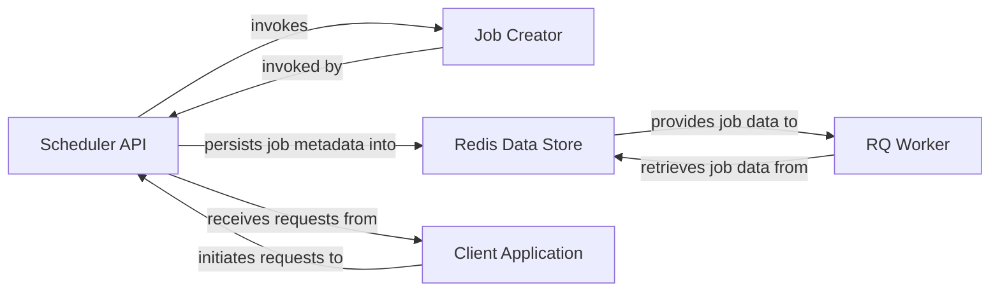

## Details

The `rq-scheduler` subsystem facilitates the scheduling and execution of background jobs using Redis as a persistent data store and message broker. The `Client Application` initiates job scheduling requests through the `Scheduler API`, which is the core component responsible for defining and managing scheduled jobs. The `Scheduler API` leverages the `Job Creator` to construct job instances and then persists their metadata into the `Redis Data Store`. Subsequently, external `RQ Worker` processes retrieve and execute these scheduled jobs from the `Redis Data Store`, completing the asynchronous job processing workflow.

### Scheduler API [[Expand]](./Scheduler_API.md)
The primary interface for clients to interact with `rq-scheduler`. It provides methods to schedule jobs at specific times, after a delay, periodically, or based on cron expressions. This component is responsible for creating the initial job metadata and persisting it into the Redis Data Store.

**Related Classes/Methods**:

- <a href="https://github.com/rq/rq-scheduler/blob/master/rq_scheduler/scheduler.py#L23-L500" target="_blank" rel="noopener noreferrer">`rq_scheduler.scheduler.Scheduler`:23-500</a>
- <a href="https://github.com/rq/rq-scheduler/blob/master/rq_scheduler/scheduler.py" target="_blank" rel="noopener noreferrer">`rq_scheduler.scheduler.Scheduler:enqueue_at`</a>
- <a href="https://github.com/rq/rq-scheduler/blob/master/rq_scheduler/scheduler.py" target="_blank" rel="noopener noreferrer">`rq_scheduler.scheduler.Scheduler:enqueue_in`</a>
- <a href="https://github.com/rq/rq-scheduler/blob/master/rq_scheduler/scheduler.py" target="_blank" rel="noopener noreferrer">`rq_scheduler.scheduler.Scheduler:schedule`</a>
- <a href="https://github.com/rq/rq-scheduler/blob/master/rq_scheduler/scheduler.py" target="_blank" rel="noopener noreferrer">`rq_scheduler.scheduler.Scheduler:cron`</a>

### Job Creator
An internal method within the `Scheduler` responsible for creating and configuring Job instances based on scheduling parameters. It acts as an internal factory for job objects, ensuring they are correctly structured before persistence.

**Related Classes/Methods**:

- <a href="https://github.com/rq/rq-scheduler/blob/master/rq_scheduler/scheduler.py" target="_blank" rel="noopener noreferrer">`rq_scheduler.scheduler.Scheduler:_create_job`</a>

### Redis Data Store
An external dependency serving as the persistent storage for scheduled job metadata and the message broker for RQ queues. It acts as the central coordination point for all components.

**Related Classes/Methods**:

### RQ Worker
An external consumer that continuously monitors and retrieves job data from Redis queues to execute the defined tasks. It represents the execution environment for jobs scheduled by `rq-scheduler`.

**Related Classes/Methods**:

### Client Application
An external application that interacts with the `Scheduler API` to schedule jobs. It represents the user or system initiating the scheduling process.

**Related Classes/Methods**:

- <a href="https://github.com/rq/rq-scheduler/blob/master/rq_scheduler/scheduler.py#L23-L500" target="_blank" rel="noopener noreferrer">`rq_scheduler.scheduler.Scheduler`:23-500</a>

### [FAQ](https://github.com/CodeBoarding/GeneratedOnBoardings/tree/main?tab=readme-ov-file#faq)