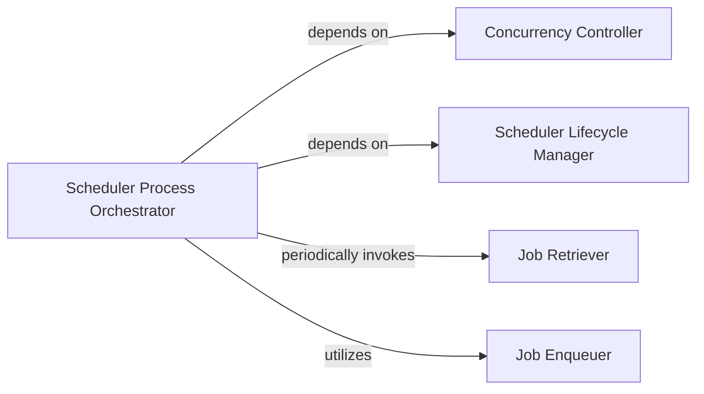

## Details

The `Scheduler Core Process` subsystem is the dedicated, long-running component at the heart of `rq-scheduler`. It is responsible for continuously monitoring the Redis Data Store for jobs due for execution, managing its own lifecycle, ensuring single-instance operation, and orchestrating the transition of scheduled jobs into standard RQ queues.

### Scheduler Process Orchestrator
The main execution loop and coordinator for the entire scheduler process. It manages the scheduler's lifecycle from startup to shutdown, including periodic tasks like heartbeat and job enqueuing.

**Related Classes/Methods**:

- <a href="https://github.com/rq/rq-scheduler/blob/master/rq_scheduler/scripts/rqscheduler.py" target="_blank" rel="noopener noreferrer">`rq_scheduler.scripts.rqscheduler.main:run`</a>

### Job Retriever
Scans the scheduled jobs data (stored in Redis) to find and retrieve jobs whose scheduled time has arrived. This component is crucial for identifying tasks ready for execution.

**Related Classes/Methods**:

- <a href="https://github.com/rq/rq-scheduler/blob/master/rq_scheduler/scheduler.py" target="_blank" rel="noopener noreferrer">`rq_scheduler.scheduler.Scheduler:get_jobs_to_queue`</a>

### Job Enqueuer
Identifies jobs that are due for execution and pushes them into the appropriate RQ queues for processing by RQ workers. This is the bridge between the scheduler and the core RQ worker system.

**Related Classes/Methods**:

- <a href="https://github.com/rq/rq-scheduler/blob/master/rq_scheduler/scheduler.py" target="_blank" rel="noopener noreferrer">`rq_scheduler.scheduler.Scheduler:enqueue_jobs`</a>

### Scheduler Lifecycle Manager
Manages the scheduler's operational status within the Redis environment, marking its active presence or graceful termination. This includes birth registration, death registration, and heartbeat updates, ensuring the scheduler's state is known.

**Related Classes/Methods**:

- <a href="https://github.com/rq/rq-scheduler/blob/master/rq_scheduler/scheduler.py" target="_blank" rel="noopener noreferrer">`rq_scheduler.scheduler.Scheduler:register_birth`</a>
- <a href="https://github.com/rq/rq-scheduler/blob/master/rq_scheduler/scheduler.py" target="_blank" rel="noopener noreferrer">`rq_scheduler.scheduler.Scheduler:register_death`</a>

### Concurrency Controller
Implements a distributed locking mechanism to ensure that only a single instance of the `rq-scheduler` is actively running at any given time, preventing duplicate job processing and maintaining data integrity.

**Related Classes/Methods**:

- <a href="https://github.com/rq/rq-scheduler/blob/master/rq_scheduler/scheduler.py" target="_blank" rel="noopener noreferrer">`rq_scheduler.scheduler.Scheduler:acquire_lock`</a>
- <a href="https://github.com/rq/rq-scheduler/blob/master/rq_scheduler/scheduler.py" target="_blank" rel="noopener noreferrer">`rq_scheduler.scheduler.Scheduler:remove_lock`</a>

### [FAQ](https://github.com/CodeBoarding/GeneratedOnBoardings/tree/main?tab=readme-ov-file#faq)