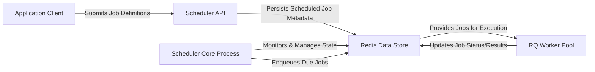

## Details

The rq-scheduler system orchestrates scheduled job execution through a clear separation of concerns. The Application Client initiates the process by interacting with the Scheduler API to define and submit jobs. The Scheduler API then persists these scheduled job definitions into the Redis Data Store. The Scheduler Core Process acts as the central orchestrator, continuously monitoring the Redis Data Store for jobs that are due. Upon identifying due jobs, it enqueues them into standard RQ queues within the Redis Data Store. Finally, the RQ Worker Pool consumes these jobs from the Redis Data Store and executes the actual task logic, updating job statuses and results back into the Redis Data Store. This architecture ensures reliable and scalable scheduled task execution by leveraging Redis for persistent storage and message brokering.

### Application Client
Represents any external application or service that integrates with rq-scheduler to define and submit tasks for future execution. This component initiates the scheduling process by interacting with the Scheduler API. As an external entity, it does not have source code within the rq-scheduler project.

**Related Classes/Methods**: _None_

### Scheduler API [[Expand]](./Scheduler_API.md)
The primary interface for clients to interact with rq-scheduler. It provides methods to schedule jobs at specific times, after a delay, periodically, or based on cron expressions. This component is responsible for creating the initial job metadata and persisting it into the Redis Data Store.

**Related Classes/Methods**:

- <a href="https://github.com/rq/rq-scheduler/blob/master/rq_scheduler/scheduler.py#L23-L500" target="_blank" rel="noopener noreferrer">`rq_scheduler.scheduler.Scheduler`:23-500</a>
- <a href="https://github.com/rq/rq-scheduler/blob/master/rq_scheduler/scheduler.py" target="_blank" rel="noopener noreferrer">`rq_scheduler.scheduler.Scheduler:enqueue_at`</a>
- <a href="https://github.com/rq/rq-scheduler/blob/master/rq_scheduler/scheduler.py" target="_blank" rel="noopener noreferrer">`rq_scheduler.scheduler.Scheduler:enqueue_in`</a>
- <a href="https://github.com/rq/rq-scheduler/blob/master/rq_scheduler/scheduler.py" target="_blank" rel="noopener noreferrer">`rq_scheduler.scheduler.Scheduler:schedule`</a>
- <a href="https://github.com/rq/rq-scheduler/blob/master/rq_scheduler/scheduler.py" target="_blank" rel="noopener noreferrer">`rq_scheduler.scheduler.Scheduler:cron`</a>
- <a href="https://github.com/rq/rq-scheduler/blob/master/rq_scheduler/scheduler.py" target="_blank" rel="noopener noreferrer">`rq_scheduler.scheduler.Scheduler:_create_job`</a>

### Scheduler Core Process [[Expand]](./Scheduler_Core_Process.md)
This is the dedicated, long-running process that forms the heart of rq-scheduler. It continuously monitors the Redis Data Store for jobs that are due for execution. It manages its own lifecycle (birth/death registration, heartbeat) and ensures single-instance operation through a locking mechanism. Upon identifying due jobs, it orchestrates their transition from scheduled status to being enqueued into the standard RQ queues.

**Related Classes/Methods**:

- <a href="https://github.com/rq/rq-scheduler/blob/master/rq_scheduler/scripts/rqscheduler.py" target="_blank" rel="noopener noreferrer">`rq_scheduler.scripts.rqscheduler.main:run`</a>
- <a href="https://github.com/rq/rq-scheduler/blob/master/rq_scheduler/scheduler.py" target="_blank" rel="noopener noreferrer">`rq_scheduler.scheduler.Scheduler:acquire_lock`</a>
- <a href="https://github.com/rq/rq-scheduler/blob/master/rq_scheduler/scheduler.py" target="_blank" rel="noopener noreferrer">`rq_scheduler.scheduler.Scheduler:remove_lock`</a>
- <a href="https://github.com/rq/rq-scheduler/blob/master/rq_scheduler/scheduler.py" target="_blank" rel="noopener noreferrer">`rq_scheduler.scheduler.Scheduler:register_birth`</a>
- <a href="https://github.com/rq/rq-scheduler/blob/master/rq_scheduler/scheduler.py" target="_blank" rel="noopener noreferrer">`rq_scheduler.scheduler.Scheduler:register_death`</a>
- <a href="https://github.com/rq/rq-scheduler/blob/master/rq_scheduler/scheduler.py" target="_blank" rel="noopener noreferrer">`rq_scheduler.scheduler.Scheduler:get_jobs_to_queue`</a>
- <a href="https://github.com/rq/rq-scheduler/blob/master/rq_scheduler/scheduler.py" target="_blank" rel="noopener noreferrer">`rq_scheduler.scheduler.Scheduler:enqueue_jobs`</a>

### Redis Data Store
The central Redis instance serves as the persistent backbone for both rq-scheduler and the core RQ system. It stores all scheduled job metadata (e.g., execution time, function, arguments, recurrence patterns), scheduler operational state (locks, heartbeats), and acts as the message broker for the RQ job queues. As an external data store, it does not have source code within the rq-scheduler project.

**Related Classes/Methods**: _None_

### RQ Worker Pool [[Expand]](./RQ_Worker_Pool.md)
A collection of rq worker processes that continuously poll the Redis Data Store for new jobs in their respective queues. Once a job is retrieved, the worker executes the actual task logic defined by the application.

**Related Classes/Methods**:

- <a href="https://github.com/rq/rq-scheduler/blob/master/" target="_blank" rel="noopener noreferrer">`rq.Worker`</a>

### [FAQ](https://github.com/CodeBoarding/GeneratedOnBoardings/tree/main?tab=readme-ov-file#faq)