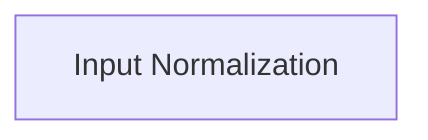

## Details

Updated analysis with source code reference for Input Normalization.

### Input Normalization
Normalizes input data to a standard scale, typically between 0 and 1 or -1 and 1, to ensure consistent data distribution and improve model training stability.

**Related Classes/Methods**:

- <a href="https://github.com/leggedrobotics/rsl_rl/blob/main/rsl_rl/networks/normalization.py" target="_blank" rel="noopener noreferrer">`rsl_rl.networks.normalization`</a>

### [FAQ](https://github.com/CodeBoarding/GeneratedOnBoardings/tree/main?tab=readme-ov-file#faq)