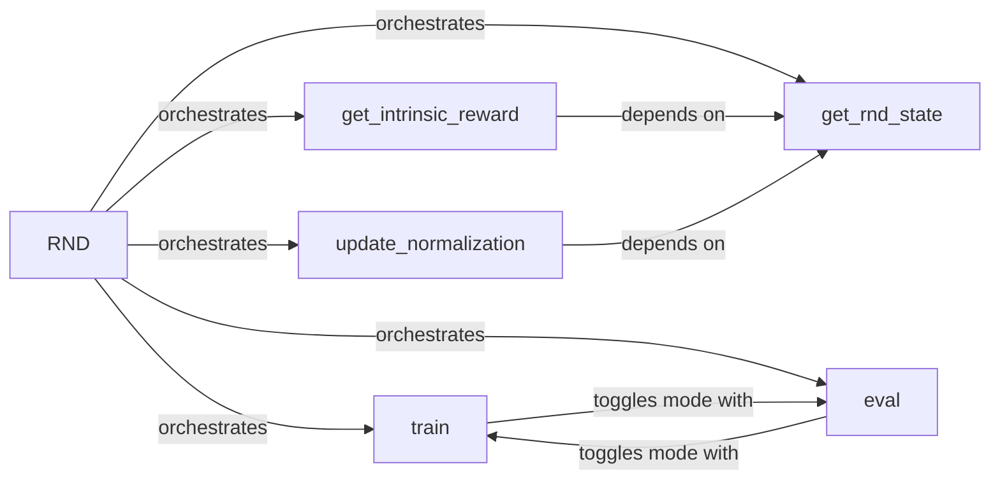

## Details

The Intrinsic Reward Module (RND) is a self-contained unit for generating intrinsic rewards to encourage exploration in reinforcement learning environments, centered around the `rsl_rl.modules.rnd.RND` class and its methods in `rsl_rl/modules/rnd.py`.

### RND
The core component of the intrinsic reward module. It encapsulates the Random Network Distillation algorithm, managing the prediction and target neural networks, their configuration, and overall state. It orchestrates the entire process of intrinsic reward generation.

**Related Classes/Methods**:

- <a href="https://github.com/leggedrobotics/rsl_rl/blob/main/rsl_rl/modules/rnd.py" target="_blank" rel="noopener noreferrer">`rsl_rl.modules.rnd.RND`</a>

### get_intrinsic_reward
Responsible for calculating the intrinsic reward based on the discrepancy between the outputs of the RND's prediction and target networks. This method is a key part of the reward computation pipeline.

**Related Classes/Methods**:

- <a href="https://github.com/leggedrobotics/rsl_rl/blob/main/rsl_rl/modules/rnd.py" target="_blank" rel="noopener noreferrer">`rsl_rl.modules.rnd.RND:get_intrinsic_reward`</a>

### get_rnd_state
A utility method that prepares and extracts the necessary state features to be used as input for the RND's prediction and target networks. It ensures the input data is correctly formatted and contains relevant information for the RND mechanism.

**Related Classes/Methods**:

- <a href="https://github.com/leggedrobotics/rsl_rl/blob/main/rsl_rl/modules/rnd.py" target="_blank" rel="noopener noreferrer">`rsl_rl.modules.rnd.RND:get_rnd_state`</a>

### update_normalization
Manages and updates the running statistics (e.g., mean and variance) used to normalize the input states for the RND networks. Proper normalization is critical for the stable training and performance of the neural networks within the RND module.

**Related Classes/Methods**:

- <a href="https://github.com/leggedrobotics/rsl_rl/blob/main/rsl_rl/modules/rnd.py" target="_blank" rel="noopener noreferrer">`rsl_rl.modules.rnd.RND:update_normalization`</a>

### train
Sets the RND module into training mode. In this mode, features like gradient calculations are enabled, and operations such as dropout are active, which are essential for updating the network weights.

**Related Classes/Methods**:

- <a href="https://github.com/leggedrobotics/rsl_rl/blob/main/rsl_rl/modules/rnd.py" target="_blank" rel="noopener noreferrer">`rsl_rl.modules.rnd.RND:train`</a>

### eval
Sets the RND module into evaluation (inference) mode. In this mode, gradient calculations are typically disabled, and features like dropout are inactive, ensuring consistent and deterministic output for reward computation during agent interaction with the environment.

**Related Classes/Methods**:

- <a href="https://github.com/leggedrobotics/rsl_rl/blob/main/rsl_rl/modules/rnd.py" target="_blank" rel="noopener noreferrer">`rsl_rl.modules.rnd.RND:eval`</a>

### [FAQ](https://github.com/CodeBoarding/GeneratedOnBoardings/tree/main?tab=readme-ov-file#faq)