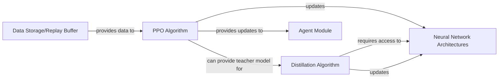

## Details

The rsl_rl project implements reinforcement learning algorithms, primarily focusing on Proximal Policy Optimization (PPO) and Knowledge Distillation. The core of the system revolves around the PPO Algorithm and Distillation Algorithm components, which are responsible for policy and value function updates. These algorithms interact with Neural Network Architectures, which define the policy and value networks, including specialized teacher and student models for distillation. Experience data, crucial for training, is managed by the Data Storage/Replay Buffer, which provides collected trajectories to the PPO algorithm. The Agent Module orchestrates the overall training and inference process, utilizing the updated policy parameters from the algorithms for action selection and managing the interaction with the environment. This modular design allows for flexible integration of different algorithms and network configurations, facilitating research and application in reinforcement learning.

### PPO Algorithm
Encapsulates the core logic for the Proximal Policy Optimization (PPO) algorithm. Its primary responsibility is to manage and execute the policy and value function updates based on collected experience. This involves computing PPO-specific losses (e.g., clipped surrogate objective, value function loss), performing optimization steps using an optimizer (e.g., Adam), and handling parameter synchronization or reduction, especially in distributed training setups.

**Related Classes/Methods**:

- <a href="https://github.com/leggedrobotics/rsl_rl/blob/main/rsl_rl/algorithms/ppo.py#L19-L469" target="_blank" rel="noopener noreferrer">`rsl_rl.algorithms.ppo.PPO`:19-469</a>
- <a href="https://github.com/leggedrobotics/rsl_rl/blob/main/rsl_rl/algorithms/ppo.py#L178-L422" target="_blank" rel="noopener noreferrer">`rsl_rl.algorithms.ppo.update`:178-422</a>
- <a href="https://github.com/leggedrobotics/rsl_rl/blob/main/rsl_rl/algorithms/ppo.py#L441-L469" target="_blank" rel="noopener noreferrer">`rsl_rl.algorithms.ppo.reduce_parameters`:441-469</a>

### Distillation Algorithm
Implements the knowledge distillation algorithm. Its main function is to facilitate the transfer of learned knowledge from a "teacher" neural network to a "student" neural network. This involves calculating distillation-specific losses (e.g., mimicking teacher outputs, matching feature representations) and updating the student model's parameters to replicate the teacher's behavior, often for model compression or policy transfer.

**Related Classes/Methods**:

- <a href="https://github.com/leggedrobotics/rsl_rl/blob/main/rsl_rl/algorithms/distillation.py#L14-L185" target="_blank" rel="noopener noreferrer">`rsl_rl.algorithms.distillation.Distillation`:14-185</a>
- <a href="https://github.com/leggedrobotics/rsl_rl/blob/main/rsl_rl/algorithms/distillation.py#L105-L151" target="_blank" rel="noopener noreferrer">`rsl_rl.algorithms.distillation.update`:105-151</a>
- <a href="https://github.com/leggedrobotics/rsl_rl/blob/main/rsl_rl/algorithms/distillation.py#L166-L185" target="_blank" rel="noopener noreferrer">`rsl_rl.algorithms.distillation.reduce_parameters`:166-185</a>

### Data Storage/Replay Buffer
Stores experience data such as states, actions, rewards, advantages, and returns, providing it to RL algorithms.

**Related Classes/Methods**:

- <a href="https://github.com/leggedrobotics/rsl_rl/blob/main/rsl_rl/storage/rollout_storage.py#L14-L260" target="_blank" rel="noopener noreferrer">`rsl_rl.storage.rollout_storage.RolloutStorage`:14-260</a>

### Neural Network Architectures
Represents the policy and value networks, including both teacher and student models, whose weights are queried and updated by RL algorithms.

**Related Classes/Methods**:

- <a href="https://github.com/leggedrobotics/rsl_rl/blob/main/rsl_rl/modules/actor_critic.py#L15-L168" target="_blank" rel="noopener noreferrer">`rsl_rl.modules.actor_critic.ActorCritic`:15-168</a>
- <a href="https://github.com/leggedrobotics/rsl_rl/blob/main/rsl_rl/modules/student_teacher.py#L15-L206" target="_blank" rel="noopener noreferrer">`rsl_rl.modules.student_teacher.StudentTeacher`:15-206</a>

### Agent Module
Uses updated policy parameters for action selection and manages the interaction loop with the environment, including data collection and algorithm updates.

**Related Classes/Methods**:

- <a href="https://github.com/leggedrobotics/rsl_rl/blob/main/rsl_rl/runners/on_policy_runner.py#L22-L460" target="_blank" rel="noopener noreferrer">`rsl_rl.runners.on_policy_runner.OnPolicyRunner`:22-460</a>

### [FAQ](https://github.com/CodeBoarding/GeneratedOnBoardings/tree/main?tab=readme-ov-file#faq)