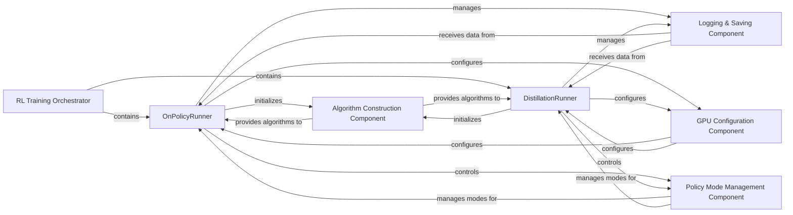

## Details

The `rsl_rl` project's core training functionality is orchestrated by the `RL Training Orchestrator`, primarily implemented by `OnPolicyRunner` and `DistillationRunner`. These runners manage the entire reinforcement learning or distillation training lifecycle. Key internal components include the `Algorithm Construction Component`, which dynamically initializes the specific learning algorithms; the `Logging & Saving Component`, responsible for recording training progress and persisting models; the `GPU Configuration Component`, which sets up the environment for efficient multi-GPU execution; and the `Policy Mode Management Component`, which controls the policy's operational state between training and evaluation. These components interact to facilitate a robust and configurable training pipeline.

### RL Training Orchestrator [[Expand]](./RL_Training_Orchestrator.md)
The overarching control unit for various training processes within `rsl_rl`. It acts as the central coordinator for the entire reinforcement learning training pipeline, encompassing specific runner implementations that manage iterative learning, environment interaction, data collection, policy updates, and various training configurations (e.g., multi-GPU, logging).

**Related Classes/Methods**:

- <a href="https://github.com/leggedrobotics/rsl_rl/blob/main/rsl_rl/runners/on_policy_runner.py#L22-L460" target="_blank" rel="noopener noreferrer">`rsl_rl.runners.on_policy_runner.OnPolicyRunner`:22-460</a>
- <a href="https://github.com/leggedrobotics/rsl_rl/blob/main/rsl_rl/runners/distillation_runner.py#L21-L179" target="_blank" rel="noopener noreferrer">`rsl_rl.runners.distillation_runner.DistillationRunner`:21-179</a>

### OnPolicyRunner
Orchestrates the complete on-policy reinforcement learning training loop. This includes initializing the algorithm, managing multi-GPU configurations, executing iterative learning steps, and preparing the policy for inference.

**Related Classes/Methods**:

- <a href="https://github.com/leggedrobotics/rsl_rl/blob/main/rsl_rl/runners/on_policy_runner.py#L22-L460" target="_blank" rel="noopener noreferrer">`rsl_rl.runners.on_policy_runner.OnPolicyRunner`:22-460</a>

### DistillationRunner
Manages the specialized distillation training process, focusing on the setup and execution of the distillation algorithm.

**Related Classes/Methods**:

- <a href="https://github.com/leggedrobotics/rsl_rl/blob/main/rsl_rl/runners/distillation_runner.py#L21-L179" target="_blank" rel="noopener noreferrer">`rsl_rl.runners.distillation_runner.DistillationRunner`:21-179</a>

### Algorithm Construction Component
Handles the instantiation and initial configuration of specific reinforcement learning or distillation algorithms, providing the core learning logic to the runners.

**Related Classes/Methods**:

- <a href="https://github.com/leggedrobotics/rsl_rl/blob/main/rsl_rl/runners/on_policy_runner.py" target="_blank" rel="noopener noreferrer">`rsl_rl.runners.on_policy_runner.OnPolicyRunner._construct_algorithm`</a>
- <a href="https://github.com/leggedrobotics/rsl_rl/blob/main/rsl_rl/runners/distillation_runner.py" target="_blank" rel="noopener noreferrer">`rsl_rl.runners.distillation_runner.DistillationRunner._construct_algorithm`</a>

### Logging & Saving Component
Manages the persistence of model checkpoints and the recording of training metrics and progress for monitoring and analysis.

**Related Classes/Methods**:

- <a href="https://github.com/leggedrobotics/rsl_rl/blob/main/rsl_rl/runners/on_policy_runner.py" target="_blank" rel="noopener noreferrer">`rsl_rl.runners.on_policy_runner.OnPolicyRunner._prepare_logging_writer`</a>
- <a href="https://github.com/leggedrobotics/rsl_rl/blob/main/rsl_rl/runners/on_policy_runner.py" target="_blank" rel="noopener noreferrer">`rsl_rl.runners.on_policy_runner.OnPolicyRunner.log`</a>
- <a href="https://github.com/leggedrobotics/rsl_rl/blob/main/rsl_rl/runners/on_policy_runner.py" target="_blank" rel="noopener noreferrer">`rsl_rl.runners.on_policy_runner.OnPolicyRunner.save`</a>

### GPU Configuration Component
Configures and optimizes the training environment for multi-GPU execution, ensuring efficient hardware utilization.

**Related Classes/Methods**:

- <a href="https://github.com/leggedrobotics/rsl_rl/blob/main/rsl_rl/runners/on_policy_runner.py" target="_blank" rel="noopener noreferrer">`rsl_rl.runners.on_policy_runner.OnPolicyRunner._configure_multi_gpu`</a>

### Policy Mode Management Component
Controls the operational mode of the policy (e.g., `train_mode` for learning, `eval_mode` for inference), ensuring the agent behaves appropriately during different phases.

**Related Classes/Methods**:

- <a href="https://github.com/leggedrobotics/rsl_rl/blob/main/rsl_rl/runners/on_policy_runner.py" target="_blank" rel="noopener noreferrer">`rsl_rl.runners.on_policy_runner.OnPolicyRunner.train_mode`</a>
- <a href="https://github.com/leggedrobotics/rsl_rl/blob/main/rsl_rl/runners/on_policy_runner.py" target="_blank" rel="noopener noreferrer">`rsl_rl.runners.on_policy_runner.OnPolicyRunner.eval_mode`</a>

### [FAQ](https://github.com/CodeBoarding/GeneratedOnBoardings/tree/main?tab=readme-ov-file#faq)