```mermaid
graph LR
    External_Environment_Interface["External Environment Interface"]
    RL_Training_Orchestrator["RL Training Orchestrator"]
    Agent_Policy_Value_Models["Agent Policy & Value Models"]
    Observation_Reward_Processing["Observation & Reward Processing"]
    Intrinsic_Reward_Module_RND_["Intrinsic Reward Module (RND)"]
    Experience_Replay_Buffer["Experience Replay Buffer"]
    RL_Algorithm_Implementations["RL Algorithm Implementations"]
    External_Environment_Interface -- "provides observations, rewards, done signals to" --> RL_Training_Orchestrator
    RL_Training_Orchestrator -- "sends actions to" --> External_Environment_Interface
    RL_Training_Orchestrator -- "requests policy inference/evaluation from" --> Agent_Policy_Value_Models
    Agent_Policy_Value_Models -- "returns actions, values, log probabilities to" --> RL_Training_Orchestrator
    RL_Training_Orchestrator -- "stores transitions in" --> Experience_Replay_Buffer
    Experience_Replay_Buffer -- "provides batches of training data to" --> RL_Algorithm_Implementations
    RL_Algorithm_Implementations -- "updates model parameters of" --> Agent_Policy_Value_Models
    RL_Training_Orchestrator -- "sends raw observations for processing to" --> Observation_Reward_Processing
    Observation_Reward_Processing -- "returns normalized observations/rewards to" --> RL_Training_Orchestrator
    RL_Training_Orchestrator -- "sends states/observations for intrinsic reward calculation to" --> Intrinsic_Reward_Module_RND_
    Intrinsic_Reward_Module_RND_ -- "provides intrinsic rewards to" --> RL_Training_Orchestrator
    click RL_Training_Orchestrator href "https://github.com/CodeBoarding/GeneratedOnBoardings/blob/main/rsl_rl/RL_Training_Orchestrator.md" "Details"
    click Agent_Policy_Value_Models href "https://github.com/CodeBoarding/GeneratedOnBoardings/blob/main/rsl_rl/Agent_Policy_Value_Models.md" "Details"
    click Intrinsic_Reward_Module_RND_ href "https://github.com/CodeBoarding/GeneratedOnBoardings/blob/main/rsl_rl/Intrinsic_Reward_Module_RND_.md" "Details"
    click RL_Algorithm_Implementations href "https://github.com/CodeBoarding/GeneratedOnBoardings/blob/main/rsl_rl/RL_Algorithm_Implementations.md" "Details"
```

## Details

The `rsl_rl` architecture is designed as a robust, modular pipeline for reinforcement learning, emphasizing the core training loop. It orchestrates the interaction between an External Environment Interface and the learning components. The RL Training Orchestrator acts as the central conductor, managing data flow from the environment, through Observation & Reward Processing and potentially the Intrinsic Reward Module (RND), to the Agent Policy & Value Models for action generation. Collected experiences are efficiently stored in the Experience Replay Buffer, which then feeds training data to the RL Algorithm Implementations. These algorithms are responsible for updating the agent's models, completing the learning cycle. This clear separation of concerns facilitates extensibility and optimizes for high-performance, GPU-accelerated RL training, making it an ideal backend for various simulation platforms.

### External Environment Interface
Abstracts the interaction with external simulation or real-world environments, providing observations and rewards while receiving actions.

**Related Classes/Methods**:

- <a href="https://github.com/leggedrobotics/rsl_rl/blob/main/rsl_rl/env/vec_env.py" target="_blank" rel="noopener noreferrer">`rsl_rl/env/vec_env.py`</a>

### RL Training Orchestrator [[Expand]](./RL_Training_Orchestrator.md)
The central control unit managing the entire RL training pipeline, coordinating environment interaction, data collection, and triggering policy updates.

**Related Classes/Methods**:

- <a href="https://github.com/leggedrobotics/rsl_rl/blob/main/rsl_rl/runners/on_policy_runner.py" target="_blank" rel="noopener noreferrer">`rsl_rl/runners/on_policy_runner.py`</a>
- <a href="https://github.com/leggedrobotics/rsl_rl/blob/main/rsl_rl/runners/distillation_runner.py" target="_blank" rel="noopener noreferrer">`rsl_rl/runners/distillation_runner.py`</a>

### Agent Policy & Value Models [[Expand]](./Agent_Policy_Value_Models.md)
Contains the neural network models (Actor, Critic, Student, Teacher) that define the agent's learned behavior and decision-making.

**Related Classes/Methods**:

- <a href="https://github.com/leggedrobotics/rsl_rl/blob/main/rsl_rl/modules/actor_critic.py" target="_blank" rel="noopener noreferrer">`rsl_rl/modules/actor_critic.py`</a>
- <a href="https://github.com/leggedrobotics/rsl_rl/blob/main/rsl_rl/modules/actor_critic_recurrent.py" target="_blank" rel="noopener noreferrer">`rsl_rl/modules/actor_critic_recurrent.py`</a>
- <a href="https://github.com/leggedrobotics/rsl_rl/blob/main/rsl_rl/modules/student_teacher.py" target="_blank" rel="noopener noreferrer">`rsl_rl/modules/student_teacher.py`</a>
- <a href="https://github.com/leggedrobotics/rsl_rl/blob/main/rsl_rl/modules/student_teacher_recurrent.py" target="_blank" rel="noopener noreferrer">`rsl_rl/modules/student_teacher_recurrent.py`</a>

### Observation & Reward Processing
Handles the pre-processing, primarily normalization, of observations and rewards to stabilize and improve training performance.

**Related Classes/Methods**:

- <a href="https://github.com/leggedrobotics/rsl_rl/blob/main/rsl_rl/networks/normalization.py" target="_blank" rel="noopener noreferrer">`rsl_rl/networks/normalization.py`</a>

### Intrinsic Reward Module (RND) [[Expand]](./Intrinsic_Reward_Module_RND_.md)
Generates intrinsic rewards (e.g., via Random Network Distillation) to encourage exploration in environments with sparse external rewards.

**Related Classes/Methods**:

- <a href="https://github.com/leggedrobotics/rsl_rl/blob/main/rsl_rl/modules/rnd.py" target="_blank" rel="noopener noreferrer">`rsl_rl/modules/rnd.py`</a>

### Experience Replay Buffer
A temporary storage mechanism for collected experience tuples, efficiently providing batches of data for the RL algorithm to learn from.

**Related Classes/Methods**:

- <a href="https://github.com/leggedrobotics/rsl_rl/blob/main/rsl_rl/storage/rollout_storage.py" target="_blank" rel="noopener noreferrer">`rsl_rl/storage/rollout_storage.py`</a>

### RL Algorithm Implementations [[Expand]](./RL_Algorithm_Implementations.md)
Encapsulates the core logic for specific reinforcement learning algorithms (e.g., PPO, Distillation), responsible for loss computation and parameter updates.

**Related Classes/Methods**:

- <a href="https://github.com/leggedrobotics/rsl_rl/blob/main/rsl_rl/algorithms/ppo.py" target="_blank" rel="noopener noreferrer">`rsl_rl/algorithms/ppo.py`</a>
- <a href="https://github.com/leggedrobotics/rsl_rl/blob/main/rsl_rl/algorithms/distillation.py" target="_blank" rel="noopener noreferrer">`rsl_rl/algorithms/distillation.py`</a>

### [FAQ](https://github.com/CodeBoarding/GeneratedOnBoardings/tree/main?tab=readme-ov-file#faq)