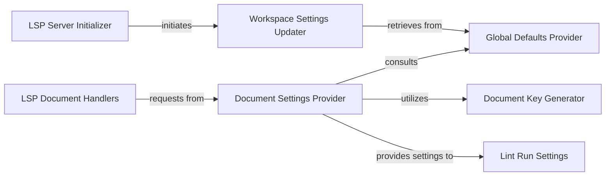

## Details

The Configuration Manager subsystem is crucial for providing a consistent and context-aware view of Ruff's operational settings to the entire Language Server. It centralizes the logic for loading, merging, and retrieving configurations from various sources, ensuring that Ruff's behavior is correctly tailored to global defaults, workspace-specific preferences, and individual document overrides.

### LSP Server Initializer
Handles the initial handshake and setup of the LSP server, including the first-time loading of workspace settings. It acts as the primary entry point for the server's configuration lifecycle.

**Related Classes/Methods**:

- <a href="https://github.com/astral-sh/ruff-lsp/blob/main/ruff_lsp/server.py" target="_blank" rel="noopener noreferrer">`ruff_lsp.server`</a>

### Workspace Settings Updater
Manages the initialization and updates of workspace-wide configuration settings. It processes global and workspace-level configurations received from the LSP client, establishing the base settings for the entire workspace.

**Related Classes/Methods**:

- <a href="https://github.com/astral-sh/ruff-lsp/blob/main/ruff_lsp/server.py" target="_blank" rel="noopener noreferrer">`ruff_lsp.server:_update_workspace_settings`</a>

### Global Defaults Provider
Establishes the baseline default configuration values for all Ruff operations. These defaults serve as the foundation upon which workspace and document-specific settings are applied.

**Related Classes/Methods**:

- <a href="https://github.com/astral-sh/ruff-lsp/blob/main/ruff_lsp/server.py" target="_blank" rel="noopener noreferrer">`ruff_lsp.server:_get_global_defaults`</a>

### Document Settings Provider
Provides a consolidated and context-aware set of Ruff settings for a specific document. It aggregates configurations from global defaults, workspace settings, and document-specific overrides, ensuring the most relevant configuration is applied for linting and other operations.

**Related Classes/Methods**:

- <a href="https://github.com/astral-sh/ruff-lsp/blob/main/ruff_lsp/server.py" target="_blank" rel="noopener noreferrer">`ruff_lsp.server:_get_settings_by_document`</a>

### Document Key Generator
Generates or retrieves a unique identifier for a document. This is crucial for the Document Settings Provider to effectively manage and retrieve document-specific setting overrides.

**Related Classes/Methods**:

- <a href="https://github.com/astral-sh/ruff-lsp/blob/main/ruff_lsp/server.py" target="_blank" rel="noopener noreferrer">`ruff_lsp.server:_get_document_key`</a>

### LSP Document Handlers
Manages LSP document-related events (e.g., did_open, did_change, did_save). These handlers trigger the retrieval of document-specific configurations when necessary for operations like linting or formatting.

**Related Classes/Methods**:

- <a href="https://github.com/astral-sh/ruff-lsp/blob/main/ruff_lsp/server.py" target="_blank" rel="noopener noreferrer">`ruff_lsp.server`</a>

### Lint Run Settings
Represents the specific configuration parameters used for a linting run. This component likely consumes the consolidated settings provided by the Document Settings Provider to configure the Ruff linter process.

**Related Classes/Methods**:

- <a href="https://github.com/astral-sh/ruff-lsp/blob/main/ruff_lsp/settings.py" target="_blank" rel="noopener noreferrer">`ruff_lsp.settings:lint_run`</a>

### [FAQ](https://github.com/CodeBoarding/GeneratedOnBoardings/tree/main?tab=readme-ov-file#faq)