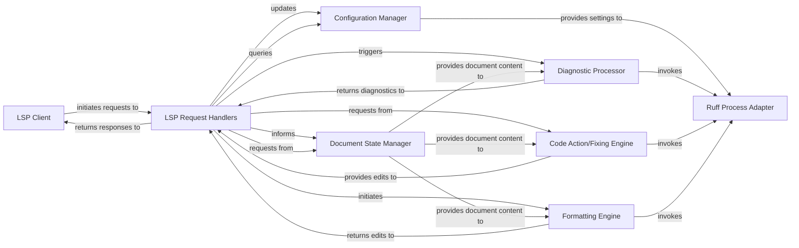

## Details

The `ruff_lsp` subsystem acts as an intermediary between an external Language Server Protocol (LSP) client and the `ruff` command-line tool. At its core, the `LSP Request Handlers` component receives and dispatches all incoming LSP messages, coordinating with the `Document State Manager` to maintain an up-to-date view of open files and the `Configuration Manager` for user-defined settings. For linting, fixing, and formatting operations, these handlers delegate to specialized engines: the `Diagnostic Processor`, `Code Action/Fixing Engine`, and `Formatting Engine`. Each of these engines, in turn, relies on the `Ruff Process Adapter` to execute `ruff` commands and interpret their output, effectively bridging the LSP server's functionality with Ruff's capabilities. This modular design ensures efficient processing of LSP requests and seamless integration with the underlying `ruff` tool.

### LSP Client [[Expand]](./LSP_Client.md)
An external Language Server Protocol client (e.g., a code editor like VS Code, Neovim, etc.) that initiates requests to and receives notifications/responses from the `ruff_lsp` server.

**Related Classes/Methods**: _None_

### LSP Request Handlers
The primary entry points for all incoming LSP messages from the client. They orchestrate the processing of requests by delegating to other internal components and formulating LSP-compliant responses.

**Related Classes/Methods**:

- <a href="https://github.com/astral-sh/ruff-lsp/blob/main/ruff_lsp/server.py" target="_blank" rel="noopener noreferrer">`ruff_lsp/server.py:initialize`</a>
- <a href="https://github.com/astral-sh/ruff-lsp/blob/main/ruff_lsp/server.py" target="_blank" rel="noopener noreferrer">`ruff_lsp/server.py:did_open`</a>
- <a href="https://github.com/astral-sh/ruff-lsp/blob/main/ruff_lsp/server.py" target="_blank" rel="noopener noreferrer">`ruff_lsp/server.py:code_action`</a>
- <a href="https://github.com/astral-sh/ruff-lsp/blob/main/ruff_lsp/server.py" target="_blank" rel="noopener noreferrer">`ruff_lsp/server.py:format_document`</a>

### Document State Manager
Responsible for maintaining the current state (content, URI, file path) of all open text and notebook documents. It provides a consistent and up-to-date view of documents to other processing components.

**Related Classes/Methods**:

- <a href="https://github.com/astral-sh/ruff-lsp/blob/main/ruff_lsp/server.py" target="_blank" rel="noopener noreferrer">`ruff_lsp/server.py:from_text_document`</a>
- <a href="https://github.com/astral-sh/ruff-lsp/blob/main/ruff_lsp/server.py" target="_blank" rel="noopener noreferrer">`ruff_lsp/server.py:from_notebook_document`</a>
- <a href="https://github.com/astral-sh/ruff-lsp/blob/main/ruff_lsp/server.py" target="_blank" rel="noopener noreferrer">`ruff_lsp/server.py:from_cell_or_text_uri`</a>
- <a href="https://github.com/astral-sh/ruff-lsp/blob/main/ruff_lsp/server.py" target="_blank" rel="noopener noreferrer">`ruff_lsp/server.py:_uri_to_fs_path`</a>

### Configuration Manager [[Expand]](./Configuration_Manager.md)
Manages workspace and document-specific settings, including Ruff's configuration. It ensures that operations like linting and formatting respect user-defined preferences.

**Related Classes/Methods**:

- <a href="https://github.com/astral-sh/ruff-lsp/blob/main/ruff_lsp/server.py" target="_blank" rel="noopener noreferrer">`ruff_lsp/server.py:_update_workspace_settings`</a>
- <a href="https://github.com/astral-sh/ruff-lsp/blob/main/ruff_lsp/server.py" target="_blank" rel="noopener noreferrer">`ruff_lsp/server.py:_get_settings_by_document`</a>

### Ruff Process Adapter
An essential abstraction layer for interacting with the external `ruff` command-line tool. It handles the execution of `ruff` subcommands (lint, fix, format, etc.) and manages their input/output, acting as the bridge to Ruff's core functionality.

**Related Classes/Methods**:

- <a href="https://github.com/astral-sh/ruff-lsp/blob/main/ruff_lsp/server.py" target="_blank" rel="noopener noreferrer">`ruff_lsp/server.py:_run_subcommand_on_document`</a>

### Diagnostic Processor
Executes linting operations using the Ruff Process Adapter, processes the raw output from Ruff, and translates it into structured LSP diagnostic messages (errors, warnings) for the client.

**Related Classes/Methods**:

- <a href="https://github.com/astral-sh/ruff-lsp/blob/main/ruff_lsp/server.py" target="_blank" rel="noopener noreferrer">`ruff_lsp/server.py:_lint_document_impl`</a>
- <a href="https://github.com/astral-sh/ruff-lsp/blob/main/ruff_lsp/server.py" target="_blank" rel="noopener noreferrer">`ruff_lsp/server.py:_group_diagnostics_by_cell`</a>

### Code Action/Fixing Engine
Identifies and generates available code actions (e.g., quick fixes, autofixes) based on diagnostics. It also applies these fixes by generating and returning LSP workspace edits.

**Related Classes/Methods**:

- <a href="https://github.com/astral-sh/ruff-lsp/blob/main/ruff_lsp/server.py" target="_blank" rel="noopener noreferrer">`ruff_lsp/server.py:_fix_document_impl`</a>
- <a href="https://github.com/astral-sh/ruff-lsp/blob/main/ruff_lsp/server.py" target="_blank" rel="noopener noreferrer">`ruff_lsp/server.py:_create_workspace_edit`</a>

### Formatting Engine
Handles code formatting requests for documents or ranges. It leverages Ruff's formatting capabilities via the Ruff Process Adapter and converts the resulting changes into LSP text edits.

**Related Classes/Methods**:

- <a href="https://github.com/astral-sh/ruff-lsp/blob/main/ruff_lsp/server.py" target="_blank" rel="noopener noreferrer">`ruff_lsp/server.py:_run_format_on_document`</a>
- <a href="https://github.com/astral-sh/ruff-lsp/blob/main/ruff_lsp/server.py" target="_blank" rel="noopener noreferrer">`ruff_lsp/server.py:_format_document_impl`</a>
- <a href="https://github.com/astral-sh/ruff-lsp/blob/main/ruff_lsp/server.py" target="_blank" rel="noopener noreferrer">`ruff_lsp/server.py:_result_to_workspace_edit`</a>

### [FAQ](https://github.com/CodeBoarding/GeneratedOnBoardings/tree/main?tab=readme-ov-file#faq)