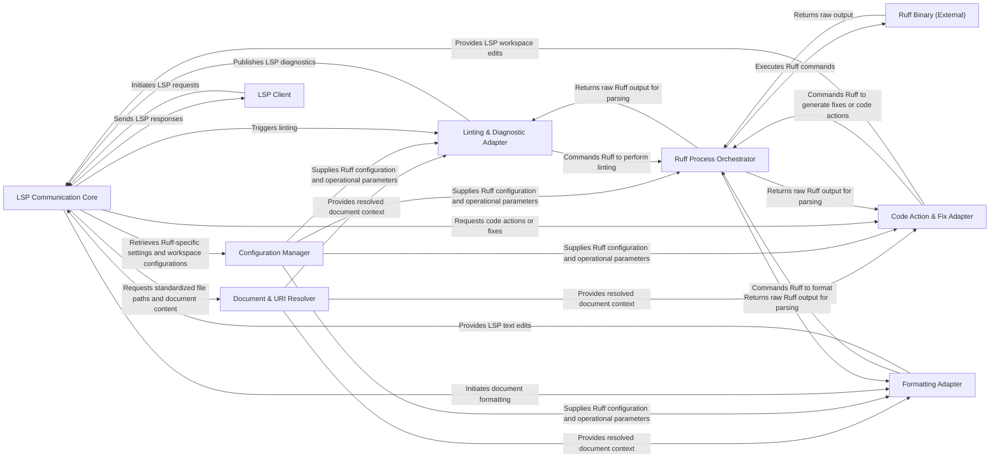

## Details

The `ruff-lsp` project functions as a Language Server Protocol (LSP) server, bridging external LSP clients (like code editors) with the Ruff linter and formatter binary. The core `LSP Communication Core` manages all client interactions, dispatching requests to specialized adapters. The `Document & URI Resolver` standardizes document inputs, while the `Configuration Manager` centralizes Ruff settings. Linting, code actions, and formatting are handled by dedicated adapters (`Linting & Diagnostic Adapter`, `Code Action & Fix Adapter`, `Formatting Adapter`), all orchestrating the `Ruff Process Orchestrator` to interact with the `Ruff Binary (External)`. This modular design ensures clear separation of concerns, enabling efficient processing of LSP requests and robust integration with Ruff.

### LSP Communication Core [[Expand]](./LSP_Communication_Core.md)
The central hub for all Language Server Protocol (LSP) interactions. It manages the server's lifecycle, parses incoming LSP requests, dispatches them to appropriate handlers, and sends responses and notifications back to the LSP client.

**Related Classes/Methods**:

- <a href="https://github.com/astral-sh/ruff-lsp/blob/main/ruff_lsp/server.py" target="_blank" rel="noopener noreferrer">`ruff_lsp/server.py:initialize`</a>
- <a href="https://github.com/astral-sh/ruff-lsp/blob/main/ruff_lsp/server.py" target="_blank" rel="noopener noreferrer">`ruff_lsp/server.py:did_open`</a>
- <a href="https://github.com/astral-sh/ruff-lsp/blob/main/ruff_lsp/server.py" target="_blank" rel="noopener noreferrer">`ruff_lsp/server.py:did_change`</a>
- <a href="https://github.com/astral-sh/ruff-lsp/blob/main/ruff_lsp/server.py" target="_blank" rel="noopener noreferrer">`ruff_lsp/server.py:hover`</a>
- <a href="https://github.com/astral-sh/ruff-lsp/blob/main/ruff_lsp/server.py" target="_blank" rel="noopener noreferrer">`ruff_lsp/server.py:code_action`</a>
- <a href="https://github.com/astral-sh/ruff-lsp/blob/main/ruff_lsp/server.py" target="_blank" rel="noopener noreferrer">`ruff_lsp/server.py:format_document`</a>

### Document & URI Resolver
Standardizes various LSP document and URI formats (e.g., text documents, notebook cells) into internal representations, primarily file paths, that Ruff can process. Ensures consistent data handling across different document types.

**Related Classes/Methods**:

- <a href="https://github.com/astral-sh/ruff-lsp/blob/main/ruff_lsp/server.py" target="_blank" rel="noopener noreferrer">`ruff_lsp/server.py:from_uri`</a>
- <a href="https://github.com/astral-sh/ruff-lsp/blob/main/ruff_lsp/server.py" target="_blank" rel="noopener noreferrer">`ruff_lsp/server.py:from_text_document`</a>
- <a href="https://github.com/astral-sh/ruff-lsp/blob/main/ruff_lsp/server.py" target="_blank" rel="noopener noreferrer">`ruff_lsp/server.py:from_notebook_document`</a>

### Configuration Manager [[Expand]](./Configuration_Manager.md)
Manages the loading, updating, and retrieval of Ruff-specific settings. It consolidates configurations from global defaults, workspace settings, and document-specific overrides, providing a unified view to other components.

**Related Classes/Methods**:

- <a href="https://github.com/astral-sh/ruff-lsp/blob/main/ruff_lsp/server.py" target="_blank" rel="noopener noreferrer">`ruff_lsp/server.py:_update_workspace_settings`</a>
- <a href="https://github.com/astral-sh/ruff-lsp/blob/main/ruff_lsp/server.py" target="_blank" rel="noopener noreferrer">`ruff_lsp/server.py:_get_settings_by_document`</a>
- <a href="https://github.com/astral-sh/ruff-lsp/blob/main/ruff_lsp/settings.py" target="_blank" rel="noopener noreferrer">`ruff_lsp/settings.py:lint_run`</a>

### Ruff Process Orchestrator
Abstracts the complexities of discovering, executing, and managing the external Ruff binary. It handles subprocess creation, command-line argument construction, and version checking, ensuring Ruff commands are executed correctly.

**Related Classes/Methods**:

- <a href="https://github.com/astral-sh/ruff-lsp/blob/main/ruff_lsp/server.py" target="_blank" rel="noopener noreferrer">`ruff_lsp/server.py:_find_ruff_binary`</a>
- <a href="https://github.com/astral-sh/ruff-lsp/blob/main/ruff_lsp/server.py" target="_blank" rel="noopener noreferrer">`ruff_lsp/server.py:_executable_version`</a>
- <a href="https://github.com/astral-sh/ruff-lsp/blob/main/ruff_lsp/server.py" target="_blank" rel="noopener noreferrer">`ruff_lsp/server.py:run_path`</a>

### Linting & Diagnostic Adapter
Orchestrates the linting process. It invokes the Ruff Process Orchestrator to run Ruff for linting, then parses Ruff's raw output into structured LSP diagnostic messages (severity, codes, tags) for client consumption.

**Related Classes/Methods**:

- <a href="https://github.com/astral-sh/ruff-lsp/blob/main/ruff_lsp/server.py" target="_blank" rel="noopener noreferrer">`ruff_lsp/server.py:_lint_document_impl`</a>
- <a href="https://github.com/astral-sh/ruff-lsp/blob/main/ruff_lsp/server.py" target="_blank" rel="noopener noreferrer">`ruff_lsp/server.py:_parse_output`</a>

### Code Action & Fix Adapter
Manages the generation and application of code actions and fixes provided by Ruff. It transforms Ruff's fix suggestions into LSP-compliant workspace edits, enabling automated code modifications in the client.

**Related Classes/Methods**:

- <a href="https://github.com/astral-sh/ruff-lsp/blob/main/ruff_lsp/server.py" target="_blank" rel="noopener noreferrer">`ruff_lsp/server.py:_fix_document_impl`</a>
- <a href="https://github.com/astral-sh/ruff-lsp/blob/main/ruff_lsp/server.py" target="_blank" rel="noopener noreferrer">`ruff_lsp/server.py:_result_to_workspace_edit`</a>
- <a href="https://github.com/astral-sh/ruff-lsp/blob/main/ruff_lsp/server.py" target="_blank" rel="noopener noreferrer">`ruff_lsp/server.py:_create_workspace_edit`</a>

### Formatting Adapter
Handles document formatting requests by invoking Ruff's formatting capabilities. It processes the formatted source code returned by Ruff and converts it into LSP text edits, which are then applied by the client.

**Related Classes/Methods**:

- <a href="https://github.com/astral-sh/ruff-lsp/blob/main/ruff_lsp/server.py" target="_blank" rel="noopener noreferrer">`ruff_lsp/server.py:_format_document_impl`</a>
- <a href="https://github.com/astral-sh/ruff-lsp/blob/main/ruff_lsp/server.py" target="_blank" rel="noopener noreferrer">`ruff_lsp/server.py:_fixed_source_to_edits`</a>

### LSP Client [[Expand]](./LSP_Client.md)
External Language Server Protocol client (e.g., a code editor).

**Related Classes/Methods**: _None_

### Ruff Binary (External)
The external Ruff linter and formatter executable.

**Related Classes/Methods**: _None_

### [FAQ](https://github.com/CodeBoarding/GeneratedOnBoardings/tree/main?tab=readme-ov-file#faq)