```mermaid
graph LR
    CLI_Entrypoint["CLI Entrypoint"]
    Command_Dispatcher_Adapter["Command Dispatcher / Adapter"]
    Registry_Proxy["Registry Proxy"]
    Interceptor_Builder["Interceptor Builder"]
    Interceptor_Factory["Interceptor Factory"]
    NPM_Interceptor["NPM Interceptor"]
    PIP_Interceptor["PIP Interceptor"]
    User_Interaction_UI["User‑Interaction UI"]
    Unclassified["Unclassified"]
    CLI_Entrypoint -- "initializes package manager via initializePackageManager" --> Command_Dispatcher_Adapter
    CLI_Entrypoint -- "starts the MITM proxy" --> Registry_Proxy
    Command_Dispatcher_Adapter -- "routes all registry HTTP(S) requests through proxy (URL rewriting)" --> Registry_Proxy
    Registry_Proxy -- "asks factory to create appropriate interceptor" --> Interceptor_Factory
    Interceptor_Factory -- "instantiates concrete interceptor (npm or pip)" --> NPM_Interceptor
    Interceptor_Factory -- "instantiates concrete interceptor (npm or pip)" --> PIP_Interceptor
    NPM_Interceptor -- "uses abstract methods defined in builder" --> Interceptor_Builder
    PIP_Interceptor -- "uses abstract methods defined in builder" --> Interceptor_Builder
    Interceptor_Builder -- "emits malwareBlocked event" --> User_Interaction_UI
    CLI_Entrypoint -- "CLI prompts UI for messages and receives decision (continue/abort)" --> User_Interaction_UI
```

## Details

The Safe‑Chain tool is driven by a thin CLI entry‑point that parses user commands, configures the environment and launches a MITM Registry Proxy. The proxy intercepts every registry request and, via the Interceptor Factory, creates an ecosystem‑specific interceptor (npm or pip). Each interceptor inherits from the abstract Interceptor Builder, which defines the request/response contract and provides a global `malwareBlocked` event. When malicious content is detected, the interceptor calls `emitMalwareBlocked`; the User‑Interaction UI (the console UI module) listens to this event, renders a coloured warning and prompts the user for a continue/abort decision. The CLI orchestrates the flow, invoking the UI for all console output and handling the user’s response, while the Command Dispatcher supplies the appropriate package‑manager adapter that rewrites registry URLs so that all traffic passes through the proxy. This layered architecture cleanly separates command‑line orchestration, proxy interception, ecosystem‑specific security logic, and user interaction, enabling straightforward documentation and a clear, direction‑consistent component diagram.

### CLI Entrypoint
Parses the user’s command line, initialises the configuration, selects the appropriate Package‑Manager adapter, starts the Registry Proxy and drives the User‑Interaction UI for prompts and final summary.

**Related Classes/Methods**:

- <a href="https://github.com/AikidoSec/safe-chain/blob/main/packages/safe-chain/bin/safe-chain.js" target="_blank" rel="noopener noreferrer">`packages/safe-chain/bin/safe-chain.js`</a>

### Command Dispatcher / Adapter
Detects the requested ecosystem (npm, pip, …) and returns a concrete Package‑Manager object that implements runCommand, isSupportedCommand and getDependencyUpdatesForCommand.

**Related Classes/Methods**:

- <a href="https://github.com/AikidoSec/safe-chain/blob/main/packages/safe-chain/src/packagemanager/currentPackageManager.js" target="_blank" rel="noopener noreferrer">`packages/safe-chain/src/packagemanager/currentPackageManager.js`</a>

### Registry Proxy
Acts as a thin MITM HTTP(S) proxy for all registry traffic. For each request it asks the Interceptor Factory for a concrete interceptor, runs the interceptor’s request/response hooks, and forwards the (possibly mutated) response to the original client.

**Related Classes/Methods**:

- <a href="https://github.com/AikidoSec/safe-chain/blob/main/packages/safe-chain/src/registryProxy/registryProxy.js" target="_blank" rel="noopener noreferrer">`packages/safe-chain/src/registryProxy/registryProxy.js`</a>

### Interceptor Builder
Defines the interceptor contract (onRequest, onResponse, block, modifyHeaders, modifyBody) and provides the helper emitMalwareBlocked that fires a global malwareBlocked event.

**Related Classes/Methods**:

- <a href="https://github.com/AikidoSec/safe-chain/blob/main/packages/safe-chain/src/registryProxy/interceptors/interceptorBuilder.js" target="_blank" rel="noopener noreferrer">`packages/safe-chain/src/registryProxy/interceptors/interceptorBuilder.js`</a>

### Interceptor Factory
Inspects the request URL, decides which ecosystem (npm or pip) it belongs to and returns a new instance of the matching concrete interceptor.

**Related Classes/Methods**:

- <a href="https://github.com/AikidoSec/safe-chain/blob/main/packages/safe-chain/src/registryProxy/interceptors/createInterceptorForEcoSystem.js" target="_blank" rel="noopener noreferrer">`packages/safe-chain/src/registryProxy/interceptors/createInterceptorForEcoSystem.js`</a>

### NPM Interceptor
Implements npm‑specific logic: parses the npm package URL, queries the malware scanner, blocks malicious packages, applies a minimum‑age rule and optionally mutates the response.

**Related Classes/Methods**:

- <a href="https://github.com/AikidoSec/safe-chain/blob/main/packages/safe-chain/src/registryProxy/interceptors/npm/npmInterceptor.js" target="_blank" rel="noopener noreferrer">`packages/safe-chain/src/registryProxy/interceptors/npm/npmInterceptor.js`</a>

### PIP Interceptor
Implements pip‑specific logic: parses pip URLs, queries the malware scanner and blocks malicious packages.

**Related Classes/Methods**:

- <a href="https://github.com/AikidoSec/safe-chain/blob/main/packages/safe-chain/src/registryProxy/interceptors/pipInterceptor.js" target="_blank" rel="noopener noreferrer">`packages/safe-chain/src/registryProxy/interceptors/pipInterceptor.js`</a>

### User‑Interaction UI
Subscribes to the global malwareBlocked event, renders coloured warnings on the console, prompts the user (continue/abort) and records blocked packages for the final CLI summary.

**Related Classes/Methods**:

- <a href="https://github.com/AikidoSec/safe-chain/blob/main/packages/safe-chain/src/environment/userInteraction.js" target="_blank" rel="noopener noreferrer">`packages/safe-chain/src/environment/userInteraction.js`</a>

### Unclassified
Component for all unclassified files and utility functions (Utility functions/External Libraries/Dependencies)

**Related Classes/Methods**: _None_

### [FAQ](https://github.com/CodeBoarding/GeneratedOnBoardings/tree/main?tab=readme-ov-file#faq)