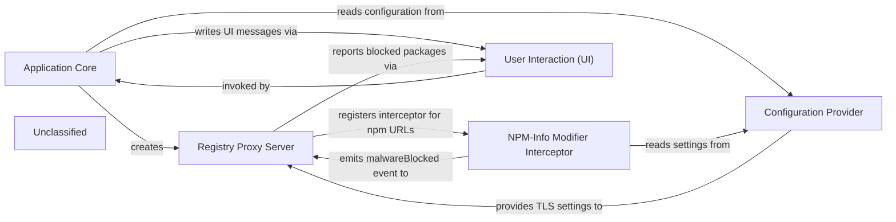

## Details

Safe‑Chain Proxy Subsystem – The Application Core (main.js) orchestrates a short‑lived MITM proxy that intercepts npm‑registry traffic. It creates the Registry Proxy Server (registryProxy.js), which starts an HTTP/HTTPS server, injects the NPM‑Info Modifier Interceptor for npm URLs, and supplies proxy‑specific environment variables. The interceptor, driven by the Configuration Provider (settings.js), rewrites request headers and strips package versions that are newer than the configured minimum age, emitting a `malwareBlocked` event whenever a version is filtered. The proxy records these events, and after the wrapped package‑manager command finishes, the core asks the proxy to verify that no malicious packages were blocked. All user‑facing messages—errors, buffered logs, blocked‑package summaries, and warnings about suppressed versions—are emitted through the User Interaction component (userInteraction.js). The whole flow is started and stopped directly by the core, without any separate lifecycle manager or event bus, matching the actual implementation.

### Application Core
Parses CLI arguments, creates the proxy, starts/stops it, runs the selected package‑manager command, buffers logs, checks the proxy for blocked packages, and drives all UI output.

**Related Classes/Methods**:

- <a href="https://github.com/AikidoSec/safe-chain/blob/main/packages/safe-chain/src/main.js" target="_blank" rel="noopener noreferrer">`packages.safe-chain.src.main.main`</a>

### Registry Proxy Server
Implements the MITM HTTP/HTTPS server, wires the interceptor chain, emits malwareBlocked events, supplies proxy‑specific environment variables, and merges them with the caller’s environment.

**Related Classes/Methods**:

- <a href="https://github.com/AikidoSec/safe-chain/blob/main/packages/safe-chain/src/registryProxy/registryProxy.js" target="_blank" rel="noopener noreferrer">`packages.safe-chain.src.registryProxy.registryProxy.createSafeChainProxy`</a>

### NPM‑Info Modifier Interceptor
Intercepts npm‑registry requests/responses, forces full JSON metadata, removes package versions newer than the configured minimum‑package‑age, tracks suppressed versions, and emits malwareBlocked when a version is filtered out.

**Related Classes/Methods**:

- <a href="https://github.com/AikidoSec/safe-chain/blob/main/packages/safe-chain/src/registryProxy/interceptors/npm/modifyNpmInfo.js" target="_blank" rel="noopener noreferrer">`packages.safe-chain.src.registryProxy.interceptors.npm.modifyNpmInfo.modifyNpmInfoResponse`</a>

### Configuration Provider
Centralises runtime settings (e.g., minimumPackageAgeHours, TLS‑cert path) that are consumed by the Interceptor and by the Proxy.

**Related Classes/Methods**:

- <a href="https://github.com/AikidoSec/safe-chain/blob/main/packages/safe-chain/src/config/settings.js" target="_blank" rel="noopener noreferrer">`packages.safe-chain.src.config.settings`</a>

### User Interaction (UI)
Formats and prints all user‑facing messages: errors, verbose logs, buffered output, blocked‑package summaries, and the final “no‑malware” or “malware‑blocked” reports.

**Related Classes/Methods**:

- <a href="https://github.com/AikidoSec/safe-chain/blob/main/packages/safe-chain/src/environment/userInteraction.js" target="_blank" rel="noopener noreferrer">`packages.safe-chain.src.environment.userInteraction.ui`</a>

### Unclassified
Component for all unclassified files and utility functions (Utility functions/External Libraries/Dependencies)

**Related Classes/Methods**: _None_

### [FAQ](https://github.com/CodeBoarding/GeneratedOnBoardings/tree/main?tab=readme-ov-file#faq)