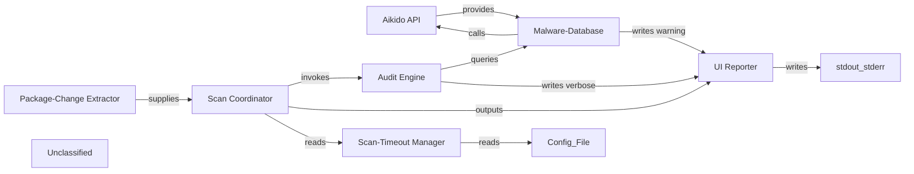

## Details

The Safe‑Chain scanning subsystem orchestrates a security check for package‑manager install commands. An Aikido API client fetches a remote malware‑prediction JSON and its ETag, which the Malware‑Database component caches locally and exposes lookup helpers and status constants. When a user runs an install command, the Scan Coordinator validates the command, obtains a structured list of package changes from the Package‑Change Extractor, and forwards them to the Audit Engine. The Audit Engine queries the Malware‑Database to flag malicious packages, records audit statistics, and emits verbose diagnostics via the UI Reporter. The Scan Coordinator enforces a configurable timeout (read by the Scan‑Timeout Manager), outputs results through the UI Reporter, and aborts the install if any disallowed changes are detected. This layered flow isolates external I/O, caching, and business logic, providing a clear, testable architecture for malware detection in package installations.

### Aikido API [[Expand]](./Aikido_API.md)
Client that contacts the remote Aikido service to fetch the latest malware‑prediction JSON and its ETag version.

**Related Classes/Methods**: _None_

### Malware-Database
Cache‑aside storage for the malware list, exposing status constants and lookup helpers such as getPackageStatus and isMalware.

**Related Classes/Methods**: _None_

### Package-Change Extractor
Facade that parses a raw package‑manager CLI invocation and returns a list of change objects {name, version, type}.

**Related Classes/Methods**: _None_

### Audit Engine
Evaluates each package change against the Malware‑Database, builds allowed/disallowed change sets, updates audit statistics, and writes verbose diagnostics.

**Related Classes/Methods**: _None_

### Scan Coordinator
Top‑level orchestrator that validates commands, obtains changes, invokes the Audit Engine, respects a configurable timeout, and drives UI output.

**Related Classes/Methods**: _None_

### UI Reporter
Centralised façade for all console output (information, warning, error, verbose, and final abort message).

**Related Classes/Methods**: _None_

### Scan-Timeout Manager
Reads the user configuration file to provide the maximum allowed duration for a scan.

**Related Classes/Methods**: _None_

### Unclassified
Component for all unclassified files and utility functions (Utility functions/External Libraries/Dependencies)

**Related Classes/Methods**: _None_

### [FAQ](https://github.com/CodeBoarding/GeneratedOnBoardings/tree/main?tab=readme-ov-file#faq)