```mermaid
graph LR
    CLI_Entrypoint["CLI Entrypoint"]
    Orchestrator["Orchestrator"]
    Configuration_Manager["Configuration Manager"]
    Package_Manager_Dispatcher["Package-Manager Dispatcher"]
    Package_Manager_Adapter_npm_["Package-Manager Adapter (npm)"]
    Scanning_Audit["Scanning / Audit"]
    Registry_Proxy_Server["Registry-Proxy – Server"]
    User_Interaction_UI_Façade["User-Interaction / UI Façade"]
    Unclassified["Unclassified"]
    CLI_Entrypoint -- "calls" --> Configuration_Manager
    CLI_Entrypoint -- "calls" --> Package_Manager_Dispatcher
    CLI_Entrypoint -- "invokes" --> Orchestrator
    Orchestrator -- "starts/stops" --> Registry_Proxy_Server
    Orchestrator -- "reads settings from" --> Configuration_Manager
    Orchestrator -- "delegates scanning to" --> Scanning_Audit
    Orchestrator -- "buffers UI via" --> User_Interaction_UI_Façade
    Orchestrator -- "executes adapter via" --> Package_Manager_Dispatcher
    Package_Manager_Dispatcher -- "returns adapter instance to" --> Package_Manager_Adapter_npm_
    Package_Manager_Adapter_npm_ -- "pre‑run scan" --> Scanning_Audit
    Package_Manager_Adapter_npm_ -- "injects proxy env" --> Registry_Proxy_Server
    Registry_Proxy_Server -- "records blocked packages" --> Scanning_Audit
    Scanning_Audit -- "prints audit stats" --> User_Interaction_UI_Façade
    Registry_Proxy_Server -- "reports blocked packages" --> User_Interaction_UI_Façade
    click Orchestrator href "https://github.com/CodeBoarding/GeneratedOnBoardings/blob/main/safe-chain/Orchestrator.md" "Details"
```

## Details

Safe‑Chain is a command‑line security shim that intercepts package‑manager invocations. The CLI Entrypoint scripts (bin/*.js) parse user arguments, initialise the immutable Configuration Manager, select the appropriate Package‑Manager Dispatcher, and hand control to the Orchestrator (src/main.js). The Orchestrator launches a local MITM Registry‑Proxy server, optionally runs a Scanning/Audit step against the Aikido Intel API, and then delegates the actual install command to the concrete Package‑Manager Adapter (e.g., the npm adapter). The adapter injects the proxy’s environment variables so that all registry traffic is routed through the proxy, where interceptors can block malicious packages and enforce policy (e.g., minimum package age). Throughout execution the User‑Interaction/UI Façade buffers child‑process output, displays coloured status messages, and, on detection of blocked packages, presents a concise summary and aborts the install. Finally, the Orchestrator stops the proxy, verifies that no malicious downloads occurred, reports audit statistics, and returns the appropriate exit code to the shell.

### CLI Entrypoint
Thin wrappers that parse process.argv, initialise CLI arguments, select the ecosystem, and invoke the Orchestrator.

**Related Classes/Methods**:

- <a href="https://github.com/AikidoSec/safe-chain/blob/main/packages/safe-chain/bin/safe-chain.js" target="_blank" rel="noopener noreferrer">`bin/safe-chain.js`</a>
- <a href="https://github.com/AikidoSec/safe-chain/blob/main/packages/safe-chain/bin/aikido-npm.js" target="_blank" rel="noopener noreferrer">`bin/aikido-npm.js`</a>

### Orchestrator [[Expand]](./Orchestrator.md)
Central coordinator – starts the Registry‑Proxy, decides whether a scan is required, buffers UI output, runs the selected Package‑Manager Adapter, validates the proxy results and returns the final exit code.

**Related Classes/Methods**:

- <a href="https://github.com/AikidoSec/safe-chain/blob/main/packages/safe-chain/src/main.js" target="_blank" rel="noopener noreferrer">`src/main.js:main`</a>

### Configuration Manager
Merges CLI flags, environment variables and user config into a single immutable settings object (logging level, ecosystem, minimum‑package‑age, etc.).

**Related Classes/Methods**:

- <a href="https://github.com/AikidoSec/safe-chain/blob/main/packages/safe-chain/src/config/settings.js" target="_blank" rel="noopener noreferrer">`src/config/settings.js`</a>

### Package-Manager Dispatcher
Detects the invoked package manager (npm, yarn, pnpm, bun, pip, …) and returns the concrete Adapter instance.

**Related Classes/Methods**:

- <a href="https://github.com/AikidoSec/safe-chain/blob/main/packages/safe-chain/src/packagemanager/currentPackageManager.js" target="_blank" rel="noopener noreferrer">`src/packagemanager/currentPackageManager.js`</a>

### Package-Manager Adapter (npm)
Translates the original npm command, optionally runs a Scan, injects proxy‑environment variables, and finally spawns the real npm binary.

**Related Classes/Methods**:

- <a href="https://github.com/AikidoSec/safe-chain/blob/main/packages/safe-chain/src/packagemanager/npm/createPackageManager.js" target="_blank" rel="noopener noreferrer">`src/packagemanager/npm/createPackageManager.js`</a>
- <a href="https://github.com/AikidoSec/safe-chain/blob/main/packages/safe-chain/src/packagemanager/npm/runNpmCommand.js" target="_blank" rel="noopener noreferrer">`src/packagemanager/npm/runNpmCommand.js`</a>

### Scanning / Audit
Determines whether a command should be scanned, queries the Aikido Intel API, aggregates audit statistics and returns a verdict (allow / block).

**Related Classes/Methods**:

- <a href="https://github.com/AikidoSec/safe-chain/blob/main/packages/safe-chain/src/scanning/index.js" target="_blank" rel="noopener noreferrer">`src/scanning/index.js`</a>

### Registry-Proxy – Server
MITM HTTP/HTTPS proxy that intercepts registry requests, applies interceptors (e.g., version‑age suppression), records blocked downloads and exposes verification helpers.

**Related Classes/Methods**:

- <a href="https://github.com/AikidoSec/safe-chain/blob/main/packages/safe-chain/src/registryProxy/registryProxy.js" target="_blank" rel="noopener noreferrer">`src/registryProxy/registryProxy.js`</a>

### User-Interaction / UI Façade
Buffers child‑process stdout/stderr, prints coloured status messages, prompts on malware detection and reports the final summary.

**Related Classes/Methods**:

- <a href="https://github.com/AikidoSec/safe-chain/blob/main/packages/safe-chain/src/environment/userInteraction.js" target="_blank" rel="noopener noreferrer">`src/environment/userInteraction.js`</a>

### Unclassified
Component for all unclassified files and utility functions (Utility functions/External Libraries/Dependencies)

**Related Classes/Methods**: _None_

### [FAQ](https://github.com/CodeBoarding/GeneratedOnBoardings/tree/main?tab=readme-ov-file#faq)