```mermaid
graph LR
    CLI_Entrypoint["CLI Entrypoint"]
    Config_Manager["Config Manager"]
    Orchestrator["Orchestrator"]
    Local_Proxy_Server["Local Proxy Server"]
    Malware_Scanner_Aikido_API["Malware Scanner & Aikido API"]
    Adapter_Factory["Adapter Factory"]
    Interceptors["Interceptors"]
    User_Interaction_façade["User‑Interaction façade"]
    Unclassified["Unclassified"]
    CLI_Entrypoint -- "provides raw argv → config resolves Settings" --> Config_Manager
    CLI_Entrypoint -- "calls main(args) to start execution" --> Orchestrator
    Orchestrator -- "createSafeChainProxy() → startServer()" --> Local_Proxy_Server
    Orchestrator -- "initializePackageManager(pkgMgrName) → getPackageManager()" --> Adapter_Factory
    Orchestrator -- "scanCommand(args) → fetchMalwareDatabase() / auditChanges()" --> Malware_Scanner_Aikido_API
    Orchestrator -- "ui.* calls for all console output" --> User_Interaction_façade
    Local_Proxy_Server -- "createInterceptorForUrl(url) → interceptor.on('malwareBlocked')" --> Interceptors
    Interceptors -- "interceptor queries scanner for package reputation" --> Malware_Scanner_Aikido_API
    Interceptors -- "ui.writeWarning / ui.writeInformation on blocked packages" --> User_Interaction_façade
    Malware_Scanner_Aikido_API -- "ui.writeInformation on scan results / errors" --> User_Interaction_façade
    Adapter_Factory -- "adapter supplies package URLs that interceptors will see" --> Interceptors
    Orchestrator -- "ui.writeExitWithoutInstallingMaliciousPackages()" --> User_Interaction_façade
    click Orchestrator href "https://github.com/CodeBoarding/GeneratedOnBoardings/blob/main/safe-chain/Orchestrator.md" "Details"
    click Local_Proxy_Server href "https://github.com/CodeBoarding/GeneratedOnBoardings/blob/main/safe-chain/Local_Proxy_Server.md" "Details"
    click Malware_Scanner_Aikido_API href "https://github.com/CodeBoarding/GeneratedOnBoardings/blob/main/safe-chain/Malware_Scanner_Aikido_API.md" "Details"
    click Interceptors href "https://github.com/CodeBoarding/GeneratedOnBoardings/blob/main/safe-chain/Interceptors.md" "Details"
```

## Details

Safe‑Chain is a command‑line orchestrated security gateway for JavaScript‑ and Python‑based package managers. The CLI Entrypoint parses user input, extracts safe‑chain flags and forwards the remaining arguments to the Orchestrator. The Orchestrator loads the Config Manager to build a unified Settings object, starts a MITM Local Proxy Server with attached Interceptors, obtains a concrete Package‑Manager Adapter via the Adapter Factory, and runs a Malware Scan through the Aikido API. Interceptors inspect each registry request, consult the Malware Scanner, emit events and record blocked downloads. All console output—including status messages, warnings, scan results, and final exit notices—is funneled through the User‑Interaction façade, which buffers logs during execution and reports any malicious packages before exiting without installing them. This clear separation of concerns yields a diagram‑friendly flow where each component has a single, verifiable source file.

### CLI Entrypoint
Parses top‑level commands, extracts `--safe‑chain‑*` flags, and forwards the remaining arguments to the Orchestrator.

**Related Classes/Methods**:

- <a href="https://github.com/AikidoSec/safe-chain/blob/main/packages/safe-chain/bin/safe-chain.js" target="_blank" rel="noopener noreferrer">`packages/safe-chain/bin/safe-chain.js`</a>

### Config Manager
Merges CLI flags, environment variables and an optional JSON config into a single Settings object.

**Related Classes/Methods**:

- <a href="https://github.com/AikidoSec/safe-chain/blob/main/packages/safe-chain/src/config/cliArguments.js" target="_blank" rel="noopener noreferrer">`packages/safe-chain/src/config/cliArguments.js`</a>
- <a href="https://github.com/AikidoSec/safe-chain/blob/main/packages/safe-chain/src/config/environmentVariables.js" target="_blank" rel="noopener noreferrer">`packages/safe-chain/src/config/environmentVariables.js`</a>
- <a href="https://github.com/AikidoSec/safe-chain/blob/main/packages/safe-chain/src/config/configFile.js" target="_blank" rel="noopener noreferrer">`packages/safe-chain/src/config/configFile.js`</a>
- <a href="https://github.com/AikidoSec/safe-chain/blob/main/packages/safe-chain/src/config/settings.js" target="_blank" rel="noopener noreferrer">`packages/safe-chain/src/config/settings.js`</a>

### Orchestrator [[Expand]](./Orchestrator.md)
Central coordinator that creates the proxy, builds interceptors, obtains the appropriate package‑manager adapter, runs the malware scan, buffers UI output, verifies blocked downloads and reports results through the UI façade.

**Related Classes/Methods**:

- <a href="https://github.com/AikidoSec/safe-chain/blob/main/packages/safe-chain/src/main.js" target="_blank" rel="noopener noreferrer">`packages/safe-chain/src/main.js`</a>

### Local Proxy Server [[Expand]](./Local_Proxy_Server.md)
MITM HTTP/HTTPS proxy that forwards traffic through selected Interceptors and records blocked requests.

**Related Classes/Methods**:

- <a href="https://github.com/AikidoSec/safe-chain/blob/main/packages/safe-chain/src/registryProxy/registryProxy.js" target="_blank" rel="noopener noreferrer">`packages/safe-chain/src/registryProxy/registryProxy.js`</a>

### Malware Scanner & Aikido API [[Expand]](./Malware_Scanner_Aikido_API.md)
Fetches the latest malware‑prediction JSON from the Aikido service, caches it locally, and evaluates the list of packages supplied by the adapter.

**Related Classes/Methods**:

- <a href="https://github.com/AikidoSec/safe-chain/blob/main/packages/safe-chain/src/api/aikido.js" target="_blank" rel="noopener noreferrer">`packages/safe-chain/src/api/aikido.js`</a>
- <a href="https://github.com/AikidoSec/safe-chain/blob/main/packages/safe-chain/src/scanning/index.js" target="_blank" rel="noopener noreferrer">`packages/safe-chain/src/scanning/index.js`</a>

### Adapter Factory
Concrete factory that creates a Package‑Manager Adapter (npm, yarn, pip, …) which knows how to parse the command line, discover packages and expose a uniform `runCommand` API.

**Related Classes/Methods**:

- <a href="https://github.com/AikidoSec/safe-chain/blob/main/packages/safe-chain/src/packagemanager/currentPackageManager.js" target="_blank" rel="noopener noreferrer">`packages/safe-chain/src/packagemanager/currentPackageManager.js`</a>

### Interceptors [[Expand]](./Interceptors.md)
Plug‑in points inside the proxy that inspect each request/response, consult the Malware Scanner for known malicious packages, emit `malwareBlocked` events and let the proxy record blocked downloads.

**Related Classes/Methods**:

- <a href="https://github.com/AikidoSec/safe-chain/blob/main/packages/safe-chain/src/registryProxy/interceptors/createInterceptorForEcoSystem.js" target="_blank" rel="noopener noreferrer">`packages/safe-chain/src/registryProxy/interceptors/createInterceptorForEcoSystem.js`</a>
- <a href="https://github.com/AikidoSec/safe-chain/blob/main/packages/safe-chain/src/registryProxy/interceptors/interceptorBuilder.js" target="_blank" rel="noopener noreferrer">`packages/safe-chain/src/registryProxy/interceptors/interceptorBuilder.js`</a>

### User‑Interaction façade
Unified console UI layer providing primitives (`writeInformation`, `writeWarning`, `writeError`, `writeExitWithoutInstallingMaliciousPackages`, etc.) used by all components to present a consistent experience.

**Related Classes/Methods**:

- <a href="https://github.com/AikidoSec/safe-chain/blob/main/packages/safe-chain/src/environment/userInteraction.js" target="_blank" rel="noopener noreferrer">`packages/safe-chain/src/environment/userInteraction.js`</a>

### Unclassified
Component for all unclassified files and utility functions (Utility functions/External Libraries/Dependencies)

**Related Classes/Methods**: _None_

### [FAQ](https://github.com/CodeBoarding/GeneratedOnBoardings/tree/main?tab=readme-ov-file#faq)