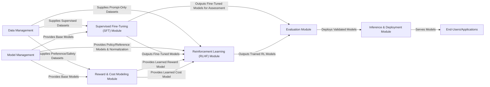

## Details

The `safe-rlhf` project is structured around a modular pipeline for training and deploying safe reinforcement learning models. The `Data Management` component serves as the initial entry point, providing various datasets to downstream modules. `Model Management` initializes and supplies base language models and tokenizers. The `Supervised Fine-Tuning (SFT) Module` performs initial model training, with its outputs feeding into both the `Reinforcement Learning (RLHF) Module` and the `Evaluation Module`. Concurrently, the `Reward & Cost Modeling Module` trains specialized models for preference and safety, which are then utilized by the `Reinforcement Learning (RLHF) Module` to align the language model with defined constraints. The `Evaluation Module` assesses the performance of all trained models, and validated models are subsequently deployed via the `Inference & Deployment Module`. Finally, the `Inference & Deployment Module` serves these models to `End-Users/Applications`, enabling real-time inference and interactive demonstrations. This architecture ensures a clear separation of concerns, facilitating iterative development and robust model deployment.

### Data Management
Manages loading, preprocessing, and batching of all datasets (supervised, preference, prompt-only).

**Related Classes/Methods**:

- <a href="https://github.com/PKU-Alignment/safe-rlhf/blob/main/safe_rlhf/datasets" target="_blank" rel="noopener noreferrer">`safe_rlhf.datasets`</a>

### Model Management
Handles loading and initialization of pre-trained language models and tokenizers, including value normalization.

**Related Classes/Methods**:

- <a href="https://github.com/PKU-Alignment/safe-rlhf/blob/main/safe_rlhf/models" target="_blank" rel="noopener noreferrer">`safe_rlhf.models`</a>

### Supervised Fine-Tuning (SFT) Module
Performs initial supervised fine-tuning of base language models.

**Related Classes/Methods**:

- <a href="https://github.com/PKU-Alignment/safe-rlhf/blob/main/safe_rlhf/finetune" target="_blank" rel="noopener noreferrer">`safe_rlhf.finetune`</a>

### Reward & Cost Modeling Module
Trains specialized models to predict human preferences (rewards) and safety violations (costs).

**Related Classes/Methods**:

- <a href="https://github.com/PKU-Alignment/safe-rlhf/blob/main/safe_rlhf/values" target="_blank" rel="noopener noreferrer">`safe_rlhf.values`</a>

### Reinforcement Learning (RLHF) Module
Implements various RL algorithms (PPO, DPO, PPO-Lag) to align the language model with preferences and safety constraints.

**Related Classes/Methods**:

- <a href="https://github.com/PKU-Alignment/safe-rlhf/blob/main/safe_rlhf/algorithms" target="_blank" rel="noopener noreferrer">`safe_rlhf.algorithms`</a>
- <a href="https://github.com/PKU-Alignment/safe-rlhf/blob/main/safe_rlhf/trainers/rl_trainer.py" target="_blank" rel="noopener noreferrer">`safe_rlhf.trainers.rl_trainer`</a>

### Evaluation Module
Provides a comprehensive suite for evaluating the performance of all trained models across various metrics.

**Related Classes/Methods**:

- <a href="https://github.com/PKU-Alignment/safe-rlhf/blob/main/safe_rlhf/evaluate" target="_blank" rel="noopener noreferrer">`safe_rlhf.evaluate`</a>

### Inference & Deployment Module
Offers interfaces for deploying and serving trained models for real-time inference and interactive demonstrations.

**Related Classes/Methods**:

- <a href="https://github.com/PKU-Alignment/safe-rlhf/blob/main/safe_rlhf/serve" target="_blank" rel="noopener noreferrer">`safe_rlhf.serve`</a>

### End-Users/Applications
Represents external users or applications that interact with and consume the deployed models for various tasks.

**Related Classes/Methods**: _None_

### [FAQ](https://github.com/CodeBoarding/GeneratedOnBoardings/tree/main?tab=readme-ov-file#faq)