```mermaid
graph LR
    Application_Orchestration["Application Orchestration"]
    Vulnerability_Scanner["Vulnerability Scanner"]
    License_Checker["License Checker"]
    Policy_Management["Policy Management"]
    Configuration_Management["Configuration Management"]
    Update_Checker["Update Checker"]
    Authentication_Authorization["Authentication & Authorization"]
    Reporting_Formatting["Reporting & Formatting"]
    General_Utilities["General Utilities"]
    Core_Logic["Core Logic"]
    Scan_Finder["Scan Finder"]
    Scan_Main["Scan Main"]
    Error_Handling["Error Handling"]
    Tool_Management["Tool Management"]
    Application_Orchestration -- "initializes and dispatches to" --> Authentication_Authorization
    Application_Orchestration -- "initializes and uses" --> General_Utilities
    Application_Orchestration -- "dispatches to" --> Vulnerability_Scanner
    Application_Orchestration -- "dispatches to" --> License_Checker
    Application_Orchestration -- "dispatches to" --> Policy_Management
    Application_Orchestration -- "dispatches to" --> Configuration_Management
    Application_Orchestration -- "dispatches to" --> Update_Checker
    Application_Orchestration -- "uses for exception handling" --> Error_Handling
    Application_Orchestration -- "orchestrates and uses" --> Scan_Main
    Application_Orchestration -- "uses for tool configuration" --> Tool_Management
    Vulnerability_Scanner -- "orchestrates and uses" --> Core_Logic
    Vulnerability_Scanner -- "uses for options and filtering" --> General_Utilities
    Vulnerability_Scanner -- "uses for report rendering" --> Reporting_Formatting
    Vulnerability_Scanner -- "uses for policy application" --> Policy_Management
    Vulnerability_Scanner -- "handles exceptions from" --> Error_Handling
    Vulnerability_Scanner -- "checks authentication status with" --> Authentication_Authorization
    License_Checker -- "orchestrates and uses" --> Core_Logic
    License_Checker -- "uses for license processing" --> General_Utilities
    License_Checker -- "uses for report rendering" --> Reporting_Formatting
    License_Checker -- "uses authentication client from" --> Authentication_Authorization
    Policy_Management -- "uses for file discovery" --> Scan_Finder
    Policy_Management -- "uses for file processing" --> Scan_Main
    Policy_Management -- "uses for policy file handling" --> General_Utilities
    Configuration_Management -- "uses for organization model" --> Authentication_Authorization
    Configuration_Management -- "uses for config file paths" --> General_Utilities
    Update_Checker -- "uses for version checks" --> Authentication_Authorization
    Update_Checker -- "uses for version information" --> General_Utilities
    Update_Checker -- "raises exceptions to" --> Error_Handling
    Authentication_Authorization -- "provides authentication options to" --> Application_Orchestration
    Authentication_Authorization -- "provides organization model to" --> Configuration_Management
    Authentication_Authorization -- "provides client for update checks to" --> Update_Checker
    Authentication_Authorization -- "filters commands for" --> Application_Orchestration
    Reporting_Formatting -- "receives data from" --> Vulnerability_Scanner
    Reporting_Formatting -- "receives data from" --> License_Checker
    General_Utilities -- "provides context and initialization to" --> Application_Orchestration
    General_Utilities -- "provides options and filters to" --> Vulnerability_Scanner
    General_Utilities -- "provides license processing to" --> License_Checker
    General_Utilities -- "provides policy file handling to" --> Policy_Management
    General_Utilities -- "provides context data cleaning to" --> Application_Orchestration
    Core_Logic -- "provides core check functionality to" --> Vulnerability_Scanner
    Core_Logic -- "provides core license functionality to" --> License_Checker
    Core_Logic -- "uses for identifier generation" --> Application_Orchestration
    Scan_Finder -- "receives include/exclude rules from" --> Policy_Management
    Scan_Finder -- "provides file paths to" --> Scan_Main
    Scan_Main -- "loads policy files from" --> Policy_Management
    Scan_Main -- "uses for file discovery" --> Scan_Finder
    Error_Handling -- "handles command exceptions from" --> Application_Orchestration
    Error_Handling -- "handles check command exceptions from" --> Vulnerability_Scanner
    Error_Handling -- "handles update check exceptions from" --> Update_Checker
    Error_Handling -- "handles validation exceptions from" --> Policy_Management
    Tool_Management -- "used by" --> Application_Orchestration
```

## Component Details

The Application Orchestration component serves as the central control unit for the Safety CLI. It manages the application's lifecycle, from initial setup and configuration to dispatching commands for vulnerability scanning, license checking, and policy management. It also integrates with an event bus for inter-component communication and telemetry, ensuring a coordinated and observable application flow. This component is the primary entry point for users interacting with Safety via the command line.

### Application Orchestration
Manages the command-line interface's primary entry point, application lifecycle (including initial setup), and the central event bus for inter-component communication and telemetry. It coordinates various application flows and provides core CLI utilities.

**Related Classes/Methods**:

- <a href="https://github.com/pyupio/safety/blob/master/safety/cli.py#L240-L258" target="_blank" rel="noopener noreferrer">`safety.safety.cli` (240:258)</a>
- `safety.safety.cli_util` (full file reference)
- `safety.safety.init` (full file reference)
- `safety.safety.events` (full file reference)
- <a href="https://github.com/pyupio/safety/blob/master/safety/cli.py#L240-L258" target="_blank" rel="noopener noreferrer">`safety.safety.cli:cli` (240:258)</a>
- <a href="https://github.com/pyupio/safety/blob/master/safety/cli.py#L261-L334" target="_blank" rel="noopener noreferrer">`safety.safety.cli:clean_check_command` (261:334)</a>
- <a href="https://github.com/pyupio/safety/blob/master/safety/cli.py#L578-L764" target="_blank" rel="noopener noreferrer">`safety.safety.cli:check` (578:764)</a>
- <a href="https://github.com/pyupio/safety/blob/master/safety/cli.py#L767-L782" target="_blank" rel="noopener noreferrer">`safety.safety.cli:clean_license_command` (767:782)</a>
- <a href="https://github.com/pyupio/safety/blob/master/safety/cli.py#L818-L851" target="_blank" rel="noopener noreferrer">`safety.safety.cli:license` (818:851)</a>
- <a href="https://github.com/pyupio/safety/blob/master/safety/cli.py#L869-L887" target="_blank" rel="noopener noreferrer">`safety.safety.cli:generate` (869:887)</a>
- <a href="https://github.com/pyupio/safety/blob/master/safety/cli.py#L890-L975" target="_blank" rel="noopener noreferrer">`safety.safety.cli:generate_installation_policy` (890:975)</a>
- <a href="https://github.com/pyupio/safety/blob/master/safety/cli.py#L978-L998" target="_blank" rel="noopener noreferrer">`safety.safety.cli:generate_policy_file` (978:998)</a>
- <a href="https://github.com/pyupio/safety/blob/master/safety/cli.py#L1015-L1086" target="_blank" rel="noopener noreferrer">`safety.safety.cli:validate` (1015:1086)</a>
- <a href="https://github.com/pyupio/safety/blob/master/safety/cli.py#L1165-L1245" target="_blank" rel="noopener noreferrer">`safety.safety.cli:configure` (1165:1245)</a>
- <a href="https://github.com/pyupio/safety/blob/master/safety/cli.py#L1277-L1406" target="_blank" rel="noopener noreferrer">`safety.safety.cli:check_updates` (1277:1406)</a>
- <a href="https://github.com/pyupio/safety/blob/master/safety/cli_util.py#L671-L684" target="_blank" rel="noopener noreferrer">`safety.safety.cli_util:CustomContext` (671:684)</a>
- <a href="https://github.com/pyupio/safety/blob/master/safety/cli_util.py#L776-L931" target="_blank" rel="noopener noreferrer">`safety.safety.cli_util:SafetyCLILegacyGroup` (776:931)</a>
- <a href="https://github.com/pyupio/safety/blob/master/safety/cli_util.py#L740-L773" target="_blank" rel="noopener noreferrer">`safety.safety.cli_util:SafetyCLICommand` (740:773)</a>
- <a href="https://github.com/pyupio/safety/blob/master/safety/cli_util.py#L687-L737" target="_blank" rel="noopener noreferrer">`safety.safety.cli_util:SafetyCLISubGroup` (687:737)</a>
- <a href="https://github.com/pyupio/safety/blob/master/safety/safety.py#L10-L10" target="_blank" rel="noopener noreferrer">`safety.safety.init:initialize_config_dirs` (10:10)</a>
- <a href="https://github.com/pyupio/safety/blob/master/safety/safety.py#L10-L10" target="_blank" rel="noopener noreferrer">`safety.safety.init:initialize_event_bus` (10:10)</a>

### Vulnerability Scanner
Orchestrates the process of identifying software vulnerabilities. It retrieves package information, queries vulnerability databases, calculates potential remediations, and generates reports. This component is central to Safety's primary function.

**Related Classes/Methods**:

- <a href="https://github.com/pyupio/safety/blob/master/safety/cli.py#L578-L764" target="_blank" rel="noopener noreferrer">`safety.safety.cli:check` (578:764)</a>
- <a href="https://github.com/pyupio/safety/blob/master/safety/cli.py#L261-L334" target="_blank" rel="noopener noreferrer">`safety.safety.cli:clean_check_command` (261:334)</a>
- <a href="https://github.com/pyupio/safety/blob/master/safety/safety.py#L1829-L1889" target="_blank" rel="noopener noreferrer">`safety.safety.init:get_packages` (1829:1889)</a>
- <a href="https://github.com/pyupio/safety/blob/master/safety/safety.py#L676-L802" target="_blank" rel="noopener noreferrer">`safety.safety.init:check` (676:802)</a>
- <a href="https://github.com/pyupio/safety/blob/master/safety/safety.py#L1017-L1040" target="_blank" rel="noopener noreferrer">`safety.safety.init:calculate_remediations` (1017:1040)</a>
- <a href="https://github.com/pyupio/safety/blob/master/safety/safety.py#L1101-L1130" target="_blank" rel="noopener noreferrer">`safety.safety.init:process_fixes` (1101:1130)</a>
- <a href="https://github.com/pyupio/safety/blob/master/safety/safety.py#L1956-L1972" target="_blank" rel="noopener noreferrer">`safety.safety.init:save_report` (1956:1972)</a>

### License Checker
Handles the process of identifying open-source licenses for project dependencies. It retrieves license information from databases and presents it to the user.

**Related Classes/Methods**:

- <a href="https://github.com/pyupio/safety/blob/master/safety/cli.py#L818-L851" target="_blank" rel="noopener noreferrer">`safety.safety.cli:license` (818:851)</a>
- <a href="https://github.com/pyupio/safety/blob/master/safety/cli.py#L767-L782" target="_blank" rel="noopener noreferrer">`safety.safety.cli:clean_license_command` (767:782)</a>
- <a href="https://github.com/pyupio/safety/blob/master/safety/safety.py#L1668-L1704" target="_blank" rel="noopener noreferrer">`safety.safety.init:get_licenses` (1668:1704)</a>
- <a href="https://github.com/pyupio/safety/blob/master/safety/util.py#L1286-L1349" target="_blank" rel="noopener noreferrer">`safety.util.get_packages_licenses` (1286:1349)</a>

### Policy Management
Deals with generating and validating Safety policy files. These files allow users to define custom rules for ignoring vulnerabilities or controlling installation behavior.

**Related Classes/Methods**:

- <a href="https://github.com/pyupio/safety/blob/master/safety/cli.py#L869-L887" target="_blank" rel="noopener noreferrer">`safety.safety.cli:generate` (869:887)</a>
- <a href="https://github.com/pyupio/safety/blob/master/safety/cli.py#L978-L998" target="_blank" rel="noopener noreferrer">`safety.safety.cli:generate_policy_file` (978:998)</a>
- <a href="https://github.com/pyupio/safety/blob/master/safety/cli.py#L890-L975" target="_blank" rel="noopener noreferrer">`safety.safety.cli:generate_installation_policy` (890:975)</a>
- <a href="https://github.com/pyupio/safety/blob/master/safety/cli.py#L1015-L1086" target="_blank" rel="noopener noreferrer">`safety.safety.cli:validate` (1015:1086)</a>
- <a href="https://github.com/pyupio/safety/blob/master/safety/scan/main.py#L79-L110" target="_blank" rel="noopener noreferrer">`safety.scan.main.load_policy_file` (79:110)</a>
- <a href="https://github.com/pyupio/safety/blob/master/safety/util.py#L845-L1212" target="_blank" rel="noopener noreferrer">`safety.util.SafetyPolicyFile` (845:1212)</a>

### Configuration Management
Manages global Safety CLI configurations, including proxy settings, organization details, and other persistent settings. It handles reading from and writing to configuration files.

**Related Classes/Methods**:

- <a href="https://github.com/pyupio/safety/blob/master/safety/cli.py#L1165-L1245" target="_blank" rel="noopener noreferrer">`safety.safety.cli:configure` (1165:1245)</a>
- <a href="https://github.com/pyupio/safety/blob/master/safety/auth/models.py#L11-L22" target="_blank" rel="noopener noreferrer">`safety.auth.models.Organization` (11:22)</a>

### Update Checker
Verifies if the Safety CLI is running the latest stable version and provides update instructions to the user. It communicates with the Safety server to get version information.

**Related Classes/Methods**:

- <a href="https://github.com/pyupio/safety/blob/master/safety/cli.py#L1277-L1406" target="_blank" rel="noopener noreferrer">`safety.safety.cli:check_updates` (1277:1406)</a>
- <a href="https://github.com/pyupio/safety/blob/master/safety/cli.py#L1252-L1256" target="_blank" rel="noopener noreferrer">`safety.safety.cli:print_check_updates_header` (1252:1256)</a>
- <a href="https://github.com/pyupio/safety/blob/master/safety/meta.py#L10-L21" target="_blank" rel="noopener noreferrer">`safety.meta.get_version` (10:21)</a>

### Authentication & Authorization
Manages user login, API key handling, and ensures that commands requiring authentication have the necessary credentials. It interacts with the Safety server for authentication and authorization checks.

**Related Classes/Methods**:

- <a href="https://github.com/pyupio/safety/blob/master/safety/auth/cli_utils.py#L187-L210" target="_blank" rel="noopener noreferrer">`safety.auth.cli_utils.auth_options` (187:210)</a>
- <a href="https://github.com/pyupio/safety/blob/master/safety/auth/utils.py#L688-L727" target="_blank" rel="noopener noreferrer">`safety.auth.utils.initialize` (688:727)</a>
- <a href="https://github.com/pyupio/safety/blob/master/safety/auth/cli_utils.py#L213-L297" target="_blank" rel="noopener noreferrer">`safety.auth.cli_utils.inject_session` (213:297)</a>

### Reporting & Formatting
Responsible for rendering scan results, license information, and announcements into various output formats such as screen, JSON, or HTML, ensuring clear and consistent presentation to the user.

**Related Classes/Methods**:

- <a href="https://github.com/pyupio/safety/blob/master/safety/formatter.py#L69-L141" target="_blank" rel="noopener noreferrer">`safety.formatter.SafetyFormatter` (69:141)</a>
- <a href="https://github.com/pyupio/safety/blob/master/safety/formatter.py#L98-L114" target="_blank" rel="noopener noreferrer">`safety.formatter.SafetyFormatter.render_vulnerabilities` (98:114)</a>
- <a href="https://github.com/pyupio/safety/blob/master/safety/formatter.py#L116-L128" target="_blank" rel="noopener noreferrer">`safety.formatter.SafetyFormatter.render_licenses` (116:128)</a>
- <a href="https://github.com/pyupio/safety/blob/master/safety/formatter.py#L130-L141" target="_blank" rel="noopener noreferrer">`safety.formatter.SafetyFormatter.render_announcements` (130:141)</a>

### General Utilities
A collection of common helper functions and classes used across different parts of the Safety CLI for tasks like context management, configuration directory initialization, option processing, and announcement filtering.

**Related Classes/Methods**:

- <a href="https://github.com/pyupio/safety/blob/master/safety/util.py#L1232-L1256" target="_blank" rel="noopener noreferrer">`safety.util.SafetyContext` (1232:1256)</a>
- <a href="https://github.com/pyupio/safety/blob/master/safety/util.py#L1465-L1474" target="_blank" rel="noopener noreferrer">`safety.util.initialize_config_dirs` (1465:1474)</a>
- <a href="https://github.com/pyupio/safety/blob/master/safety/util.py#L1477-L1523" target="_blank" rel="noopener noreferrer">`safety.util.initialize_event_bus` (1477:1523)</a>
- <a href="https://github.com/pyupio/safety/blob/master/safety/util.py#L534-L559" target="_blank" rel="noopener noreferrer">`safety.util.get_fix_options` (534:559)</a>
- <a href="https://github.com/pyupio/safety/blob/master/safety/util.py#L472-L531" target="_blank" rel="noopener noreferrer">`safety.util.get_processed_options` (472:531)</a>
- <a href="https://github.com/pyupio/safety/blob/master/safety/util.py#L50-L60" target="_blank" rel="noopener noreferrer">`safety.util.is_a_remote_mirror` (50:60)</a>
- <a href="https://github.com/pyupio/safety/blob/master/safety/util.py#L333-L350" target="_blank" rel="noopener noreferrer">`safety.util.filter_announcements` (333:350)</a>
- <a href="https://github.com/pyupio/safety/blob/master/safety/output_utils.py#L1079-L1093" target="_blank" rel="noopener noreferrer">`safety.output_utils.should_add_nl` (1079:1093)</a>

### Core Logic
Encapsulates the primary business logic for Safety, including fetching packages, performing vulnerability checks against databases, retrieving server policies, and managing announcements. It serves as the backend for scanning and licensing functionalities.

**Related Classes/Methods**:

- <a href="https://github.com/pyupio/safety/blob/master/safety/safety.py#L1912-L1953" target="_blank" rel="noopener noreferrer">`safety.safety.get_server_policies` (1912:1953)</a>
- <a href="https://github.com/pyupio/safety/blob/master/safety/safety.py#L1829-L1889" target="_blank" rel="noopener noreferrer">`safety.safety.get_packages` (1829:1889)</a>
- <a href="https://github.com/pyupio/safety/blob/master/safety/safety.py#L676-L802" target="_blank" rel="noopener noreferrer">`safety.safety.check` (676:802)</a>
- <a href="https://github.com/pyupio/safety/blob/master/safety/safety.py#L1017-L1040" target="_blank" rel="noopener noreferrer">`safety.safety.calculate_remediations` (1017:1040)</a>
- <a href="https://github.com/pyupio/safety/blob/master/safety/safety.py#L1756-L1826" target="_blank" rel="noopener noreferrer">`safety.safety.get_announcements` (1756:1826)</a>
- <a href="https://github.com/pyupio/safety/blob/master/safety/safety.py#L1707-L1753" target="_blank" rel="noopener noreferrer">`safety.safety.add_local_notifications` (1707:1753)</a>
- <a href="https://github.com/pyupio/safety/blob/master/safety/safety.py#L1101-L1130" target="_blank" rel="noopener noreferrer">`safety.safety.process_fixes` (1101:1130)</a>
- <a href="https://github.com/pyupio/safety/blob/master/safety/safety.py#L1956-L1972" target="_blank" rel="noopener noreferrer">`safety.safety.save_report` (1956:1972)</a>
- <a href="https://github.com/pyupio/safety/blob/master/safety/safety.py#L1668-L1704" target="_blank" rel="noopener noreferrer">`safety.safety.get_licenses` (1668:1704)</a>

### Scan Finder
Responsible for recursively searching and identifying relevant files and dependencies within a specified target directory for scanning. It helps in locating project files that need to be analyzed.

**Related Classes/Methods**:

- <a href="https://github.com/pyupio/safety/blob/master/safety/scan/finder/file_finder.py#L42-L167" target="_blank" rel="noopener noreferrer">`safety.scan.finder.file_finder.FileFinder` (42:167)</a>
- <a href="https://github.com/pyupio/safety/blob/master/safety/scan/finder/file_finder.py#L160-L167" target="_blank" rel="noopener noreferrer">`safety.scan.finder.file_finder.FileFinder.search` (160:167)</a>

### Scan Main
Orchestrates the actual processing of identified files, analyzing them for dependencies and potential vulnerabilities based on the configured policies. It acts as a central coordinator for the scanning process.

**Related Classes/Methods**:

- <a href="https://github.com/pyupio/safety/blob/master/safety/scan/main.py#L205-L279" target="_blank" rel="noopener noreferrer">`safety.scan.main.process_files` (205:279)</a>
- <a href="https://github.com/pyupio/safety/blob/master/safety/scan/main.py#L79-L110" target="_blank" rel="noopener noreferrer">`safety.safety.scan.main.load_policy_file` (79:110)</a>

### Error Handling
Provides a centralized mechanism for catching, logging, and presenting errors and exceptions to the user in a consistent and informative manner, ensuring graceful degradation and helpful feedback.

**Related Classes/Methods**:

- <a href="https://github.com/pyupio/safety/blob/master/safety/errors.py#L176-L203" target="_blank" rel="noopener noreferrer">`safety.errors.InvalidCredentialError` (176:203)</a>
- <a href="https://github.com/pyupio/safety/blob/master/safety/errors.py#L38-L58" target="_blank" rel="noopener noreferrer">`safety.errors.SafetyError` (38:58)</a>
- <a href="https://github.com/pyupio/safety/blob/master/safety/errors.py#L16-L35" target="_blank" rel="noopener noreferrer">`safety.errors.SafetyException` (16:35)</a>
- <a href="https://github.com/pyupio/safety/blob/master/safety/error_handlers.py#L24-L44" target="_blank" rel="noopener noreferrer">`safety.error_handlers.output_exception` (24:44)</a>

### Tool Management
Manages the configuration and interaction with external tools, such as `pip` or `poetry`, for dependency resolution and environment setup. It handles local tool file discovery and system-wide configurations.

**Related Classes/Methods**:

- <a href="https://github.com/pyupio/safety/blob/master/safety/tool/main.py#L26-L42" target="_blank" rel="noopener noreferrer">`safety.safety.tool.main.find_local_tool_files` (26:42)</a>
- <a href="https://github.com/pyupio/safety/blob/master/safety/tool/main.py#L85-L99" target="_blank" rel="noopener noreferrer">`safety.safety.tool.main.configure_local_directory` (85:99)</a>
- <a href="https://github.com/pyupio/safety/blob/master/safety/tool/main.py#L45-L56" target="_blank" rel="noopener noreferrer">`safety.safety.tool.main.configure_system` (45:56)</a>
- <a href="https://github.com/pyupio/safety/blob/master/safety/tool/main.py#L66-L82" target="_blank" rel="noopener noreferrer">`safety.safety.tool.main.configure_alias` (66:82)</a>

### [FAQ](https://github.com/CodeBoarding/GeneratedOnBoardings/tree/main?tab=readme-ov-file#faq)