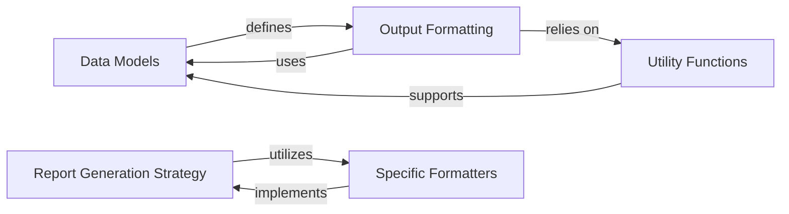

## Component Details

The Data Management & Reporting component is responsible for handling the application's data structures, formatting scan results, licenses, and announcements into various output formats, and providing general utility functions for data manipulation and common tasks. It defines the models for packages, vulnerabilities, and requirements, and orchestrates the rendering of reports to the user.

### Data Models
This component defines the core data structures used throughout the Safety application, including representations for packages, vulnerabilities, and safety requirements. It provides the foundational models for all data processed and reported by the system.

**Related Classes/Methods**:

- `safety.safety.models` (full file reference)
- <a href="https://github.com/pyupio/safety/blob/master/safety/models/vulnerabilities.py#L121-L249" target="_blank" rel="noopener noreferrer">`safety.models.vulnerabilities.Package` (121:249)</a>
- <a href="https://github.com/pyupio/safety/blob/master/safety/models/vulnerabilities.py#L48-L117" target="_blank" rel="noopener noreferrer">`safety.models.vulnerabilities.SafetyRequirement` (48:117)</a>
- <a href="https://github.com/pyupio/safety/blob/master/safety/models/vulnerabilities.py#L52-L90" target="_blank" rel="noopener noreferrer">`safety.models.vulnerabilities.SafetyRequirement:__init__` (52:90)</a>
- <a href="https://github.com/pyupio/safety/blob/master/safety/models/vulnerabilities.py#L136-L146" target="_blank" rel="noopener noreferrer">`safety.models.vulnerabilities.Package:has_unpinned_req` (136:146)</a>
- <a href="https://github.com/pyupio/safety/blob/master/safety/models/vulnerabilities.py#L148-L155" target="_blank" rel="noopener noreferrer">`safety.models.vulnerabilities.Package:get_unpinned_req` (148:155)</a>
- <a href="https://github.com/pyupio/safety/blob/master/safety/models/vulnerabilities.py#L178-L191" target="_blank" rel="noopener noreferrer">`safety.models.vulnerabilities.Package:get_versions` (178:191)</a>
- <a href="https://github.com/pyupio/safety/blob/master/safety/models/vulnerabilities.py#L193-L210" target="_blank" rel="noopener noreferrer">`safety.models.vulnerabilities.Package:refresh_from` (193:210)</a>
- <a href="https://github.com/pyupio/safety/blob/master/safety/models/vulnerabilities.py#L157-L176" target="_blank" rel="noopener noreferrer">`safety.models.vulnerabilities.Package.filter_by_supported_versions` (157:176)</a>
- <a href="https://github.com/pyupio/safety/blob/master/safety/models/vulnerabilities.py#L240-L249" target="_blank" rel="noopener noreferrer">`safety.models.vulnerabilities.Package.update` (240:249)</a>
- <a href="https://github.com/pyupio/safety/blob/master/safety/models/requirements.py#L4-L19" target="_blank" rel="noopener noreferrer">`safety.models.requirements.is_pinned_requirement` (4:19)</a>
- <a href="https://github.com/pyupio/safety/blob/master/safety/errors.py#L131-L150" target="_blank" rel="noopener noreferrer">`safety.errors.InvalidRequirementError` (131:150)</a>
- <a href="https://github.com/pyupio/safety/blob/master/safety/errors.py#L109-L128" target="_blank" rel="noopener noreferrer">`safety.errors.InvalidProvidedReportError` (109:128)</a>

### Output Formatting
This component is responsible for formatting raw data (vulnerabilities, licenses, announcements) into human-readable and machine-readable output formats. It handles the styling, structure, and content presentation for various report types (screen, JSON, HTML, bare, text).

**Related Classes/Methods**:

- `safety.safety.output_utils` (full file reference)
- <a href="https://github.com/pyupio/safety/blob/master/safety/output_utils.py#L1059-L1066" target="_blank" rel="noopener noreferrer">`safety.safety.output_utils.is_using_api_key` (1059:1066)</a>
- <a href="https://github.com/pyupio/safety/blob/master/safety/output_utils.py#L1172-L1201" target="_blank" rel="noopener noreferrer">`safety.safety.output_utils.print_service` (1172:1201)</a>
- <a href="https://github.com/pyupio/safety/blob/master/safety/output_utils.py#L1147-L1169" target="_blank" rel="noopener noreferrer">`safety.safety.output_utils.get_fix_opt_used_msg` (1147:1169)</a>
- <a href="https://github.com/pyupio/safety/blob/master/safety/output_utils.py#L1120-L1131" target="_blank" rel="noopener noreferrer">`safety.safety.output_utils.get_applied_msg` (1120:1131)</a>
- <a href="https://github.com/pyupio/safety/blob/master/safety/output_utils.py#L1134-L1144" target="_blank" rel="noopener noreferrer">`safety.safety.output_utils.get_skipped_msg` (1134:1144)</a>
- <a href="https://github.com/pyupio/safety/blob/master/safety/output_utils.py#L1205-L1236" target="_blank" rel="noopener noreferrer">`safety.safety.output_utils.prompt_service` (1205:1236)</a>
- <a href="https://github.com/pyupio/safety/blob/master/safety/output_utils.py#L332-L355" target="_blank" rel="noopener noreferrer">`safety.safety.output_utils.get_specifier_range_info` (332:355)</a>
- <a href="https://github.com/pyupio/safety/blob/master/safety/output_utils.py#L28-L58" target="_blank" rel="noopener noreferrer">`safety.safety.output_utils.build_announcements_section_content` (28:58)</a>
- <a href="https://github.com/pyupio/safety/blob/master/safety/output_utils.py#L61-L68" target="_blank" rel="noopener noreferrer">`safety.safety.output_utils.add_empty_line` (61:68)</a>
- <a href="https://github.com/pyupio/safety/blob/master/safety/output_utils.py#L71-L109" target="_blank" rel="noopener noreferrer">`safety.safety.output_utils.style_lines` (71:109)</a>
- <a href="https://github.com/pyupio/safety/blob/master/safety/output_utils.py#L112-L268" target="_blank" rel="noopener noreferrer">`safety.safety.output_utils.format_vulnerability` (112:268)</a>
- <a href="https://github.com/pyupio/safety/blob/master/safety/output_utils.py#L271-L293" target="_blank" rel="noopener noreferrer">`safety.safety.output_utils.format_license` (271:293)</a>
- <a href="https://github.com/pyupio/safety/blob/master/safety/output_utils.py#L296-L315" target="_blank" rel="noopener noreferrer">`safety.safety.output_utils.get_fix_hint_for_unpinned` (296:315)</a>
- <a href="https://github.com/pyupio/safety/blob/master/safety/output_utils.py#L358-L387" target="_blank" rel="noopener noreferrer">`safety.safety.output_utils.build_other_options_msg` (358:387)</a>
- <a href="https://github.com/pyupio/safety/blob/master/safety/output_utils.py#L390-L538" target="_blank" rel="noopener noreferrer">`safety.safety.output_utils.build_remediation_section` (390:538)</a>
- <a href="https://github.com/pyupio/safety/blob/master/safety/output_utils.py#L318-L329" target="_blank" rel="noopener noreferrer">`safety.safety.output_utils.get_unpinned_hint` (318:329)</a>
- <a href="https://github.com/pyupio/safety/blob/master/safety/output_utils.py#L541-L573" target="_blank" rel="noopener noreferrer">`safety.safety.output_utils.get_final_brief` (541:573)</a>
- <a href="https://github.com/pyupio/safety/blob/master/safety/output_utils.py#L576-L595" target="_blank" rel="noopener noreferrer">`safety.safety.output_utils.get_final_brief_license` (576:595)</a>
- <a href="https://github.com/pyupio/safety/blob/master/safety/output_utils.py#L598-L641" target="_blank" rel="noopener noreferrer">`safety.safety.output_utils.format_long_text` (598:641)</a>
- <a href="https://github.com/pyupio/safety/blob/master/safety/output_utils.py#L644-L693" target="_blank" rel="noopener noreferrer">`safety.safety.output_utils.get_printable_list_of_scanned_items` (644:693)</a>
- <a href="https://github.com/pyupio/safety/blob/master/safety/output_utils.py#L699-L741" target="_blank" rel="noopener noreferrer">`safety.safety.output_utils.build_report_brief_section` (699:741)</a>
- <a href="https://github.com/pyupio/safety/blob/master/safety/output_utils.py#L744-L799" target="_blank" rel="noopener noreferrer">`safety.safety.output_utils.build_report_for_review_vuln_report` (744:799)</a>
- <a href="https://github.com/pyupio/safety/blob/master/safety/output_utils.py#L802-L837" target="_blank" rel="noopener noreferrer">`safety.safety.output_utils.build_using_sentence` (802:837)</a>
- <a href="https://github.com/pyupio/safety/blob/master/safety/output_utils.py#L840-L855" target="_blank" rel="noopener noreferrer">`safety.safety.output_utils.build_scanned_count_sentence` (840:855)</a>
- <a href="https://github.com/pyupio/safety/blob/master/safety/output_utils.py#L858-L878" target="_blank" rel="noopener noreferrer">`safety.safety.output_utils.add_warnings_if_needed` (858:878)</a>
- <a href="https://github.com/pyupio/safety/blob/master/safety/output_utils.py#L881-L1028" target="_blank" rel="noopener noreferrer">`safety.safety.output_utils.get_report_brief_info` (881:1028)</a>
- <a href="https://github.com/pyupio/safety/blob/master/safety/output_utils.py#L1031-L1056" target="_blank" rel="noopener noreferrer">`safety.safety.output_utils.build_primary_announcement` (1031:1056)</a>
- <a href="https://github.com/pyupio/safety/blob/master/safety/output_utils.py#L1069-L1076" target="_blank" rel="noopener noreferrer">`safety.safety.output_utils.is_using_a_safety_policy_file` (1069:1076)</a>
- <a href="https://github.com/pyupio/safety/blob/master/safety/output_utils.py#L1096-L1117" target="_blank" rel="noopener noreferrer">`safety.safety.output_utils.get_skip_reason` (1096:1117)</a>
- <a href="https://github.com/pyupio/safety/blob/master/safety/output_utils.py#L1256-L1297" target="_blank" rel="noopener noreferrer">`safety.safety.output_utils.format_unpinned_vulnerabilities` (1256:1297)</a>

### Report Generation Strategy
This component defines the abstract interface for report generation and provides a concrete implementation that dispatches to specific formatters (Screen, JSON, HTML, Bare, Text) based on the desired output format. It acts as a central point for rendering different types of reports.

**Related Classes/Methods**:

- `safety.safety.formatter` (full file reference)
- <a href="https://github.com/pyupio/safety/blob/master/safety/formatter.py#L69-L141" target="_blank" rel="noopener noreferrer">`safety.safety.formatter.SafetyFormatter` (69:141)</a>
- <a href="https://github.com/pyupio/safety/blob/master/safety/formatter.py#L73-L96" target="_blank" rel="noopener noreferrer">`safety.safety.formatter.SafetyFormatter:__init__` (73:96)</a>
- <a href="https://github.com/pyupio/safety/blob/master/safety/formatter.py#L98-L114" target="_blank" rel="noopener noreferrer">`safety.safety.formatter.SafetyFormatter:render_vulnerabilities` (98:114)</a>
- <a href="https://github.com/pyupio/safety/blob/master/safety/formatter.py#L116-L128" target="_blank" rel="noopener noreferrer">`safety.safety.formatter.SafetyFormatter:render_licenses` (116:128)</a>
- <a href="https://github.com/pyupio/safety/blob/master/safety/formatter.py#L130-L141" target="_blank" rel="noopener noreferrer">`safety.safety.formatter.SafetyFormatter:render_announcements` (130:141)</a>

### Specific Formatters
This component comprises the concrete implementations of various report formatters, each tailored to a specific output type (e.g., screen, JSON, HTML, bare, text). These formatters handle the final rendering logic for their respective formats.

**Related Classes/Methods**:

- `safety.safety.formatters` (full file reference)
- <a href="https://github.com/pyupio/safety/blob/master/safety/formatters/screen.py#L13-L196" target="_blank" rel="noopener noreferrer">`safety.safety.formatters.screen.ScreenReport` (13:196)</a>
- <a href="https://github.com/pyupio/safety/blob/master/safety/formatters/screen.py#L33-L52" target="_blank" rel="noopener noreferrer">`safety.safety.formatters.screen.ScreenReport:__build_announcements_section` (33:52)</a>
- <a href="https://github.com/pyupio/safety/blob/master/safety/formatters/screen.py#L54-L135" target="_blank" rel="noopener noreferrer">`safety.safety.formatters.screen.ScreenReport:render_vulnerabilities` (54:135)</a>
- <a href="https://github.com/pyupio/safety/blob/master/safety/formatters/screen.py#L137-L184" target="_blank" rel="noopener noreferrer">`safety.safety.formatters.screen.ScreenReport:render_licenses` (137:184)</a>
- <a href="https://github.com/pyupio/safety/blob/master/safety/formatters/screen.py#L186-L196" target="_blank" rel="noopener noreferrer">`safety.safety.formatters.screen.ScreenReport:render_announcements` (186:196)</a>
- <a href="https://github.com/pyupio/safety/blob/master/safety/formatters/json.py#L74-L236" target="_blank" rel="noopener noreferrer">`safety.safety.formatters.json.JsonReport` (74:236)</a>
- <a href="https://github.com/pyupio/safety/blob/master/safety/formatters/json.py#L79-L87" target="_blank" rel="noopener noreferrer">`safety.safety.formatters.json.JsonReport:__init__` (79:87)</a>
- <a href="https://github.com/pyupio/safety/blob/master/safety/formatters/json.py#L89-L132" target="_blank" rel="noopener noreferrer">`safety.safety.formatters.json.JsonReport:render_vulnerabilities` (89:132)</a>
- <a href="https://github.com/pyupio/safety/blob/master/safety/formatters/json.py#L134-L156" target="_blank" rel="noopener noreferrer">`safety.safety.formatters.json.JsonReport:render_licenses` (134:156)</a>
- <a href="https://github.com/pyupio/safety/blob/master/safety/formatters/json.py#L158-L170" target="_blank" rel="noopener noreferrer">`safety.safety.formatters.json.JsonReport:render_announcements` (158:170)</a>
- <a href="https://github.com/pyupio/safety/blob/master/safety/formatters/json.py#L17-L71" target="_blank" rel="noopener noreferrer">`safety.safety.formatters.json:build_json_report` (17:71)</a>
- <a href="https://github.com/pyupio/safety/blob/master/safety/formatters/html.py#L13-L58" target="_blank" rel="noopener noreferrer">`safety.safety.formatters.html.HTMLReport` (13:58)</a>
- <a href="https://github.com/pyupio/safety/blob/master/safety/formatters/html.py#L18-L39" target="_blank" rel="noopener noreferrer">`safety.safety.formatters.html.HTMLReport:render_vulnerabilities` (18:39)</a>
- <a href="https://github.com/pyupio/safety/blob/master/safety/formatters/bare.py#L8-L71" target="_blank" rel="noopener noreferrer">`safety.safety.formatters.bare.BareReport` (8:71)</a>
- <a href="https://github.com/pyupio/safety/blob/master/safety/formatters/bare.py#L13-L39" target="_blank" rel="noopener noreferrer">`safety.safety.formatters.bare.BareReport:render_vulnerabilities` (13:39)</a>
- <a href="https://github.com/pyupio/safety/blob/master/safety/formatters/bare.py#L41-L62" target="_blank" rel="noopener noreferrer">`safety.safety.formatters.bare.BareReport:render_licenses` (41:62)</a>
- <a href="https://github.com/pyupio/safety/blob/master/safety/formatters/text.py#L14-L198" target="_blank" rel="noopener noreferrer">`safety.safety.formatters.text.TextReport` (14:198)</a>
- <a href="https://github.com/pyupio/safety/blob/master/safety/formatters/text.py#L34-L54" target="_blank" rel="noopener noreferrer">`safety.safety.formatters.text.TextReport:__build_announcements_section` (34:54)</a>
- <a href="https://github.com/pyupio/safety/blob/master/safety/formatters/text.py#L56-L138" target="_blank" rel="noopener noreferrer">`safety.safety.formatters.text.TextReport:render_vulnerabilities` (56:138)</a>
- <a href="https://github.com/pyupio/safety/blob/master/safety/formatters/text.py#L140-L184" target="_blank" rel="noopener noreferrer">`safety.safety.formatters.text.TextReport:render_licenses` (140:184)</a>
- <a href="https://github.com/pyupio/safety/blob/master/safety/formatters/text.py#L186-L198" target="_blank" rel="noopener noreferrer">`safety.safety.formatters.text.TextReport:render_announcements` (186:198)</a>
- <a href="https://github.com/pyupio/safety/blob/master/safety/scan/render.py#L540-L616" target="_blank" rel="noopener noreferrer">`safety.safety.scan.render:render_scan_html` (540:616)</a>
- <a href="https://github.com/pyupio/safety/blob/master/safety/scan/render.py#L791-L820" target="_blank" rel="noopener noreferrer">`safety.safety.scan.render:render_scan_spdx` (791:820)</a>
- <a href="https://github.com/pyupio/safety/blob/master/safety/scan/render.py#L745-L788" target="_blank" rel="noopener noreferrer">`safety.safety.scan.render.create_spdx_document` (745:788)</a>
- <a href="https://github.com/pyupio/safety/blob/master/safety/output_utils.py#L1079-L1093" target="_blank" rel="noopener noreferrer">`safety.output_utils.should_add_nl` (1079:1093)</a>
- <a href="https://github.com/pyupio/safety/blob/master/safety/output_utils.py#L1239-L1253" target="_blank" rel="noopener noreferrer">`safety.output_utils.parse_html` (1239:1253)</a>

### Utility Functions
This component provides a collection of general utility functions for data manipulation, file operations, and common tasks that support the overall data management and reporting processes. It includes functions for parsing requirements, handling policy files, and building telemetry data.

**Related Classes/Methods**:

- `safety.safety.util` (full file reference)
- <a href="https://github.com/pyupio/safety/blob/master/safety/util.py#L86-L103" target="_blank" rel="noopener noreferrer">`safety.safety.util:parse_requirement` (86:103)</a>
- <a href="https://github.com/pyupio/safety/blob/master/safety/util.py#L106-L126" target="_blank" rel="noopener noreferrer">`safety.safety.util:find_version` (106:126)</a>
- <a href="https://github.com/pyupio/safety/blob/master/safety/util.py#L129-L187" target="_blank" rel="noopener noreferrer">`safety.safety.util:read_requirements` (129:187)</a>
- <a href="https://github.com/pyupio/safety/blob/master/safety/util.py#L247-L269" target="_blank" rel="noopener noreferrer">`safety.safety.util:get_used_options` (247:269)</a>
- <a href="https://github.com/pyupio/safety/blob/master/safety/util.py#L284-L308" target="_blank" rel="noopener noreferrer">`safety.safety.util:get_primary_announcement` (284:308)</a>
- <a href="https://github.com/pyupio/safety/blob/master/safety/util.py#L353-L395" target="_blank" rel="noopener noreferrer">`safety.safety.util:build_telemetry_data` (353:395)</a>
- <a href="https://github.com/pyupio/safety/blob/master/safety/util.py#L845-L1212" target="_blank" rel="noopener noreferrer">`safety.safety.util.SafetyPolicyFile` (845:1212)</a>
- <a href="https://github.com/pyupio/safety/blob/master/safety/util.py#L949-L1191" target="_blank" rel="noopener noreferrer">`safety.safety.util.SafetyPolicyFile.convert` (949:1191)</a>
- <a href="https://github.com/pyupio/safety/blob/master/safety/util.py#L879-L925" target="_blank" rel="noopener noreferrer">`safety.safety.util.SafetyPolicyFile.fail_if_unrecognized_keys` (879:925)</a>
- <a href="https://github.com/pyupio/safety/blob/master/safety/util.py#L927-L947" target="_blank" rel="noopener noreferrer">`safety.safety.util.SafetyPolicyFile.fail_if_wrong_bool_value` (927:947)</a>
- <a href="https://github.com/pyupio/safety/blob/master/safety/util.py#L1259-L1282" target="_blank" rel="noopener noreferrer">`safety.safety.util:sync_safety_context` (1259:1282)</a>
- <a href="https://github.com/pyupio/safety/blob/master/safety/util.py#L1286-L1349" target="_blank" rel="noopener noreferrer">`safety.safety.util:get_packages_licenses` (1286:1349)</a>
- <a href="https://github.com/pyupio/safety/blob/master/safety/util.py#L1352-L1377" target="_blank" rel="noopener noreferrer">`safety.safety.util:get_requirements_content` (1352:1377)</a>
- <a href="https://github.com/pyupio/safety/blob/master/safety/util.py#L1380-L1391" target="_blank" rel="noopener noreferrer">`safety.safety.util:is_ignore_unpinned_mode` (1380:1391)</a>
- <a href="https://github.com/pyupio/safety/blob/master/safety/util.py#L1232-L1256" target="_blank" rel="noopener noreferrer">`safety.safety.util.SafetyContext` (1232:1256)</a>
- <a href="https://github.com/pyupio/safety/blob/master/safety/util.py#L444-L469" target="_blank" rel="noopener noreferrer">`safety.util.build_remediation_info_url` (444:469)</a>
- <a href="https://github.com/pyupio/safety/blob/master/safety/util.py#L1407-L1425" target="_blank" rel="noopener noreferrer">`safety.util.get_hashes` (1407:1425)</a>
- <a href="https://github.com/pyupio/safety/blob/master/safety/util.py#L1428-L1462" target="_blank" rel="noopener noreferrer">`safety.util.pluralize` (1428:1462)</a>
- <a href="https://github.com/pyupio/safety/blob/master/safety/util.py#L786-L799" target="_blank" rel="noopener noreferrer">`safety.util.get_terminal_size` (786:799)</a>
- <a href="https://github.com/pyupio/safety/blob/master/safety/util.py#L472-L531" target="_blank" rel="noopener noreferrer">`safety.util.get_processed_options` (472:531)</a>
- <a href="https://github.com/pyupio/safety/blob/master/safety/util.py#L50-L60" target="_blank" rel="noopener noreferrer">`safety.util.is_a_remote_mirror` (50:60)</a>
- <a href="https://github.com/pyupio/safety/blob/master/safety/util.py#L333-L350" target="_blank" rel="noopener noreferrer">`safety.util.filter_announcements` (333:350)</a>
- <a href="https://github.com/pyupio/safety/blob/master/safety/util.py#L1394-L1404" target="_blank" rel="noopener noreferrer">`safety.util.get_remediations_count` (1394:1404)</a>
- <a href="https://github.com/pyupio/safety/blob/master/safety/util.py#L398-L441" target="_blank" rel="noopener noreferrer">`safety.util.build_git_data` (398:441)</a>
- <a href="https://github.com/pyupio/safety/blob/master/safety/util.py#L311-L330" target="_blank" rel="noopener noreferrer">`safety.util.get_basic_announcements` (311:330)</a>
- <a href="https://github.com/pyupio/safety/blob/master/safety/util.py#L272-L281" target="_blank" rel="noopener noreferrer">`safety.util.get_version` (272:281)</a>
- <a href="https://github.com/pyupio/safety/blob/master/safety/util.py#L228-L244" target="_blank" rel="noopener noreferrer">`safety.util.get_flags_from_context` (228:244)</a>
- <a href="https://github.com/pyupio/safety/blob/master/safety/util.py#L819-L842" target="_blank" rel="noopener noreferrer">`safety.util.validate_expiration_date` (819:842)</a>
- <a href="https://github.com/pyupio/safety/blob/master/safety/util.py#L210-L225" target="_blank" rel="noopener noreferrer">`safety.util.get_license_name_by_id` (210:225)</a>
- <a href="https://github.com/pyupio/safety/blob/master/safety/util.py#L63-L83" target="_blank" rel="noopener noreferrer">`safety.safety.util.is_supported_by_parser` (63:83)</a>

### [FAQ](https://github.com/CodeBoarding/GeneratedOnBoardings/tree/main?tab=readme-ov-file#faq)