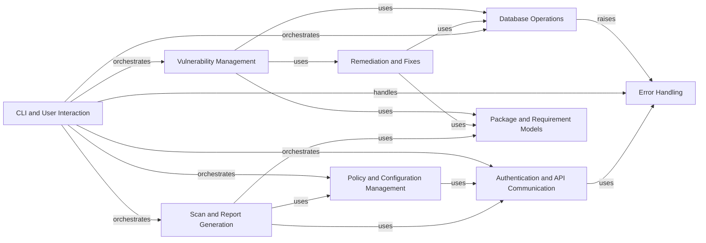

## Component Details

The Error Handling component provides a centralized mechanism for catching, logging, and presenting various errors and exceptions that occur throughout the application. It ensures graceful degradation and informative user feedback by defining a hierarchy of custom exception classes and providing utility functions to handle and output these exceptions consistently, especially within the command-line interface.

### Error Handling
Provides a centralized mechanism for catching, logging, and presenting various errors and exceptions that occur throughout the application, ensuring graceful degradation and informative user feedback.

**Related Classes/Methods**:

- <a href="https://github.com/pyupio/safety/blob/master/safety/errors.py#L16-L35" target="_blank" rel="noopener noreferrer">`safety.safety.errors.SafetyException` (16:35)</a>
- <a href="https://github.com/pyupio/safety/blob/master/safety/errors.py#L38-L58" target="_blank" rel="noopener noreferrer">`safety.safety.errors.SafetyError` (38:58)</a>
- <a href="https://github.com/pyupio/safety/blob/master/safety/errors.py#L61-L85" target="_blank" rel="noopener noreferrer">`safety.safety.errors.MalformedDatabase` (61:85)</a>
- <a href="https://github.com/pyupio/safety/blob/master/safety/errors.py#L88-L106" target="_blank" rel="noopener noreferrer">`safety.safety.errors.DatabaseFetchError` (88:106)</a>
- <a href="https://github.com/pyupio/safety/blob/master/safety/errors.py#L109-L128" target="_blank" rel="noopener noreferrer">`safety.safety.errors.InvalidProvidedReportError` (109:128)</a>
- <a href="https://github.com/pyupio/safety/blob/master/safety/errors.py#L131-L150" target="_blank" rel="noopener noreferrer">`safety.safety.errors.InvalidRequirementError` (131:150)</a>
- <a href="https://github.com/pyupio/safety/blob/master/safety/errors.py#L153-L173" target="_blank" rel="noopener noreferrer">`safety.safety.errors.DatabaseFileNotFoundError` (153:173)</a>
- <a href="https://github.com/pyupio/safety/blob/master/safety/errors.py#L176-L203" target="_blank" rel="noopener noreferrer">`safety.safety.errors.InvalidCredentialError` (176:203)</a>
- <a href="https://github.com/pyupio/safety/blob/master/safety/errors.py#L205-L223" target="_blank" rel="noopener noreferrer">`safety.safety.errors.NotVerifiedEmailError` (205:223)</a>
- <a href="https://github.com/pyupio/safety/blob/master/safety/errors.py#L225-L246" target="_blank" rel="noopener noreferrer">`safety.safety.errors.TooManyRequestsError` (225:246)</a>
- <a href="https://github.com/pyupio/safety/blob/master/safety/errors.py#L249-L259" target="_blank" rel="noopener noreferrer">`safety.safety.errors.NetworkConnectionError` (249:259)</a>
- <a href="https://github.com/pyupio/safety/blob/master/safety/errors.py#L262-L271" target="_blank" rel="noopener noreferrer">`safety.safety.errors.RequestTimeoutError` (262:271)</a>
- <a href="https://github.com/pyupio/safety/blob/master/safety/errors.py#L274-L287" target="_blank" rel="noopener noreferrer">`safety.safety.errors.ServerError` (274:287)</a>
- <a href="https://github.com/pyupio/safety/blob/master/safety/error_handlers.py#L24-L44" target="_blank" rel="noopener noreferrer">`safety.safety.error_handlers.output_exception` (24:44)</a>
- <a href="https://github.com/pyupio/safety/blob/master/safety/error_handlers.py#L47-L89" target="_blank" rel="noopener noreferrer">`safety.safety.error_handlers.handle_cmd_exception` (47:89)</a>

### Database Operations
This component manages the fetching, caching, and validation of vulnerability and license databases. It handles both remote and local database sources, including error handling for network issues, timeouts, and malformed data. It also includes functions for reading and writing to a local cache.

**Related Classes/Methods**:

- <a href="https://github.com/pyupio/safety/blob/master/safety/safety.py#L219-L287" target="_blank" rel="noopener noreferrer">`safety.safety.safety:fetch_database_url` (219:287)</a>
- <a href="https://github.com/pyupio/safety/blob/master/safety/safety.py#L313-L344" target="_blank" rel="noopener noreferrer">`safety.safety.safety:fetch_database_file` (313:344)</a>
- <a href="https://github.com/pyupio/safety/blob/master/safety/safety.py#L366-L425" target="_blank" rel="noopener noreferrer">`safety.safety.safety:fetch_database` (366:425)</a>
- <a href="https://github.com/pyupio/safety/blob/master/safety/safety.py#L91-L149" target="_blank" rel="noopener noreferrer">`safety.safety.safety:get_from_cache` (91:149)</a>
- <a href="https://github.com/pyupio/safety/blob/master/safety/safety.py#L152-L201" target="_blank" rel="noopener noreferrer">`safety.safety.safety:write_to_cache` (152:201)</a>
- <a href="https://github.com/pyupio/safety/blob/master/safety/safety.py#L347-L363" target="_blank" rel="noopener noreferrer">`safety.safety.safety:is_valid_database` (347:363)</a>
- <a href="https://github.com/pyupio/safety/blob/master/safety/safety.py#L1668-L1704" target="_blank" rel="noopener noreferrer">`safety.safety.safety:get_licenses` (1668:1704)</a>

### Vulnerability Management
This component is responsible for identifying, processing, and reporting software vulnerabilities. It includes functions for retrieving vulnerabilities from the database, constructing vulnerability objects, applying ignore rules based on severity or unpinned requirements, and performing the main vulnerability check.

**Related Classes/Methods**:

- <a href="https://github.com/pyupio/safety/blob/master/safety/safety.py#L428-L445" target="_blank" rel="noopener noreferrer">`safety.safety.safety:get_vulnerabilities` (428:445)</a>
- <a href="https://github.com/pyupio/safety/blob/master/safety/safety.py#L448-L532" target="_blank" rel="noopener noreferrer">`safety.safety.safety:get_vulnerability_from` (448:532)</a>
- <a href="https://github.com/pyupio/safety/blob/master/safety/safety.py#L535-L565" target="_blank" rel="noopener noreferrer">`safety.safety.safety:get_cve_from` (535:565)</a>
- <a href="https://github.com/pyupio/safety/blob/master/safety/safety.py#L568-L638" target="_blank" rel="noopener noreferrer">`safety.safety.safety:ignore_vuln_if_needed` (568:638)</a>
- <a href="https://github.com/pyupio/safety/blob/master/safety/safety.py#L641-L672" target="_blank" rel="noopener noreferrer">`safety.safety.safety:is_vulnerable` (641:672)</a>
- <a href="https://github.com/pyupio/safety/blob/master/safety/safety.py#L676-L802" target="_blank" rel="noopener noreferrer">`safety.safety.safety:check` (676:802)</a>
- <a href="https://github.com/pyupio/safety/blob/master/safety/safety.py#L1580-L1664" target="_blank" rel="noopener noreferrer">`safety.safety.safety:review` (1580:1664)</a>

### Remediation and Fixes
This component focuses on calculating and applying remediations for identified vulnerabilities. It determines the closest secure versions, processes fixes based on automatic remediation limits and user prompts, and updates requirement files accordingly.

**Related Classes/Methods**:

- <a href="https://github.com/pyupio/safety/blob/master/safety/safety.py#L805-L855" target="_blank" rel="noopener noreferrer">`safety.safety.safety:precompute_remediations` (805:855)</a>
- <a href="https://github.com/pyupio/safety/blob/master/safety/safety.py#L858-L908" target="_blank" rel="noopener noreferrer">`safety.safety.safety:get_closest_ver` (858:908)</a>
- <a href="https://github.com/pyupio/safety/blob/master/safety/safety.py#L911-L940" target="_blank" rel="noopener noreferrer">`safety.safety.safety:compute_sec_ver_for_user` (911:940)</a>
- <a href="https://github.com/pyupio/safety/blob/master/safety/safety.py#L943-L1014" target="_blank" rel="noopener noreferrer">`safety.safety.safety:compute_sec_ver` (943:1014)</a>
- <a href="https://github.com/pyupio/safety/blob/master/safety/safety.py#L1017-L1040" target="_blank" rel="noopener noreferrer">`safety.safety.safety:calculate_remediations` (1017:1040)</a>
- <a href="https://github.com/pyupio/safety/blob/master/safety/safety.py#L1043-L1078" target="_blank" rel="noopener noreferrer">`safety.safety.safety:should_apply_auto_fix` (1043:1078)</a>
- <a href="https://github.com/pyupio/safety/blob/master/safety/safety.py#L1081-L1098" target="_blank" rel="noopener noreferrer">`safety.safety.safety:get_update_type` (1081:1098)</a>
- <a href="https://github.com/pyupio/safety/blob/master/safety/safety.py#L1101-L1130" target="_blank" rel="noopener noreferrer">`safety.safety.safety:process_fixes` (1101:1130)</a>
- <a href="https://github.com/pyupio/safety/blob/master/safety/safety.py#L1133-L1231" target="_blank" rel="noopener noreferrer">`safety.safety.safety:process_fixes_scan` (1133:1231)</a>
- <a href="https://github.com/pyupio/safety/blob/master/safety/safety.py#L1234-L1366" target="_blank" rel="noopener noreferrer">`safety.safety.safety:compute_fixes_per_requirements` (1234:1366)</a>
- <a href="https://github.com/pyupio/safety/blob/master/safety/safety.py#L1369-L1551" target="_blank" rel="noopener noreferrer">`safety.safety.safety:apply_fixes` (1369:1551)</a>
- <a href="https://github.com/pyupio/safety/blob/master/safety/safety.py#L1554-L1576" target="_blank" rel="noopener noreferrer">`safety.safety.safety:find_vulnerabilities_fixed` (1554:1576)</a>

### CLI and User Interaction
This component handles the command-line interface (CLI) of the Safety tool. It defines commands like 'check', 'license', 'generate', and 'validate', manages command-line arguments and options, configures logging, and prints output to the console, including deprecation messages and announcements.

**Related Classes/Methods**:

- <a href="https://github.com/pyupio/safety/blob/master/safety/cli.py#L240-L258" target="_blank" rel="noopener noreferrer">`safety.safety.cli:cli` (240:258)</a>
- <a href="https://github.com/pyupio/safety/blob/master/safety/cli.py#L261-L334" target="_blank" rel="noopener noreferrer">`safety.safety.cli:clean_check_command` (261:334)</a>
- <a href="https://github.com/pyupio/safety/blob/master/safety/cli.py#L337-L383" target="_blank" rel="noopener noreferrer">`safety.safety.cli:print_deprecation_message` (337:383)</a>
- <a href="https://github.com/pyupio/safety/blob/master/safety/cli.py#L578-L764" target="_blank" rel="noopener noreferrer">`safety.safety.cli:check` (578:764)</a>
- <a href="https://github.com/pyupio/safety/blob/master/safety/cli.py#L767-L782" target="_blank" rel="noopener noreferrer">`safety.safety.cli:clean_license_command` (767:782)</a>
- <a href="https://github.com/pyupio/safety/blob/master/safety/cli.py#L818-L851" target="_blank" rel="noopener noreferrer">`safety.safety.cli:license` (818:851)</a>
- <a href="https://github.com/pyupio/safety/blob/master/safety/cli.py#L869-L887" target="_blank" rel="noopener noreferrer">`safety.safety.cli:generate` (869:887)</a>
- <a href="https://github.com/pyupio/safety/blob/master/safety/cli.py#L890-L975" target="_blank" rel="noopener noreferrer">`safety.safety.cli:generate_installation_policy` (890:975)</a>
- <a href="https://github.com/pyupio/safety/blob/master/safety/cli.py#L978-L998" target="_blank" rel="noopener noreferrer">`safety.safety.cli:generate_policy_file` (978:998)</a>
- <a href="https://github.com/pyupio/safety/blob/master/safety/cli.py#L1015-L1086" target="_blank" rel="noopener noreferrer">`safety.safety.cli:validate` (1015:1086)</a>
- <a href="https://github.com/pyupio/safety/blob/master/safety/cli.py#L1165-L1245" target="_blank" rel="noopener noreferrer">`safety.safety.cli:configure` (1165:1245)</a>
- <a href="https://github.com/pyupio/safety/blob/master/safety/cli.py#L1252-L1256" target="_blank" rel="noopener noreferrer">`safety.safety.cli:print_check_updates_header` (1252:1256)</a>
- <a href="https://github.com/pyupio/safety/blob/master/safety/cli.py#L1277-L1406" target="_blank" rel="noopener noreferrer">`safety.safety.cli:check_updates` (1277:1406)</a>

### Authentication and API Communication
This component manages user authentication and secure communication with the Safety API. It handles API key and token-based authentication, parses API responses, and includes retry mechanisms for network-related issues. It also provides functionalities for checking project information, downloading policies, and uploading scan reports.

**Related Classes/Methods**:

- <a href="https://github.com/pyupio/safety/blob/master/safety/auth/utils.py#L55-L70" target="_blank" rel="noopener noreferrer">`safety.safety.auth.utils:get_keys` (55:70)</a>
- <a href="https://github.com/pyupio/safety/blob/master/safety/auth/utils.py#L73-L88" target="_blank" rel="noopener noreferrer">`safety.safety.auth.utils:is_email_verified` (73:88)</a>
- <a href="https://github.com/pyupio/safety/blob/master/safety/auth/utils.py#L91-L108" target="_blank" rel="noopener noreferrer">`safety.safety.auth.utils:extract_detail` (91:108)</a>
- <a href="https://github.com/pyupio/safety/blob/master/safety/auth/utils.py#L111-L188" target="_blank" rel="noopener noreferrer">`safety.safety.auth.utils:parse_response` (111:188)</a>
- <a href="https://github.com/pyupio/safety/blob/master/safety/auth/utils.py#L246-L342" target="_blank" rel="noopener noreferrer">`safety.safety.auth.utils.SafetyAuthSession:request` (246:342)</a>
- <a href="https://github.com/pyupio/safety/blob/master/safety/auth/utils.py#L345-L356" target="_blank" rel="noopener noreferrer">`safety.safety.auth.utils.SafetyAuthSession:fetch_user_info` (345:356)</a>
- <a href="https://github.com/pyupio/safety/blob/master/safety/auth/utils.py#L359-L391" target="_blank" rel="noopener noreferrer">`safety.safety.auth.utils.SafetyAuthSession:check_project` (359:391)</a>
- <a href="https://github.com/pyupio/safety/blob/master/safety/auth/utils.py#L394-L406" target="_blank" rel="noopener noreferrer">`safety.safety.auth.utils.SafetyAuthSession:project` (394:406)</a>
- <a href="https://github.com/pyupio/safety/blob/master/safety/auth/utils.py#L409-L429" target="_blank" rel="noopener noreferrer">`safety.safety.auth.utils.SafetyAuthSession:download_policy` (409:429)</a>
- <a href="https://github.com/pyupio/safety/blob/master/safety/auth/utils.py#L432-L444" target="_blank" rel="noopener noreferrer">`safety.safety.auth.utils.SafetyAuthSession:project_scan_request` (432:444)</a>
- <a href="https://github.com/pyupio/safety/blob/master/safety/auth/utils.py#L447-L462" target="_blank" rel="noopener noreferrer">`safety.safety.auth.utils.SafetyAuthSession:upload_report` (447:462)</a>
- <a href="https://github.com/pyupio/safety/blob/master/safety/auth/utils.py#L464-L476" target="_blank" rel="noopener noreferrer">`safety.safety.auth.utils.SafetyAuthSession:upload_requirements` (464:476)</a>
- <a href="https://github.com/pyupio/safety/blob/master/safety/auth/utils.py#L479-L511" target="_blank" rel="noopener noreferrer">`safety.safety.auth.utils.SafetyAuthSession:check_updates` (479:511)</a>
- <a href="https://github.com/pyupio/safety/blob/master/safety/auth/utils.py#L514-L525" target="_blank" rel="noopener noreferrer">`safety.safety.auth.utils.SafetyAuthSession:audit_packages` (514:525)</a>
- <a href="https://github.com/pyupio/safety/blob/master/safety/auth/utils.py#L528-L546" target="_blank" rel="noopener noreferrer">`safety.safety.auth.utils.SafetyAuthSession:initialize` (528:546)</a>

### Policy and Configuration Management
This component is responsible for loading, resolving, and managing security policies, both local and cloud-based. It handles the parsing and validation of policy files and integrates with the authentication component to download server-side policies.

**Related Classes/Methods**:

- <a href="https://github.com/pyupio/safety/blob/master/safety/scan/main.py#L30-L76" target="_blank" rel="noopener noreferrer">`safety.safety.scan.main:download_policy` (30:76)</a>
- <a href="https://github.com/pyupio/safety/blob/master/safety/scan/main.py#L79-L110" target="_blank" rel="noopener noreferrer">`safety.safety.scan.main:load_policy_file` (79:110)</a>
- <a href="https://github.com/pyupio/safety/blob/master/safety/scan/main.py#L113-L133" target="_blank" rel="noopener noreferrer">`safety.safety.scan.main:resolve_policy` (113:133)</a>
- <a href="https://github.com/pyupio/safety/blob/master/safety/safety.py#L1912-L1953" target="_blank" rel="noopener noreferrer">`safety.safety.safety:get_server_policies` (1912:1953)</a>

### Package and Requirement Models
This component defines the data models for packages, requirements, vulnerabilities, and related entities. It includes classes for representing package information, parsing requirement strings, and structuring vulnerability details, CVEs, and severity levels.

**Related Classes/Methods**:

- <a href="https://github.com/pyupio/safety/blob/master/safety/models/vulnerabilities.py#L48-L117" target="_blank" rel="noopener noreferrer">`safety.safety.models.vulnerabilities.SafetyRequirement` (48:117)</a>
- <a href="https://github.com/pyupio/safety/blob/master/safety/models/vulnerabilities.py#L121-L249" target="_blank" rel="noopener noreferrer">`safety.safety.models.vulnerabilities.Package` (121:249)</a>
- <a href="https://github.com/pyupio/safety/blob/master/safety/models/vulnerabilities.py#L252-L256" target="_blank" rel="noopener noreferrer">`safety.safety.models.vulnerabilities.Announcement` (252:256)</a>
- <a href="https://github.com/pyupio/safety/blob/master/safety/models/vulnerabilities.py#L259-L275" target="_blank" rel="noopener noreferrer">`safety.safety.models.vulnerabilities.Remediation` (259:275)</a>
- <a href="https://github.com/pyupio/safety/blob/master/safety/models/vulnerabilities.py#L279-L293" target="_blank" rel="noopener noreferrer">`safety.safety.models.vulnerabilities.Fix` (279:293)</a>
- <a href="https://github.com/pyupio/safety/blob/master/safety/models/vulnerabilities.py#L296-L308" target="_blank" rel="noopener noreferrer">`safety.safety.models.vulnerabilities.CVE` (296:308)</a>
- <a href="https://github.com/pyupio/safety/blob/master/safety/models/vulnerabilities.py#L311-L327" target="_blank" rel="noopener noreferrer">`safety.safety.models.vulnerabilities.Severity` (311:327)</a>
- <a href="https://github.com/pyupio/safety/blob/master/safety/models/vulnerabilities.py#L330-L349" target="_blank" rel="noopener noreferrer">`safety.safety.models.vulnerabilities.SafetyEncoder` (330:349)</a>
- <a href="https://github.com/pyupio/safety/blob/master/safety/models/vulnerabilities.py#L352-L425" target="_blank" rel="noopener noreferrer">`safety.safety.models.vulnerabilities.Vulnerability` (352:425)</a>
- <a href="https://github.com/pyupio/safety/blob/master/safety/models/vulnerabilities.py#L429-L434" target="_blank" rel="noopener noreferrer">`safety.safety.models.vulnerabilities.Safety` (429:434)</a>

### Scan and Report Generation
This component orchestrates the scanning process, including file processing, building metadata for reports, and saving scan results. It interacts with other components to gather package information, apply policies, and generate comprehensive scan reports.

**Related Classes/Methods**:

- <a href="https://github.com/pyupio/safety/blob/master/safety/scan/main.py#L136-L156" target="_blank" rel="noopener noreferrer">`safety.safety.scan.main:save_report_as` (136:156)</a>
- <a href="https://github.com/pyupio/safety/blob/master/safety/scan/main.py#L159-L202" target="_blank" rel="noopener noreferrer">`safety.safety.scan.main:build_meta` (159:202)</a>
- <a href="https://github.com/pyupio/safety/blob/master/safety/scan/main.py#L205-L279" target="_blank" rel="noopener noreferrer">`safety.safety.scan.main:process_files` (205:279)</a>
- <a href="https://github.com/pyupio/safety/blob/master/safety/safety.py#L1956-L1972" target="_blank" rel="noopener noreferrer">`safety.safety.safety:save_report` (1956:1972)</a>
- <a href="https://github.com/pyupio/safety/blob/master/safety/safety.py#L1707-L1753" target="_blank" rel="noopener noreferrer">`safety.safety.safety:add_local_notifications` (1707:1753)</a>
- <a href="https://github.com/pyupio/safety/blob/master/safety/safety.py#L1756-L1826" target="_blank" rel="noopener noreferrer">`safety.safety.safety:get_announcements` (1756:1826)</a>
- <a href="https://github.com/pyupio/safety/blob/master/safety/safety.py#L1829-L1889" target="_blank" rel="noopener noreferrer">`safety.safety.safety:get_packages` (1829:1889)</a>

### [FAQ](https://github.com/CodeBoarding/GeneratedOnBoardings/tree/main?tab=readme-ov-file#faq)