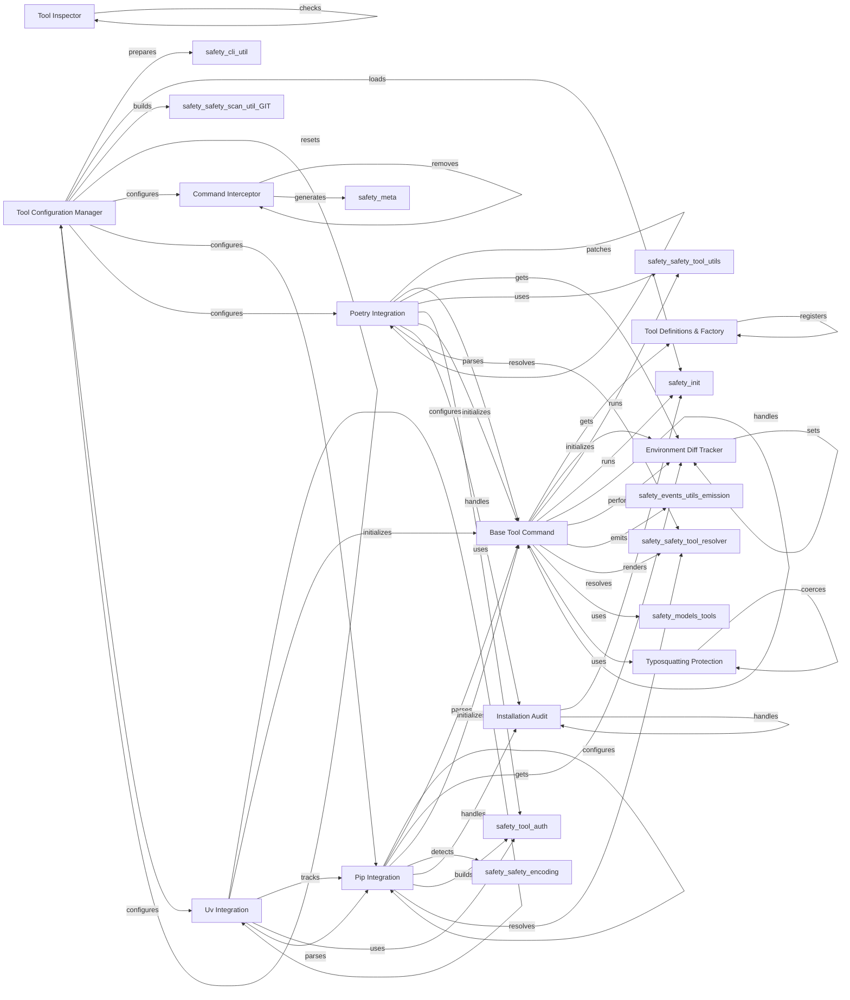

## Component Details

Manages the interaction and interception of commands for external package management tools (e.g., pip, poetry, uv). It allows Safety to audit and modify their behavior, track environment changes, and facilitate security updates.

### Tool Inspector
Inspects and manages tool instances, including finding executable paths and checking tool validity.

**Related Classes/Methods**:

- <a href="https://github.com/pyupio/safety/blob/master/safety/tool/tool_inspector.py#L101-L122" target="_blank" rel="noopener noreferrer">`safety.safety.tool.tool_inspector.ToolInspector:inspect_all_tools` (101:122)</a>
- <a href="https://github.com/pyupio/safety/blob/master/safety/tool/tool_inspector.py#L124-L142" target="_blank" rel="noopener noreferrer">`safety.safety.tool.tool_inspector.ToolInspector._find_tool_instances` (124:142)</a>
- <a href="https://github.com/pyupio/safety/blob/master/safety/tool/tool_inspector.py#L209-L275" target="_blank" rel="noopener noreferrer">`safety.safety.tool.tool_inspector.ToolInspector._check_tool` (209:275)</a>
- <a href="https://github.com/pyupio/safety/blob/master/safety/tool/tool_inspector.py#L184-L194" target="_blank" rel="noopener noreferrer">`safety.safety.tool.tool_inspector.ToolInspector._find_executable_paths` (184:194)</a>
- <a href="https://github.com/pyupio/safety/blob/master/safety/tool/tool_inspector.py#L196-L207" target="_blank" rel="noopener noreferrer">`safety.safety.tool.tool_inspector.ToolInspector._kill_process` (196:207)</a>

### Base Tool Command
Provides the foundational structure and common functionalities for all tool commands, including initialization, execution flow, state tracking, and handling command results.

**Related Classes/Methods**:

- <a href="https://github.com/pyupio/safety/blob/master/safety/tool/base.py#L45-L72" target="_blank" rel="noopener noreferrer">`safety.safety.tool.base.BaseCommand:__init__` (45:72)</a>
- <a href="https://github.com/pyupio/safety/blob/master/safety/tool/base.py#L75-L83" target="_blank" rel="noopener noreferrer">`safety.safety.tool.base.BaseCommand.get_tool_type` (75:83)</a>
- <a href="https://github.com/pyupio/safety/blob/master/safety/tool/base.py#L97-L105" target="_blank" rel="noopener noreferrer">`safety.safety.tool.base.BaseCommand.get_lock_path` (97:105)</a>
- <a href="https://github.com/pyupio/safety/blob/master/safety/tool/base.py#L108-L116" target="_blank" rel="noopener noreferrer">`safety.safety.tool.base.BaseCommand.get_diff_tracker` (108:116)</a>
- <a href="https://github.com/pyupio/safety/blob/master/safety/tool/base.py#L118-L131" target="_blank" rel="noopener noreferrer">`safety.safety.tool.base.BaseCommand.should_track_state` (118:131)</a>
- <a href="https://github.com/pyupio/safety/blob/master/safety/tool/base.py#L133-L142" target="_blank" rel="noopener noreferrer">`safety.safety.tool.base.BaseCommand.get_package_list_command` (133:142)</a>
- <a href="https://github.com/pyupio/safety/blob/master/safety/tool/base.py#L86-L94" target="_blank" rel="noopener noreferrer">`safety.safety.tool.base.BaseCommand.get_command_name` (86:94)</a>
- <a href="https://github.com/pyupio/safety/blob/master/safety/tool/base.py#L163-L169" target="_blank" rel="noopener noreferrer">`safety.safety.tool.base.BaseCommand._initialize_diff_tracker` (163:169)</a>
- <a href="https://github.com/pyupio/safety/blob/master/safety/tool/base.py#L290-L299" target="_blank" rel="noopener noreferrer">`safety.safety.tool.base.BaseCommand._get_installed_packages` (290:299)</a>
- <a href="https://github.com/pyupio/safety/blob/master/safety/tool/base.py#L171-L180" target="_blank" rel="noopener noreferrer">`safety.safety.tool.base.BaseCommand.__run_scan_if_needed` (171:180)</a>
- <a href="https://github.com/pyupio/safety/blob/master/safety/tool/base.py#L182-L206" target="_blank" rel="noopener noreferrer">`safety.safety.tool.base.BaseCommand.__run_silent_scan` (182:206)</a>
- <a href="https://github.com/pyupio/safety/blob/master/safety/tool/base.py#L208-L224" target="_blank" rel="noopener noreferrer">`safety.safety.tool.base.BaseCommand._handle_command_result` (208:224)</a>
- <a href="https://github.com/pyupio/safety/blob/master/safety/tool/base.py#L301-L317" target="_blank" rel="noopener noreferrer">`safety.safety.tool.base.BaseCommand._perform_diff` (301:317)</a>
- <a href="https://github.com/pyupio/safety/blob/master/safety/tool/base.py#L226-L234" target="_blank" rel="noopener noreferrer">`safety.safety.tool.base.BaseCommand.is_installed` (226:234)</a>
- <a href="https://github.com/pyupio/safety/blob/master/safety/tool/base.py#L236-L247" target="_blank" rel="noopener noreferrer">`safety.safety.tool.base.BaseCommand.before` (236:247)</a>
- <a href="https://github.com/pyupio/safety/blob/master/safety/tool/base.py#L249-L250" target="_blank" rel="noopener noreferrer">`safety.safety.tool.base.BaseCommand.after` (249:250)</a>
- <a href="https://github.com/pyupio/safety/blob/master/safety/tool/base.py#L252-L275" target="_blank" rel="noopener noreferrer">`safety.safety.tool.base.BaseCommand.execute` (252:275)</a>
- <a href="https://github.com/pyupio/safety/blob/master/safety/tool/base.py#L144-L161" target="_blank" rel="noopener noreferrer">`safety.safety.tool.base.BaseCommand.parse_package_list_output` (144:161)</a>
- <a href="https://github.com/pyupio/safety/blob/master/safety/tool/base.py#L325-L326" target="_blank" rel="noopener noreferrer">`safety.safety.tool.base.ToolCommandLineParser:__init__` (325:326)</a>
- <a href="https://github.com/pyupio/safety/blob/master/safety/tool/base.py#L329-L333" target="_blank" rel="noopener noreferrer">`safety.safety.tool.base.ToolCommandLineParser.get_tool_name` (329:333)</a>

### Tool Configuration Manager
Handles the overall configuration, setup, and reset of various package managers (Pip, Poetry, Uv) and local directories, as well as alias configuration.

**Related Classes/Methods**:

- <a href="https://github.com/pyupio/safety/blob/master/safety/tool/main.py#L26-L42" target="_blank" rel="noopener noreferrer">`safety.safety.tool.main:find_local_tool_files` (26:42)</a>
- <a href="https://github.com/pyupio/safety/blob/master/safety/tool/main.py#L45-L56" target="_blank" rel="noopener noreferrer">`safety.safety.tool.main:configure_system` (45:56)</a>
- <a href="https://github.com/pyupio/safety/blob/master/safety/tool/main.py#L59-L63" target="_blank" rel="noopener noreferrer">`safety.safety.tool.main:reset_system` (59:63)</a>
- <a href="https://github.com/pyupio/safety/blob/master/safety/tool/main.py#L66-L82" target="_blank" rel="noopener noreferrer">`safety.safety.tool.main:configure_alias` (66:82)</a>
- <a href="https://github.com/pyupio/safety/blob/master/safety/tool/main.py#L85-L99" target="_blank" rel="noopener noreferrer">`safety.safety.tool.main:configure_local_directory` (85:99)</a>
- <a href="https://github.com/pyupio/safety/blob/master/safety/tool/utils.py#L56-L59" target="_blank" rel="noopener noreferrer">`safety.safety.tool.utils.PipRequirementsConfigurator:configure` (56:59)</a>
- <a href="https://github.com/pyupio/safety/blob/master/safety/tool/utils.py#L65-L68" target="_blank" rel="noopener noreferrer">`safety.safety.tool.utils.PoetryPyprojectConfigurator:is_supported` (65:68)</a>
- <a href="https://github.com/pyupio/safety/blob/master/safety/tool/utils.py#L70-L75" target="_blank" rel="noopener noreferrer">`safety.safety.tool.utils.PoetryPyprojectConfigurator:configure` (70:75)</a>
- <a href="https://github.com/pyupio/safety/blob/master/safety/tool/utils.py#L98-L99" target="_blank" rel="noopener noreferrer">`safety.safety.tool.utils.PipConfigurator:configure` (98:99)</a>
- <a href="https://github.com/pyupio/safety/blob/master/safety/tool/utils.py#L101-L102" target="_blank" rel="noopener noreferrer">`safety.safety.tool.utils.PipConfigurator:reset` (101:102)</a>
- <a href="https://github.com/pyupio/safety/blob/master/safety/tool/utils.py#L118-L119" target="_blank" rel="noopener noreferrer">`safety.safety.tool.utils.UvConfigurator:configure` (118:119)</a>
- <a href="https://github.com/pyupio/safety/blob/master/safety/tool/utils.py#L121-L122" target="_blank" rel="noopener noreferrer">`safety.safety.tool.utils.UvConfigurator:reset` (121:122)</a>
- <a href="https://github.com/pyupio/safety/blob/master/safety/tool/utils.py#L134-L139" target="_blank" rel="noopener noreferrer">`safety.safety.tool.utils.UvPyprojectConfigurator:configure` (134:139)</a>
- <a href="https://github.com/pyupio/safety/blob/master/safety/tool/utils.py#L128-L132" target="_blank" rel="noopener noreferrer">`safety.safety.tool.utils.UvPyprojectConfigurator:is_supported` (128:132)</a>
- <a href="https://github.com/pyupio/safety/blob/master/safety/tool/utils.py#L20-L21" target="_blank" rel="noopener noreferrer">`safety.safety.tool.utils.is_os_supported` (20:21)</a>

### Command Interceptor
Manages the interception of commands for different operating systems (Unix, Windows) by installing and removing aliases or batch files.

**Related Classes/Methods**:

- <a href="https://github.com/pyupio/safety/blob/master/safety/tool/interceptors/unix.py#L17-L26" target="_blank" rel="noopener noreferrer">`safety.safety.tool.interceptors.unix.UnixAliasInterceptor:__init__` (17:26)</a>
- <a href="https://github.com/pyupio/safety/blob/master/safety/tool/interceptors/unix.py#L28-L38" target="_blank" rel="noopener noreferrer">`safety.safety.tool.interceptors.unix.UnixAliasInterceptor._get_user_rc_paths` (28:38)</a>
- <a href="https://github.com/pyupio/safety/blob/master/safety/tool/interceptors/unix.py#L40-L41" target="_blank" rel="noopener noreferrer">`safety.safety.tool.interceptors.unix.UnixAliasInterceptor._get_custom_rc_path` (40:41)</a>
- <a href="https://github.com/pyupio/safety/blob/master/safety/tool/interceptors/unix.py#L84-L95" target="_blank" rel="noopener noreferrer">`safety.safety.tool.interceptors.unix.UnixAliasInterceptor._generate_custom_rc_content` (84:95)</a>
- <a href="https://github.com/pyupio/safety/blob/master/safety/tool/interceptors/unix.py#L97-L113" target="_blank" rel="noopener noreferrer">`safety.safety.tool.interceptors.unix.UnixAliasInterceptor._ensure_source_line_in_user_rc` (97:113)</a>
- <a href="https://github.com/pyupio/safety/blob/master/safety/tool/interceptors/unix.py#L115-L151" target="_blank" rel="noopener noreferrer">`safety.safety.tool.interceptors.unix.UnixAliasInterceptor._batch_install_tools` (115:151)</a>
- <a href="https://github.com/pyupio/safety/blob/master/safety/tool/interceptors/unix.py#L153-L187" target="_blank" rel="noopener noreferrer">`safety.safety.tool.interceptors.unix.UnixAliasInterceptor._batch_remove_tools` (153:187)</a>
- <a href="https://github.com/pyupio/safety/blob/master/safety/tool/interceptors/unix.py#L189-L190" target="_blank" rel="noopener noreferrer">`safety.safety.tool.interceptors.unix.UnixAliasInterceptor._install_tool` (189:190)</a>
- <a href="https://github.com/pyupio/safety/blob/master/safety/tool/interceptors/unix.py#L192-L193" target="_blank" rel="noopener noreferrer">`safety.safety.tool.interceptors.unix.UnixAliasInterceptor._remove_tool` (192:193)</a>
- <a href="https://github.com/pyupio/safety/blob/master/safety/tool/interceptors/base.py#L34-L42" target="_blank" rel="noopener noreferrer">`safety.safety.tool.interceptors.base.CommandInterceptor:__init__` (34:42)</a>
- <a href="https://github.com/pyupio/safety/blob/master/safety/tool/interceptors/base.py#L58-L64" target="_blank" rel="noopener noreferrer">`safety.safety.tool.interceptors.base.CommandInterceptor:install_interceptors` (58:64)</a>
- <a href="https://github.com/pyupio/safety/blob/master/safety/tool/interceptors/base.py#L66-L72" target="_blank" rel="noopener noreferrer">`safety.safety.tool.interceptors.base.CommandInterceptor:remove_interceptors` (66:72)</a>
- <a href="https://github.com/pyupio/safety/blob/master/safety/tool/interceptors/base.py#L82-L90" target="_blank" rel="noopener noreferrer">`safety.safety.tool.interceptors.base.CommandInterceptor._generate_metadata_content` (82:90)</a>
- <a href="https://github.com/pyupio/safety/blob/master/safety/tool/interceptors/windows.py#L18-L27" target="_blank" rel="noopener noreferrer">`safety.safety.tool.interceptors.windows.WindowsInterceptor:__init__` (18:27)</a>
- <a href="https://github.com/pyupio/safety/blob/master/safety/tool/interceptors/windows.py#L29-L43" target="_blank" rel="noopener noreferrer">`safety.safety.tool.interceptors.windows.WindowsInterceptor._backup_path_env` (29:43)</a>
- <a href="https://github.com/pyupio/safety/blob/master/safety/tool/interceptors/windows.py#L45-L63" target="_blank" rel="noopener noreferrer">`safety.safety.tool.interceptors.windows.WindowsInterceptor._generate_bat_content` (45:63)</a>
- <a href="https://github.com/pyupio/safety/blob/master/safety/tool/interceptors/windows.py#L65-L94" target="_blank" rel="noopener noreferrer">`safety.safety.tool.interceptors.windows.WindowsInterceptor._batch_install_tools` (65:94)</a>
- <a href="https://github.com/pyupio/safety/blob/master/safety/tool/interceptors/windows.py#L96-L112" target="_blank" rel="noopener noreferrer">`safety.safety.tool.interceptors.windows.WindowsInterceptor._batch_remove_tools` (96:112)</a>
- <a href="https://github.com/pyupio/safety/blob/master/safety/tool/interceptors/windows.py#L114-L151" target="_blank" rel="noopener noreferrer">`safety.safety.tool.interceptors.windows.WindowsInterceptor._update_path` (114:151)</a>
- <a href="https://github.com/pyupio/safety/blob/master/safety/tool/interceptors/windows.py#L153-L155" target="_blank" rel="noopener noreferrer">`safety.safety.tool.interceptors.windows.WindowsInterceptor._install_tool` (153:155)</a>
- <a href="https://github.com/pyupio/safety/blob/master/safety/tool/interceptors/windows.py#L157-L159" target="_blank" rel="noopener noreferrer">`safety.safety.tool.interceptors.windows.WindowsInterceptor._remove_tool` (157:159)</a>

### Environment Diff Tracker
Tracks changes in the environment, specifically installed packages, to identify differences before and after tool execution.

**Related Classes/Methods**:

- <a href="https://github.com/pyupio/safety/blob/master/safety/tool/environment_diff.py#L36-L43" target="_blank" rel="noopener noreferrer">`safety.safety.tool.environment_diff.EnvironmentDiffTracker:set_before_state` (36:43)</a>
- <a href="https://github.com/pyupio/safety/blob/master/safety/tool/environment_diff.py#L45-L52" target="_blank" rel="noopener noreferrer">`safety.safety.tool.environment_diff.EnvironmentDiffTracker:set_after_state` (45:52)</a>
- <a href="https://github.com/pyupio/safety/blob/master/safety/tool/environment_diff.py#L89-L109" target="_blank" rel="noopener noreferrer">`safety.safety.tool.environment_diff.EnvironmentDiffTracker._normalize_items_data` (89:109)</a>
- <a href="https://github.com/pyupio/safety/blob/master/safety/tool/environment_diff.py#L117-L121" target="_blank" rel="noopener noreferrer">`safety.safety.tool.environment_diff.PipEnvironmentDiffTracker:__init__` (117:121)</a>

### Pip Integration
Provides specific implementations for interacting with the Pip package manager, including command parsing, execution, and configuration.

**Related Classes/Methods**:

- <a href="https://github.com/pyupio/safety/blob/master/safety/tool/pip/parser.py#L22-L98" target="_blank" rel="noopener noreferrer">`safety.safety.tool.pip.parser.PipParser:parse` (22:98)</a>
- <a href="https://github.com/pyupio/safety/blob/master/safety/tool/pip/parser.py#L100-L118" target="_blank" rel="noopener noreferrer">`safety.safety.tool.pip.parser.PipParser._parse_package_spec` (100:118)</a>
- <a href="https://github.com/pyupio/safety/blob/master/safety/tool/pip/command.py#L54-L55" target="_blank" rel="noopener noreferrer">`safety.safety.tool.pip.command.PipCommand:get_diff_tracker` (54:55)</a>
- <a href="https://github.com/pyupio/safety/blob/master/safety/tool/pip/command.py#L68-L75" target="_blank" rel="noopener noreferrer">`safety.safety.tool.pip.command.PipCommand:from_args` (68:75)</a>
- <a href="https://github.com/pyupio/safety/blob/master/safety/tool/pip/command.py#L83-L86" target="_blank" rel="noopener noreferrer">`safety.safety.tool.pip.command.PipInstallCommand:__init__` (83:86)</a>
- <a href="https://github.com/pyupio/safety/blob/master/safety/tool/pip/command.py#L88-L137" target="_blank" rel="noopener noreferrer">`safety.safety.tool.pip.command.PipInstallCommand:before` (88:137)</a>
- <a href="https://github.com/pyupio/safety/blob/master/safety/tool/pip/command.py#L139-L141" target="_blank" rel="noopener noreferrer">`safety.safety.tool.pip.command.PipInstallCommand:after` (139:141)</a>
- <a href="https://github.com/pyupio/safety/blob/master/safety/tool/pip/command.py#L143-L146" target="_blank" rel="noopener noreferrer">`safety.safety.tool.pip.command.PipInstallCommand:env` (143:146)</a>
- <a href="https://github.com/pyupio/safety/blob/master/safety/tool/pip/main.py#L38-L77" target="_blank" rel="noopener noreferrer">`safety.safety.tool.pip.main.Pip:configure_requirements` (38:77)</a>
- <a href="https://github.com/pyupio/safety/blob/master/safety/tool/pip/main.py#L80-L121" target="_blank" rel="noopener noreferrer">`safety.safety.tool.pip.main.Pip:configure_system` (80:121)</a>
- <a href="https://github.com/pyupio/safety/blob/master/safety/tool/pip/main.py#L124-L137" target="_blank" rel="noopener noreferrer">`safety.safety.tool.pip.main.Pip:reset_system` (124:137)</a>
- <a href="https://github.com/pyupio/safety/blob/master/safety/tool/pip/main.py#L144-L158" target="_blank" rel="noopener noreferrer">`safety.safety.tool.pip.main.Pip:build_index_url` (144:158)</a>
- <a href="https://github.com/pyupio/safety/blob/master/safety/tool/pip/command.py#L78-L79" target="_blank" rel="noopener noreferrer">`safety.safety.tool.pip.command.PipGenericCommand` (78:79)</a>

### Poetry Integration
Provides specific implementations for interacting with the Poetry package manager, including command parsing, execution, and configuration.

**Related Classes/Methods**:

- <a href="https://github.com/pyupio/safety/blob/master/safety/tool/poetry/parser.py#L26-L111" target="_blank" rel="noopener noreferrer">`safety.safety.tool.poetry.parser.PoetryParser:parse` (26:111)</a>
- <a href="https://github.com/pyupio/safety/blob/master/safety/tool/poetry/parser.py#L113-L164" target="_blank" rel="noopener noreferrer">`safety.safety.tool.poetry.parser.PoetryParser._parse_package_spec` (113:164)</a>
- <a href="https://github.com/pyupio/safety/blob/master/safety/tool/poetry/command.py#L48-L50" target="_blank" rel="noopener noreferrer">`safety.safety.tool.poetry.command.PoetryCommand:get_diff_tracker` (48:50)</a>
- <a href="https://github.com/pyupio/safety/blob/master/safety/tool/poetry/command.py#L106-L136" target="_blank" rel="noopener noreferrer">`safety.safety.tool.poetry.command.PoetryCommand:before` (106:136)</a>
- <a href="https://github.com/pyupio/safety/blob/master/safety/tool/poetry/command.py#L138-L148" target="_blank" rel="noopener noreferrer">`safety.safety.tool.poetry.command.PoetryCommand:env` (138:148)</a>
- <a href="https://github.com/pyupio/safety/blob/master/safety/tool/poetry/command.py#L151-L159" target="_blank" rel="noopener noreferrer">`safety.safety.tool.poetry.command.PoetryCommand:from_args` (151:159)</a>
- <a href="https://github.com/pyupio/safety/blob/master/safety/tool/poetry/command.py#L167-L169" target="_blank" rel="noopener noreferrer">`safety.safety.tool.poetry.command.PoetryAddCommand:__init__` (167:169)</a>
- <a href="https://github.com/pyupio/safety/blob/master/safety/tool/poetry/command.py#L201-L210" target="_blank" rel="noopener noreferrer">`safety.safety.tool.poetry.command.PoetryAddCommand:before` (201:210)</a>
- <a href="https://github.com/pyupio/safety/blob/master/safety/tool/poetry/command.py#L212-L221" target="_blank" rel="noopener noreferrer">`safety.safety.tool.poetry.command.PoetryAddCommand:after` (212:221)</a>
- <a href="https://github.com/pyupio/safety/blob/master/safety/tool/poetry/command.py#L171-L199" target="_blank" rel="noopener noreferrer">`safety.safety.tool.poetry.command.PoetryAddCommand:patch_source_option` (171:199)</a>
- <a href="https://github.com/pyupio/safety/blob/master/safety/tool/poetry/main.py#L56-L100" target="_blank" rel="noopener noreferrer">`safety.safety.tool.poetry.main.Poetry:configure_pyproject` (56:100)</a>
- <a href="https://github.com/pyupio/safety/blob/master/safety/tool/poetry/main.py#L38-L53" target="_blank" rel="noopener noreferrer">`safety.safety.tool.poetry.main.Poetry:is_poetry_project_file` (38:53)</a>
- <a href="https://github.com/pyupio/safety/blob/master/safety/tool/poetry/command.py#L162-L163" target="_blank" rel="noopener noreferrer">`safety.safety.tool.poetry.command.PoetryGenericCommand` (162:163)</a>

### Uv Integration
Provides specific implementations for interacting with the Uv package manager, including command execution and configuration.

**Related Classes/Methods**:

- <a href="https://github.com/pyupio/safety/blob/master/safety/tool/uv/command.py#L14-L16" target="_blank" rel="noopener noreferrer">`safety.safety.tool.uv.command.UvCommand:__init__` (14:16)</a>
- <a href="https://github.com/pyupio/safety/blob/master/safety/tool/uv/command.py#L27-L39" target="_blank" rel="noopener noreferrer">`safety.safety.tool.uv.command.UvCommand:should_track_state` (27:39)</a>
- <a href="https://github.com/pyupio/safety/blob/master/safety/tool/uv/command.py#L41-L51" target="_blank" rel="noopener noreferrer">`safety.safety.tool.uv.command.UvCommand:env` (41:51)</a>
- <a href="https://github.com/pyupio/safety/blob/master/safety/tool/uv/command.py#L54-L68" target="_blank" rel="noopener noreferrer">`safety.safety.tool.uv.command.UvCommand:from_args` (54:68)</a>
- <a href="https://github.com/pyupio/safety/blob/master/safety/tool/uv/main.py#L57-L124" target="_blank" rel="noopener noreferrer">`safety.safety.tool.uv.main.Uv:configure_pyproject` (57:124)</a>
- <a href="https://github.com/pyupio/safety/blob/master/safety/tool/uv/main.py#L167-L218" target="_blank" rel="noopener noreferrer">`safety.safety.tool.uv.main.Uv:configure_system` (167:218)</a>
- <a href="https://github.com/pyupio/safety/blob/master/safety/tool/uv/main.py#L221-L232" target="_blank" rel="noopener noreferrer">`safety.safety.tool.uv.main.Uv:reset_system` (221:232)</a>
- <a href="https://github.com/pyupio/safety/blob/master/safety/tool/uv/main.py#L127-L148" target="_blank" rel="noopener noreferrer">`safety.safety.tool.uv.main.Uv.get_user_config_path` (127:148)</a>
- <a href="https://github.com/pyupio/safety/blob/master/safety/tool/uv/main.py#L151-L164" target="_blank" rel="noopener noreferrer">`safety.safety.tool.uv.main.Uv.filter_out_safety_index` (151:164)</a>
- <a href="https://github.com/pyupio/safety/blob/master/safety/tool/uv/main.py#L25-L31" target="_blank" rel="noopener noreferrer">`safety.safety.tool.uv.main.backup_file` (25:31)</a>
- <a href="https://github.com/pyupio/safety/blob/master/safety/tool/uv/command.py#L71-L73" target="_blank" rel="noopener noreferrer">`safety.safety.tool.uv.command.UvInstallCommand` (71:73)</a>
- <a href="https://github.com/pyupio/safety/blob/master/safety/tool/uv/command.py#L76-L78" target="_blank" rel="noopener noreferrer">`safety.safety.tool.uv.command.UvGenericCommand` (76:78)</a>

### Tool Definitions & Factory
Defines the structure of tool commands and provides a factory for automatic tool registration.

**Related Classes/Methods**:

- <a href="https://github.com/pyupio/safety/blob/master/safety/tool/definitions.py#L60-L73" target="_blank" rel="noopener noreferrer">`safety.safety.tool.definitions.ToolCommandModel:get_command_settings` (60:73)</a>
- <a href="https://github.com/pyupio/safety/blob/master/safety/tool/definitions.py#L36-L44" target="_blank" rel="noopener noreferrer">`safety.safety.tool.definitions.CommandSettingsModel` (36:44)</a>
- <a href="https://github.com/pyupio/safety/blob/master/safety/tool/factory.py#L135-L182" target="_blank" rel="noopener noreferrer">`safety.safety.tool.factory.ToolCommandFactory:auto_register_tools` (135:182)</a>
- <a href="https://github.com/pyupio/safety/blob/master/safety/tool/factory.py#L38-L48" target="_blank" rel="noopener noreferrer">`safety.safety.tool.factory.ToolCommandFactory._get_command_class_name` (38:48)</a>
- <a href="https://github.com/pyupio/safety/blob/master/safety/tool/factory.py#L50-L133" target="_blank" rel="noopener noreferrer">`safety.safety.tool.factory.ToolCommandFactory._create_tool_group` (50:133)</a>

### Typosquatting Protection
Implements protection against typosquatting for packages.

**Related Classes/Methods**:

- <a href="https://github.com/pyupio/safety/blob/master/safety/tool/typosquatting.py#L47-L71" target="_blank" rel="noopener noreferrer">`safety.safety.tool.typosquatting.TyposquattingProtection:coerce` (47:71)</a>
- <a href="https://github.com/pyupio/safety/blob/master/safety/tool/typosquatting.py#L23-L45" target="_blank" rel="noopener noreferrer">`safety.safety.tool.typosquatting.TyposquattingProtection.check_package` (23:45)</a>

### Installation Audit
Provides reusable functionality for auditing package installations.

**Related Classes/Methods**:

- <a href="https://github.com/pyupio/safety/blob/master/safety/tool/mixins.py#L46-L79" target="_blank" rel="noopener noreferrer">`safety.safety.tool.mixins.InstallationAuditMixin:render_installation_warnings` (46:79)</a>
- <a href="https://github.com/pyupio/safety/blob/master/safety/tool/mixins.py#L126-L151" target="_blank" rel="noopener noreferrer">`safety.safety.tool.mixins.InstallationAuditMixin:handle_installation_audit` (126:151)</a>
- <a href="https://github.com/pyupio/safety/blob/master/safety/tool/mixins.py#L94-L124" target="_blank" rel="noopener noreferrer">`safety.safety.tool.mixins.InstallationAuditMixin.audit_packages` (94:124)</a>
- <a href="https://github.com/pyupio/safety/blob/master/safety/tool/mixins.py#L81-L92" target="_blank" rel="noopener noreferrer">`safety.safety.tool.mixins.InstallationAuditMixin.render_package_details` (81:92)</a>

### [FAQ](https://github.com/CodeBoarding/GeneratedOnBoardings/tree/main?tab=readme-ov-file#faq)