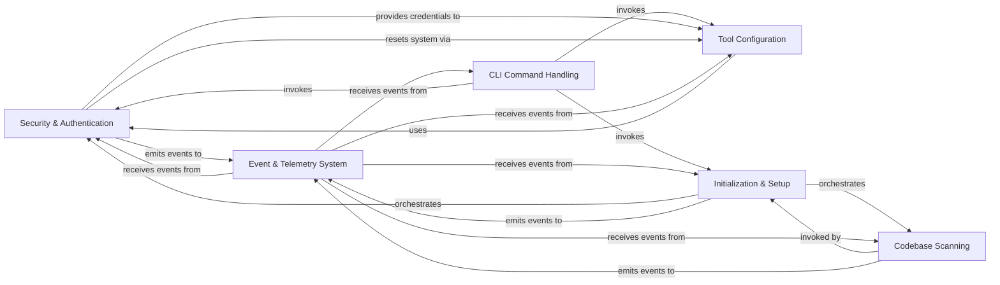

## Component Details

This graph illustrates the core components of the Safety CLI, detailing their responsibilities and interactions to provide comprehensive vulnerability scanning, user authentication, and firewall management. The central flow involves command handling, which orchestrates initialization, authentication, and codebase scanning. The Security & Authentication component is pivotal, managing user access and integrating with the Safety Firewall, while the Event & Telemetry System captures operational data across all components for monitoring and analysis.

### Security & Authentication
Handles user authentication with the Safety platform, including login, logout, status checks, and registration. It manages API keys, tokens, and session information to secure access to commercial features and data, and also manages the Safety Firewall feature.

**Related Classes/Methods**:

- `safety.safety.auth` (full file reference)
- `safety.safety.firewall` (full file reference)

### CLI Command Handling
Manages the overall command-line interface, including command parsing, argument handling, and filtering commands based on enabled features. It acts as the primary entry point for user interactions with the Safety CLI.

**Related Classes/Methods**:

- <a href="https://github.com/pyupio/safety/blob/master/safety/cli_util.py#L776-L931" target="_blank" rel="noopener noreferrer">`safety.safety.cli_util.SafetyCLILegacyGroup` (776:931)</a>
- <a href="https://github.com/pyupio/safety/blob/master/safety/cli_util.py#L858-L878" target="_blank" rel="noopener noreferrer">`safety.safety.cli_util.SafetyCLILegacyGroup:get_filtered_commands` (858:878)</a>
- <a href="https://github.com/pyupio/safety/blob/master/safety/cli_util.py#L880-L910" target="_blank" rel="noopener noreferrer">`safety.safety.cli_util.SafetyCLILegacyGroup:invoke` (880:910)</a>
- <a href="https://github.com/pyupio/safety/blob/master/safety/cli_util.py#L687-L737" target="_blank" rel="noopener noreferrer">`safety.safety.cli_util.SafetyCLISubGroup` (687:737)</a>
- <a href="https://github.com/pyupio/safety/blob/master/safety/cli_util.py#L740-L773" target="_blank" rel="noopener noreferrer">`safety.safety.cli_util.SafetyCLICommand` (740:773)</a>
- <a href="https://github.com/pyupio/safety/blob/master/safety/cli_util.py#L583-L668" target="_blank" rel="noopener noreferrer">`safety.safety.cli_util.process_auth_status_not_ready` (583:668)</a>
- <a href="https://github.com/pyupio/safety/blob/master/safety/cli_util.py#L137-L172" target="_blank" rel="noopener noreferrer">`safety.safety.cli_util.get_command_for` (137:172)</a>
- <a href="https://github.com/pyupio/safety/blob/master/safety/cli.py#L240-L258" target="_blank" rel="noopener noreferrer">`safety.safety.cli:cli` (240:258)</a>
- <a href="https://github.com/pyupio/safety/blob/master/safety/cli.py#L578-L764" target="_blank" rel="noopener noreferrer">`safety.safety.cli:check` (578:764)</a>
- <a href="https://github.com/pyupio/safety/blob/master/safety/cli.py#L818-L851" target="_blank" rel="noopener noreferrer">`safety.safety.cli:license` (818:851)</a>
- <a href="https://github.com/pyupio/safety/blob/master/safety/cli.py#L1165-L1245" target="_blank" rel="noopener noreferrer">`safety.safety.cli:configure` (1165:1245)</a>

### Tool Configuration
Manages the configuration of external package management tools like Pip, Poetry, and Uv, primarily for setting up Safety's package index URLs and handling credentials.

**Related Classes/Methods**:

- <a href="https://github.com/pyupio/safety/blob/master/safety/tool/pip/main.py#L26-L158" target="_blank" rel="noopener noreferrer">`safety.safety.tool.pip.main.Pip` (26:158)</a>
- <a href="https://github.com/pyupio/safety/blob/master/safety/tool/pip/main.py#L144-L158" target="_blank" rel="noopener noreferrer">`safety.safety.tool.pip.main.Pip:build_index_url` (144:158)</a>
- <a href="https://github.com/pyupio/safety/blob/master/safety/tool/pip/main.py#L38-L77" target="_blank" rel="noopener noreferrer">`safety.safety.tool.pip.main.Pip:configure_requirements` (38:77)</a>
- <a href="https://github.com/pyupio/safety/blob/master/safety/tool/pip/main.py#L80-L121" target="_blank" rel="noopener noreferrer">`safety.safety.tool.pip.main.Pip:configure_system` (80:121)</a>
- <a href="https://github.com/pyupio/safety/blob/master/safety/tool/pip/main.py#L124-L137" target="_blank" rel="noopener noreferrer">`safety.safety.tool.pip.main.Pip:reset_system` (124:137)</a>
- <a href="https://github.com/pyupio/safety/blob/master/safety/tool/pip/main.py#L140-L141" target="_blank" rel="noopener noreferrer">`safety.safety.tool.pip.main.Pip:default_index_url` (140:141)</a>
- <a href="https://github.com/pyupio/safety/blob/master/safety/tool/uv/command.py#L41-L51" target="_blank" rel="noopener noreferrer">`safety.safety.tool.uv.command.UvCommand:env` (41:51)</a>
- <a href="https://github.com/pyupio/safety/blob/master/safety/tool/poetry/command.py#L138-L148" target="_blank" rel="noopener noreferrer">`safety.safety.tool.poetry.command.PoetryCommand:env` (138:148)</a>
- <a href="https://github.com/pyupio/safety/blob/master/safety/tool/auth.py#L7-L35" target="_blank" rel="noopener noreferrer">`safety.safety.tool.auth.index_credentials` (7:35)</a>
- <a href="https://github.com/pyupio/safety/blob/master/safety/tool/main.py#L45-L56" target="_blank" rel="noopener noreferrer">`safety.safety.tool.main.configure_system` (45:56)</a>
- <a href="https://github.com/pyupio/safety/blob/master/safety/tool/main.py#L66-L82" target="_blank" rel="noopener noreferrer">`safety.safety.tool.main.configure_alias` (66:82)</a>
- <a href="https://github.com/pyupio/safety/blob/master/safety/tool/main.py#L59-L63" target="_blank" rel="noopener noreferrer">`safety.safety.tool.main.reset_system` (59:63)</a>
- <a href="https://github.com/pyupio/safety/blob/master/safety/tool/main.py#L85-L99" target="_blank" rel="noopener noreferrer">`safety.safety.tool.main.configure_local_directory` (85:99)</a>
- <a href="https://github.com/pyupio/safety/blob/master/safety/tool/main.py#L26-L42" target="_blank" rel="noopener noreferrer">`safety.safety.tool.main.find_local_tool_files` (26:42)</a>
- <a href="https://github.com/pyupio/safety/blob/master/safety/tool/tool_inspector.py#L18-L275" target="_blank" rel="noopener noreferrer">`safety.tool.tool_inspector.ToolInspector` (18:275)</a>
- <a href="https://github.com/pyupio/safety/blob/master/safety/tool/tool_inspector.py#L101-L122" target="_blank" rel="noopener noreferrer">`safety.tool.tool_inspector.ToolInspector.inspect_all_tools` (101:122)</a>
- <a href="https://github.com/pyupio/safety/blob/master/safety/tool/resolver.py#L5-L25" target="_blank" rel="noopener noreferrer">`safety.tool.resolver.get_unwrapped_command` (5:25)</a>

### Initialization & Setup
Orchestrates the initial setup process for the Safety CLI, guiding users through authentication, firewall configuration, and codebase scanning.

**Related Classes/Methods**:

- <a href="https://github.com/pyupio/safety/blob/master/safety/init/command.py#L563-L754" target="_blank" rel="noopener noreferrer">`safety.safety.init.command:do_init` (563:754)</a>
- <a href="https://github.com/pyupio/safety/blob/master/safety/init/command.py#L537-L560" target="_blank" rel="noopener noreferrer">`safety.safety.init.command:init` (537:560)</a>
- <a href="https://github.com/pyupio/safety/blob/master/safety/init/main.py#L320-L370" target="_blank" rel="noopener noreferrer">`safety.safety.init.main:launch_auth_if_needed` (320:370)</a>
- <a href="https://github.com/pyupio/safety/blob/master/safety/init/main.py#L373-L504" target="_blank" rel="noopener noreferrer">`safety.safety.init.main:setup_firewall` (373:504)</a>
- <a href="https://github.com/pyupio/safety/blob/master/safety/init/main.py#L286-L317" target="_blank" rel="noopener noreferrer">`safety.safety.init.main:create_project` (286:317)</a>
- <a href="https://github.com/pyupio/safety/blob/master/safety/init/render.py#L78-L112" target="_blank" rel="noopener noreferrer">`safety.safety.init.render:ask_firewall_setup` (78:112)</a>
- <a href="https://github.com/pyupio/safety/blob/master/safety/init/render.py#L115-L149" target="_blank" rel="noopener noreferrer">`safety.safety.init.render:ask_codebase_setup` (115:149)</a>
- <a href="https://github.com/pyupio/safety/blob/master/safety/init/render.py#L63-L75" target="_blank" rel="noopener noreferrer">`safety.safety.init.render:render_header` (63:75)</a>
- <a href="https://github.com/pyupio/safety/blob/master/safety/init/render.py#L48-L54" target="_blank" rel="noopener noreferrer">`safety.safety.init.render:typed_print` (48:54)</a>
- <a href="https://github.com/pyupio/safety/blob/master/safety/init/render.py#L57-L60" target="_blank" rel="noopener noreferrer">`safety.safety.init.render:progressive_print` (57:60)</a>
- <a href="https://github.com/pyupio/safety/blob/master/safety/init/render.py#L18-L45" target="_blank" rel="noopener noreferrer">`safety.safety.init.render:load_emoji` (18:45)</a>
- <a href="https://github.com/pyupio/safety/blob/master/safety/init/command.py#L110-L147" target="_blank" rel="noopener noreferrer">`safety.safety.init.command.InitScanState` (110:147)</a>
- <a href="https://github.com/pyupio/safety/blob/master/safety/init/command.py#L150-L253" target="_blank" rel="noopener noreferrer">`safety.safety.init.command.generate_summary` (150:253)</a>
- <a href="https://github.com/pyupio/safety/blob/master/safety/init/command.py#L256-L299" target="_blank" rel="noopener noreferrer">`safety.safety.init.command.generate_status_updates` (256:299)</a>
- <a href="https://github.com/pyupio/safety/blob/master/safety/init/command.py#L302-L407" target="_blank" rel="noopener noreferrer">`safety.safety.init.command.process_scan_results` (302:407)</a>
- <a href="https://github.com/pyupio/safety/blob/master/safety/init/command.py#L410-L520" target="_blank" rel="noopener noreferrer">`safety.safety.init.command.init_scan_ui` (410:520)</a>

### Event & Telemetry System
A core system responsible for creating, emitting, and managing various events throughout the Safety CLI's operation, used for internal communication and telemetry.

**Related Classes/Methods**:

- <a href="https://github.com/pyupio/safety/blob/master/safety/events/utils/emission.py#L76-L108" target="_blank" rel="noopener noreferrer">`safety.safety.events.utils.emission.send_and_flush` (76:108)</a>
- <a href="https://github.com/pyupio/safety/blob/master/safety/events/utils/emission.py#L112-L118" target="_blank" rel="noopener noreferrer">`safety.safety.events.utils.emission.emit_firewall_heartbeat` (112:118)</a>
- <a href="https://github.com/pyupio/safety/blob/master/safety/events/utils/emission.py#L122-L131" target="_blank" rel="noopener noreferrer">`safety.safety.events.utils.emission.emit_firewall_disabled` (122:131)</a>
- <a href="https://github.com/pyupio/safety/blob/master/safety/events/utils/emission.py#L134-L174" target="_blank" rel="noopener noreferrer">`safety.safety.events.utils.emission.status_to_tool_status` (134:174)</a>
- <a href="https://github.com/pyupio/safety/blob/master/safety/events/utils/emission.py#L178-L190" target="_blank" rel="noopener noreferrer">`safety.safety.events.utils.emission.emit_firewall_configured` (178:190)</a>
- <a href="https://github.com/pyupio/safety/blob/master/safety/events/utils/emission.py#L194-L248" target="_blank" rel="noopener noreferrer">`safety.safety.events.utils.emission.emit_diff_operations` (194:248)</a>
- <a href="https://github.com/pyupio/safety/blob/master/safety/events/utils/emission.py#L252-L283" target="_blank" rel="noopener noreferrer">`safety.safety.events.utils.emission.emit_tool_command_executed` (252:283)</a>
- <a href="https://github.com/pyupio/safety/blob/master/safety/events/utils/emission.py#L287-L344" target="_blank" rel="noopener noreferrer">`safety.safety.events.utils.emission.emit_command_executed` (287:344)</a>
- <a href="https://github.com/pyupio/safety/blob/master/safety/events/utils/emission.py#L348-L383" target="_blank" rel="noopener noreferrer">`safety.safety.events.utils.emission.emit_command_error` (348:383)</a>
- <a href="https://github.com/pyupio/safety/blob/master/safety/events/utils/emission.py#L386-L410" target="_blank" rel="noopener noreferrer">`safety.safety.events.utils.emission.emit_init_started` (386:410)</a>
- <a href="https://github.com/pyupio/safety/blob/master/safety/events/utils/emission.py#L413-L435" target="_blank" rel="noopener noreferrer">`safety.safety.events.utils.emission.emit_auth_started` (413:435)</a>
- <a href="https://github.com/pyupio/safety/blob/master/safety/events/utils/emission.py#L439-L474" target="_blank" rel="noopener noreferrer">`safety.safety.events.utils.emission.emit_auth_completed` (439:474)</a>
- <a href="https://github.com/pyupio/safety/blob/master/safety/events/utils/emission.py#L478-L501" target="_blank" rel="noopener noreferrer">`safety.safety.events.utils.emission.emit_firewall_setup_response_created` (478:501)</a>
- <a href="https://github.com/pyupio/safety/blob/master/safety/events/utils/emission.py#L505-L528" target="_blank" rel="noopener noreferrer">`safety.safety.events.utils.emission.emit_codebase_setup_response_created` (505:528)</a>
- <a href="https://github.com/pyupio/safety/blob/master/safety/events/utils/emission.py#L532-L560" target="_blank" rel="noopener noreferrer">`safety.safety.events.utils.emission.emit_codebase_detection_status` (532:560)</a>
- <a href="https://github.com/pyupio/safety/blob/master/safety/events/utils/emission.py#L564-L584" target="_blank" rel="noopener noreferrer">`safety.safety.events.utils.emission.emit_init_scan_completed` (564:584)</a>
- <a href="https://github.com/pyupio/safety/blob/master/safety/events/utils/emission.py#L588-L611" target="_blank" rel="noopener noreferrer">`safety.safety.events.utils.emission.emit_codebase_setup_completed` (588:611)</a>
- <a href="https://github.com/pyupio/safety/blob/master/safety/events/utils/emission.py#L615-L639" target="_blank" rel="noopener noreferrer">`safety.safety.events.utils.emission.emit_firewall_setup_completed` (615:639)</a>
- <a href="https://github.com/pyupio/safety/blob/master/safety/events/utils/emission.py#L643-L663" target="_blank" rel="noopener noreferrer">`safety.safety.events.utils.emission.emit_init_exited` (643:663)</a>
- <a href="https://github.com/pyupio/safety/blob/master/safety/events/event_bus/utils.py#L15-L57" target="_blank" rel="noopener noreferrer">`safety.safety.events.event_bus.utils:start_event_bus` (15:57)</a>
- <a href="https://github.com/pyupio/safety/blob/master/safety/events/utils/conditions.py#L42-L42" target="_blank" rel="noopener noreferrer">`safety.safety.events.utils.conditions.conditional_emitter` (42:42)</a>
- <a href="https://github.com/pyupio/safety/blob/master/safety/events/utils/conditions.py#L26-L33" target="_blank" rel="noopener noreferrer">`safety.safety.events.utils.conditions.should_emit_firewall_heartbeat` (26:33)</a>
- <a href="https://github.com/pyupio/safety/blob/master/safety/events/utils/creation.py#L14-L33" target="_blank" rel="noopener noreferrer">`safety.safety.events.utils.creation.create_event` (14:33)</a>
- <a href="https://github.com/pyupio/safety/blob/master/safety/events/utils/data.py#L56-L66" target="_blank" rel="noopener noreferrer">`safety.safety.events.utils.data.clean_parameter` (56:66)</a>
- <a href="https://github.com/pyupio/safety/blob/master/safety/events/utils/data.py#L69-L84" target="_blank" rel="noopener noreferrer">`safety.safety.events.utils.data.get_command_path` (69:84)</a>
- <a href="https://github.com/pyupio/safety/blob/master/safety/events/utils/data.py#L87-L94" target="_blank" rel="noopener noreferrer">`safety.safety.events.utils.data.get_root_context` (87:94)</a>
- <a href="https://github.com/pyupio/safety/blob/master/safety/events/utils/data.py#L23-L53" target="_blank" rel="noopener noreferrer">`safety.safety.events.utils.data.scrub_sensitive_value` (23:53)</a>
- <a href="https://github.com/pyupio/safety/blob/master/safety/events/utils/data.py#L97-L110" target="_blank" rel="noopener noreferrer">`safety.safety.events.utils.data.translate_param_source` (97:110)</a>

### Codebase Scanning
Focuses on the actual scanning of project dependencies for vulnerabilities, identifying issues and providing results.

**Related Classes/Methods**:

- <a href="https://github.com/pyupio/safety/blob/master/safety/scan/decorators.py#L31-L159" target="_blank" rel="noopener noreferrer">`safety.safety.scan.decorators:scan_project_command_init` (31:159)</a>
- <a href="https://github.com/pyupio/safety/blob/master/safety/scan/decorators.py#L162-L255" target="_blank" rel="noopener noreferrer">`safety.safety.scan.decorators:scan_system_command_init` (162:255)</a>
- <a href="https://github.com/pyupio/safety/blob/master/safety/scan/init_scan.py#L481-L557" target="_blank" rel="noopener noreferrer">`safety.scan.init_scan.start_scan` (481:557)</a>

### [FAQ](https://github.com/CodeBoarding/GeneratedOnBoardings/tree/main?tab=readme-ov-file#faq)