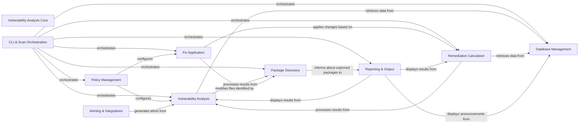

## Component Details

The Vulnerability Analysis Core is the central engine of the Safety tool, orchestrating the entire process of identifying, analyzing, and remediating software vulnerabilities. It integrates various sub-components to fetch and validate vulnerability databases, discover installed packages, perform detailed vulnerability checks, calculate recommended fixes, apply those fixes to dependency files, generate comprehensive reports, manage security policies, and integrate with external alerting systems. Its primary purpose is to provide a robust and automated solution for maintaining software supply chain security.

### Vulnerability Analysis Core
The central engine for identifying software vulnerabilities. It handles fetching and validating vulnerability databases, analyzing package dependencies, calculating remediations, and orchestrating the overall scanning process.

**Related Classes/Methods**:

- <a href="https://github.com/pyupio/safety/blob/master/safety/safety.py#L1-L1000" target="_blank" rel="noopener noreferrer">`safety.safety.safety` (1:1000)</a>
- <a href="https://github.com/pyupio/safety/blob/master/safety/safety.py#L1-L700" target="_blank" rel="noopener noreferrer">`safety.safety.scan` (1:700)</a>
- <a href="https://github.com/pyupio/safety/blob/master/safety/safety.py#L1-L190" target="_blank" rel="noopener noreferrer">`safety.safety.scan` (1:190)</a>
- <a href="https://github.com/pyupio/safety/blob/master/safety/safety.py#L1-L200" target="_blank" rel="noopener noreferrer">`safety.safety.scan` (1:200)</a>
- <a href="https://github.com/pyupio/safety/blob/master/safety/safety.py#L1-L300" target="_blank" rel="noopener noreferrer">`safety.safety.scan` (1:300)</a>
- <a href="https://github.com/pyupio/safety/blob/master/safety/safety.py#L1-L400" target="_blank" rel="noopener noreferrer">`safety.safety.scan` (1:400)</a>
- <a href="https://github.com/pyupio/safety/blob/master/safety/safety.py#L1-L400" target="_blank" rel="noopener noreferrer">`safety.safety.alerts` (1:400)</a>

### Database Management
This component is responsible for fetching, caching, and validating vulnerability and license databases from remote mirrors or local files. It ensures that the Safety tool has access to up-to-date security intelligence.

**Related Classes/Methods**:

- <a href="https://github.com/pyupio/safety/blob/master/safety/safety.py#L219-L287" target="_blank" rel="noopener noreferrer">`safety.safety.safety:fetch_database_url` (219:287)</a>
- <a href="https://github.com/pyupio/safety/blob/master/safety/safety.py#L313-L344" target="_blank" rel="noopener noreferrer">`safety.safety.safety:fetch_database_file` (313:344)</a>
- <a href="https://github.com/pyupio/safety/blob/master/safety/safety.py#L366-L425" target="_blank" rel="noopener noreferrer">`safety.safety.safety:fetch_database` (366:425)</a>
- <a href="https://github.com/pyupio/safety/blob/master/safety/safety.py#L91-L149" target="_blank" rel="noopener noreferrer">`safety.safety.safety:get_from_cache` (91:149)</a>
- <a href="https://github.com/pyupio/safety/blob/master/safety/safety.py#L152-L201" target="_blank" rel="noopener noreferrer">`safety.safety.safety:write_to_cache` (152:201)</a>
- <a href="https://github.com/pyupio/safety/blob/master/safety/safety.py#L347-L363" target="_blank" rel="noopener noreferrer">`safety.safety.safety:is_valid_database` (347:363)</a>
- <a href="https://github.com/pyupio/safety/blob/master/safety/safety.py#L1892-L1909" target="_blank" rel="noopener noreferrer">`safety.safety.safety:read_vulnerabilities` (1892:1909)</a>
- <a href="https://github.com/pyupio/safety/blob/master/safety/safety.py#L1668-L1704" target="_blank" rel="noopener noreferrer">`safety.safety.safety:get_licenses` (1668:1704)</a>

### Vulnerability Analysis
This component contains the core logic for identifying security vulnerabilities within discovered packages. It queries the vulnerability database, checks package versions against known vulnerable specifications, and constructs detailed vulnerability objects.

**Related Classes/Methods**:

- <a href="https://github.com/pyupio/safety/blob/master/safety/safety.py#L676-L802" target="_blank" rel="noopener noreferrer">`safety.safety.safety:check` (676:802)</a>
- <a href="https://github.com/pyupio/safety/blob/master/safety/safety.py#L428-L445" target="_blank" rel="noopener noreferrer">`safety.safety.safety:get_vulnerabilities` (428:445)</a>
- <a href="https://github.com/pyupio/safety/blob/master/safety/safety.py#L448-L532" target="_blank" rel="noopener noreferrer">`safety.safety.safety:get_vulnerability_from` (448:532)</a>
- <a href="https://github.com/pyupio/safety/blob/master/safety/safety.py#L535-L565" target="_blank" rel="noopener noreferrer">`safety.safety.safety:get_cve_from` (535:565)</a>
- <a href="https://github.com/pyupio/safety/blob/master/safety/safety.py#L568-L638" target="_blank" rel="noopener noreferrer">`safety.safety.safety:ignore_vuln_if_needed` (568:638)</a>
- <a href="https://github.com/pyupio/safety/blob/master/safety/safety.py#L641-L672" target="_blank" rel="noopener noreferrer">`safety.safety.safety:is_vulnerable` (641:672)</a>
- <a href="https://github.com/pyupio/safety/blob/master/safety/scan/ecosystems/python/main.py#L239-L350" target="_blank" rel="noopener noreferrer">`safety.safety.scan.ecosystems.python.main.PythonFile:__find_dependency_vulnerabilities__` (239:350)</a>
- <a href="https://github.com/pyupio/safety/blob/master/safety/scan/ecosystems/python/main.py#L352-L367" target="_blank" rel="noopener noreferrer">`safety.safety.scan.ecosystems.python.main.PythonFile:inspect` (352:367)</a>

### Remediation Calculation
This component is responsible for calculating recommended fixes for identified vulnerabilities. It determines secure versions for packages and provides options for upgrading or downgrading to non-vulnerable versions.

**Related Classes/Methods**:

- <a href="https://github.com/pyupio/safety/blob/master/safety/safety.py#L805-L855" target="_blank" rel="noopener noreferrer">`safety.safety.safety:precompute_remediations` (805:855)</a>
- <a href="https://github.com/pyupio/safety/blob/master/safety/safety.py#L911-L940" target="_blank" rel="noopener noreferrer">`safety.safety.safety:compute_sec_ver_for_user` (911:940)</a>
- <a href="https://github.com/pyupio/safety/blob/master/safety/safety.py#L943-L1014" target="_blank" rel="noopener noreferrer">`safety.safety.safety:compute_sec_ver` (943:1014)</a>
- <a href="https://github.com/pyupio/safety/blob/master/safety/safety.py#L1017-L1040" target="_blank" rel="noopener noreferrer">`safety.safety.safety:calculate_remediations` (1017:1040)</a>
- <a href="https://github.com/pyupio/safety/blob/master/safety/safety.py#L858-L908" target="_blank" rel="noopener noreferrer">`safety.safety.safety:get_closest_ver` (858:908)</a>
- <a href="https://github.com/pyupio/safety/blob/master/safety/scan/ecosystems/python/main.py#L401-L463" target="_blank" rel="noopener noreferrer">`safety.safety.scan.ecosystems.python.main.PythonFile:remediate` (401:463)</a>

### Fix Application
This component handles the actual modification of requirement files to apply the calculated remediations. It supports automatic and manual application of fixes based on user preferences and update types.

**Related Classes/Methods**:

- <a href="https://github.com/pyupio/safety/blob/master/safety/safety.py#L1101-L1130" target="_blank" rel="noopener noreferrer">`safety.safety.safety:process_fixes` (1101:1130)</a>
- <a href="https://github.com/pyupio/safety/blob/master/safety/safety.py#L1133-L1231" target="_blank" rel="noopener noreferrer">`safety.safety.safety:process_fixes_scan` (1133:1231)</a>
- <a href="https://github.com/pyupio/safety/blob/master/safety/safety.py#L1234-L1366" target="_blank" rel="noopener noreferrer">`safety.safety.safety:compute_fixes_per_requirements` (1234:1366)</a>
- <a href="https://github.com/pyupio/safety/blob/master/safety/safety.py#L1369-L1551" target="_blank" rel="noopener noreferrer">`safety.safety.safety:apply_fixes` (1369:1551)</a>
- <a href="https://github.com/pyupio/safety/blob/master/safety/safety.py#L1043-L1078" target="_blank" rel="noopener noreferrer">`safety.safety.safety:should_apply_auto_fix` (1043:1078)</a>
- <a href="https://github.com/pyupio/safety/blob/master/safety/safety.py#L1081-L1098" target="_blank" rel="noopener noreferrer">`safety.safety.safety:get_update_type` (1081:1098)</a>

### Package Discovery
This component is responsible for identifying and collecting information about installed packages or packages defined in various dependency files (e.g., requirements.txt, Pipfile).

**Related Classes/Methods**:

- <a href="https://github.com/pyupio/safety/blob/master/safety/safety.py#L1829-L1889" target="_blank" rel="noopener noreferrer">`safety.safety.safety:get_packages` (1829:1889)</a>
- <a href="https://github.com/pyupio/safety/blob/master/safety/scan/ecosystems/python/dependencies.py#L274-L294" target="_blank" rel="noopener noreferrer">`safety.safety.scan.ecosystems.python.dependencies:get_dependencies` (274:294)</a>
- <a href="https://github.com/pyupio/safety/blob/master/safety/scan/finder/file_finder.py#L160-L167" target="_blank" rel="noopener noreferrer">`safety.safety.scan.finder.file_finder.FileFinder:search` (160:167)</a>

### CLI & Scan Orchestration
This component manages the overall execution flow of Safety's command-line interface and the scanning process. It coordinates interactions between other components, handles command-line arguments, and initializes the scan environment.

**Related Classes/Methods**:

- <a href="https://github.com/pyupio/safety/blob/master/safety/cli.py#L578-L764" target="_blank" rel="noopener noreferrer">`safety.safety.cli:check` (578:764)</a>
- <a href="https://github.com/pyupio/safety/blob/master/safety/cli.py#L818-L851" target="_blank" rel="noopener noreferrer">`safety.safety.cli:license` (818:851)</a>
- <a href="https://github.com/pyupio/safety/blob/master/safety/cli.py#L869-L887" target="_blank" rel="noopener noreferrer">`safety.safety.cli:generate` (869:887)</a>
- <a href="https://github.com/pyupio/safety/blob/master/safety/cli.py#L1015-L1086" target="_blank" rel="noopener noreferrer">`safety.safety.cli:validate` (1015:1086)</a>
- <a href="https://github.com/pyupio/safety/blob/master/safety/scan/command.py#L826-L1146" target="_blank" rel="noopener noreferrer">`safety.safety.scan.command:scan` (826:1146)</a>
- <a href="https://github.com/pyupio/safety/blob/master/safety/scan/command.py#L1161-L1502" target="_blank" rel="noopener noreferrer">`safety.safety.scan.command:system_scan` (1161:1502)</a>
- <a href="https://github.com/pyupio/safety/blob/master/safety/scan/main.py#L205-L279" target="_blank" rel="noopener noreferrer">`safety.safety.scan.main:process_files` (205:279)</a>
- <a href="https://github.com/pyupio/safety/blob/master/safety/scan/decorators.py#L31-L159" target="_blank" rel="noopener noreferrer">`safety.safety.scan.decorators:scan_project_command_init` (31:159)</a>
- <a href="https://github.com/pyupio/safety/blob/master/safety/scan/decorators.py#L162-L255" target="_blank" rel="noopener noreferrer">`safety.safety.scan.decorators:scan_system_command_init` (162:255)</a>
- <a href="https://github.com/pyupio/safety/blob/master/safety/scan/init_scan.py#L481-L557" target="_blank" rel="noopener noreferrer">`safety.safety.scan.init_scan:start_scan` (481:557)</a>
- <a href="https://github.com/pyupio/safety/blob/master/safety/scan/init_scan.py#L168-L478" target="_blank" rel="noopener noreferrer">`safety.safety.scan.init_scan:init_scan` (168:478)</a>

### Reporting & Output
This component is responsible for generating, formatting, and displaying scan results, announcements, and other relevant information to the user. It supports various output formats like text, HTML, and SPDX.

**Related Classes/Methods**:

- <a href="https://github.com/pyupio/safety/blob/master/safety/safety.py#L1580-L1664" target="_blank" rel="noopener noreferrer">`safety.safety.safety:review` (1580:1664)</a>
- <a href="https://github.com/pyupio/safety/blob/master/safety/safety.py#L1956-L1972" target="_blank" rel="noopener noreferrer">`safety.safety.safety:save_report` (1956:1972)</a>
- <a href="https://github.com/pyupio/safety/blob/master/safety/safety.py#L1707-L1753" target="_blank" rel="noopener noreferrer">`safety.safety.safety:add_local_notifications` (1707:1753)</a>
- <a href="https://github.com/pyupio/safety/blob/master/safety/safety.py#L1756-L1826" target="_blank" rel="noopener noreferrer">`safety.safety.safety:get_announcements` (1756:1826)</a>
- <a href="https://github.com/pyupio/safety/blob/master/safety/scan/command.py#L164-L320" target="_blank" rel="noopener noreferrer">`safety.safety.scan.command:process_report` (164:320)</a>
- <a href="https://github.com/pyupio/safety/blob/master/safety/scan/render.py#L62-L71" target="_blank" rel="noopener noreferrer">`safety.safety.scan.render:print_header` (62:71)</a>
- <a href="https://github.com/pyupio/safety/blob/master/safety/scan/render.py#L74-L97" target="_blank" rel="noopener noreferrer">`safety.safety.scan.render:print_announcements` (74:97)</a>
- <a href="https://github.com/pyupio/safety/blob/master/safety/scan/render.py#L181-L308" target="_blank" rel="noopener noreferrer">`safety.safety.scan.render:print_summary` (181:308)</a>
- <a href="https://github.com/pyupio/safety/blob/master/safety/scan/render.py#L540-L616" target="_blank" rel="noopener noreferrer">`safety.safety.scan.render:render_scan_html` (540:616)</a>
- <a href="https://github.com/pyupio/safety/blob/master/safety/scan/render.py#L791-L820" target="_blank" rel="noopener noreferrer">`safety.safety.scan.render:render_scan_spdx` (791:820)</a>

### Policy Management
This component handles the retrieval, parsing, and application of security policies, which can be defined locally or fetched from a server. Policies influence how vulnerabilities are handled and ignored.

**Related Classes/Methods**:

- <a href="https://github.com/pyupio/safety/blob/master/safety/safety.py#L290-L310" target="_blank" rel="noopener noreferrer">`safety.safety.safety:fetch_policy` (290:310)</a>
- <a href="https://github.com/pyupio/safety/blob/master/safety/safety.py#L1912-L1953" target="_blank" rel="noopener noreferrer">`safety.safety.safety:get_server_policies` (1912:1953)</a>
- <a href="https://github.com/pyupio/safety/blob/master/safety/scan/main.py#L79-L110" target="_blank" rel="noopener noreferrer">`safety.safety.scan.main:load_policy_file` (79:110)</a>
- <a href="https://github.com/pyupio/safety/blob/master/safety/scan/main.py#L30-L76" target="_blank" rel="noopener noreferrer">`safety.safety.scan.main:download_policy` (30:76)</a>

### Alerting & Integrations
This component provides functionality for integrating with external systems, specifically for generating alerts like GitHub Pull Requests or Issues based on scan findings.

**Related Classes/Methods**:

- <a href="https://github.com/pyupio/safety/blob/master/safety/alerts/github.py#L52-L283" target="_blank" rel="noopener noreferrer">`safety.safety.alerts.github:github_pr` (52:283)</a>
- <a href="https://github.com/pyupio/safety/blob/master/safety/alerts/github.py#L292-L419" target="_blank" rel="noopener noreferrer">`safety.safety.alerts.github:github_issue` (292:419)</a>
- `safety.safety.alerts:alert` (full file reference)

### [FAQ](https://github.com/CodeBoarding/GeneratedOnBoardings/tree/main?tab=readme-ov-file#faq)