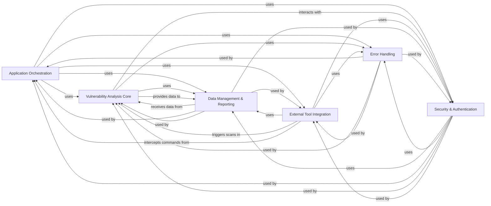

## Component Details

The `safety` project's architecture is primarily driven by its command-line interface, orchestrating vulnerability scanning and remediation processes. It leverages a core vulnerability analysis engine that interacts with external package management tools and a robust data management layer for reporting. Authentication and error handling are cross-cutting concerns, ensuring secure operations and graceful degradation, all facilitated by an internal event management system for decoupled communication and telemetry.

### Application Orchestration
Manages the command-line interface, application lifecycle, initial setup, and the central event bus for inter-component communication and telemetry. It acts as the primary entry point and coordinator for various application flows.

**Related Classes/Methods**:

- <a href="https://github.com/pyupio/safety/blob/master/safety/cli.py#L240-L258" target="_blank" rel="noopener noreferrer">`safety.safety.cli` (240:258)</a>
- `safety.safety.cli_util` (full file reference)
- `safety.safety.init` (full file reference)
- `safety.safety.events` (full file reference)

### Vulnerability Analysis Core
The central engine for identifying software vulnerabilities. It handles fetching and validating vulnerability databases, analyzing package dependencies, calculating remediations, and orchestrating the overall scanning process.

**Related Classes/Methods**:

- `safety.safety.safety` (full file reference)
- `safety.safety.scan` (full file reference)
- `safety.safety.alerts` (full file reference)

### External Tool Integration
Manages the interaction and interception of commands for external package management tools (e.g., pip, poetry, uv). It allows Safety to audit and modify their behavior, track environment changes, and facilitate security updates.

**Related Classes/Methods**:

- `safety.safety.tool` (full file reference)

### Data Management & Reporting
Responsible for defining the application's data structures, formatting scan results, licenses, and announcements for various output formats, and providing general utility functions for data manipulation and common tasks.

**Related Classes/Methods**:

- `safety.safety.output_utils` (full file reference)
- `safety.safety.formatter` (full file reference)
- `safety.safety.formatters` (full file reference)
- `safety.safety.models` (full file reference)
- `safety.safety.util` (full file reference)

### Security & Authentication
Handles user authentication with the Safety platform, including login, logout, status checks, and registration. It manages API keys, tokens, and session information to secure access to commercial features and data, and also manages the Safety Firewall feature.

**Related Classes/Methods**:

- `safety.safety.auth` (full file reference)
- `safety.safety.firewall` (full file reference)

### Error Handling
Provides a centralized mechanism for catching, logging, and presenting various errors and exceptions that occur throughout the application, ensuring graceful degradation and informative user feedback.

**Related Classes/Methods**:

- `safety.safety.errors` (full file reference)
- `safety.safety.error_handlers` (full file reference)

### [FAQ](https://github.com/CodeBoarding/GeneratedOnBoardings/tree/main?tab=readme-ov-file#faq)