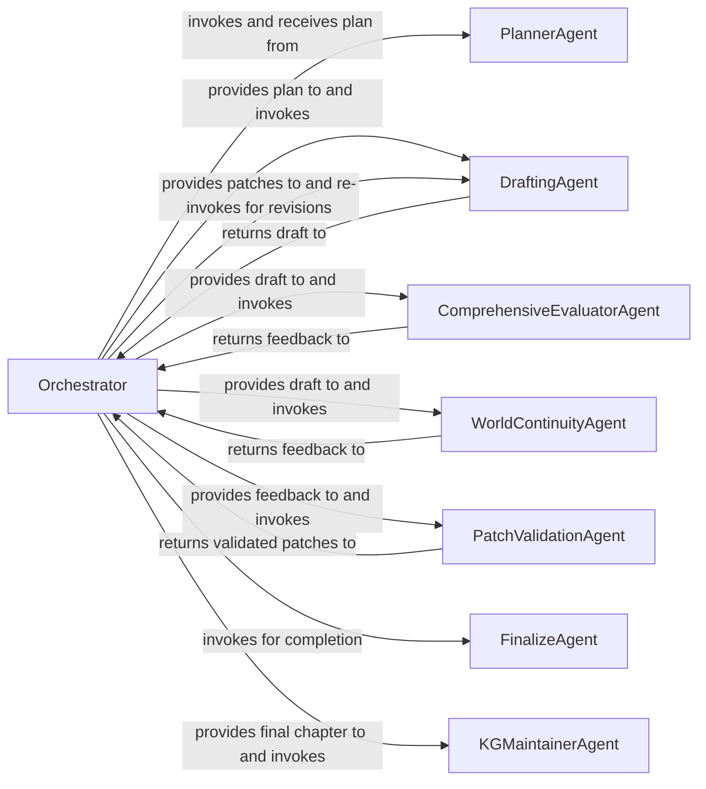

## Details

One paragraph explaining the functionality which is represented by this graph. What the main flow is and what is its purpose.

### Orchestrator
Manages the end-to-end chapter generation workflow. It initiates the agent sequence and controls the iterative revision loop until the chapter meets quality standards.

**Related Classes/Methods**:

- `saga.orchestration.chapter_flow`

### PlannerAgent
Decomposes high-level chapter goals into a structured outline. This plan serves as the foundational blueprint for the `DraftingAgent`.

**Related Classes/Methods**:

- `saga.agents.planner_agent`

### DraftingAgent
Generates the initial prose for the chapter based on the provided plan. It also integrates revisions (patches) during the iterative feedback loop.

**Related Classes/Methods**:

- `saga.agents.drafting_agent`

### ComprehensiveEvaluatorAgent
Performs a holistic quality assessment of the draft, focusing on narrative coherence, style, pacing, and overall readability.

**Related Classes/Methods**:

- `saga.agents.comprehensive_evaluator_agent`

### WorldContinuityAgent
A specialized evaluator that validates the draft against the established world-building details in the Knowledge Graph, ensuring narrative consistency.

**Related Classes/Methods**:

- `saga.agents.world_continuity_agent`

### PatchValidationAgent
Reviews and validates revision suggestions from all evaluator agents, ensuring they are logical and correctly formatted before being sent back for application.

**Related Classes/Methods**:

- `saga.agents.patch_validation_agent`

### FinalizeAgent
Executes the final steps to complete a chapter after it has passed all evaluations. This includes final formatting and triggering the knowledge update process.

**Related Classes/Methods**:

- `saga.agents.finalize_agent`

### KGMaintainerAgent
Extracts new entities, events, and relationships from the finalized chapter and updates the Neo4j Knowledge Graph, enriching the system's long-term memory.

**Related Classes/Methods**:

- `saga.agents.kg_maintainer_agent`

### [FAQ](https://github.com/CodeBoarding/GeneratedOnBoardings/tree/main?tab=readme-ov-file#faq)