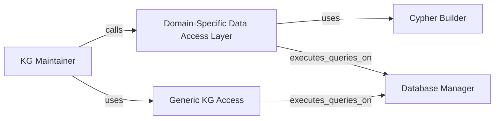

## Details

Based on the provided feedback, I have re-evaluated the architecture of the `saga` data access subsystem. The feedback correctly identifies that the `Domain-Specific Data Access Layer` and the `Generic KG Access` component do not have a hierarchical relationship. Instead, they operate as parallel layers that both interact directly with a lower-level database management component. The original analysis incorrectly modeled the `Domain-Specific Data Access Layer` as executing its functions *through* the `Generic KG Access` layer. The control flow analysis shows this is not the case. I have updated the component definitions and relationships to reflect this more accurate, parallel architecture. A new component, `Database Manager`, has been introduced to represent the shared, underlying database connection and execution engine that both data access layers utilize.

### KG Maintainer
Orchestrates the integration of new information into the knowledge graph. It takes unstructured or semi-structured data from AI agents, uses parsing and normalization services, and intelligently merges the resulting entities and relationships into the graph to ensure consistency and avoid duplication.

**Related Classes/Methods**:

- `saga.kg_maintainer`

### Domain-Specific Data Access Layer
Provides a high-level, conceptual API for interacting with core narrative entities (e.g., Character, World, Plot). It abstracts the graph schema, allowing other components to perform CRUD-like operations on domain concepts without writing raw Cypher queries.

**Related Classes/Methods**:

- `saga.data_access.character_queries`
- `saga.data_access.world_queries`
- `saga.data_access.plot_queries`
- `saga.data_access.chapter_queries`

### Generic KG Access
A low-level component that offers foundational functions for direct graph manipulation, such as executing raw Cypher queries or adding generic triples (subject-predicate-object). It provides a direct interface for graph operations that are not covered by the domain-specific layer.

**Related Classes/Methods**:

- `saga.data_access.kg_queries`

### Cypher Builder
A utility component responsible for dynamically constructing complex and parameterized Cypher queries. It prevents string formatting errors and potential injection vulnerabilities by providing a structured way to build queries.

**Related Classes/Methods**:

- `saga.data_access.cypher_builders`

### Database Manager
A low-level infrastructure component that manages the connection to the Neo4j database and executes Cypher queries. It serves as the single point of interaction with the database for all data access components.

**Related Classes/Methods**:

- <a href="https://github.com/Lanerra/saga/blob/master/core/db_manager.py#L18-L298" target="_blank" rel="noopener noreferrer">`core.db_manager.Neo4jManagerSingleton` (18:298)</a>

### [FAQ](https://github.com/CodeBoarding/GeneratedOnBoardings/tree/main?tab=readme-ov-file#faq)