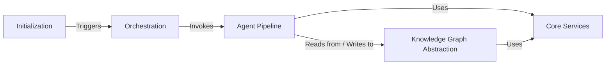

## Details

Abstract Components Overview

### Initialization
Bootstraps the story world by processing initial user input to create and populate the foundational entities (e.g., characters, plot, world details) in the knowledge graph.

**Related Classes/Methods**:

- `saga.initialization.genesis`

### Orchestration
The central controller that manages the end-to-end content generation workflow, sequencing the calls to the Agent Pipeline for chapter creation, evaluation, and finalization.

**Related Classes/Methods**:

- <a href="https://github.com/Lanerra/saga/blob/master/orchestration/nana_orchestrator.py#L56-L1365" target="_blank" rel="noopener noreferrer">`saga.orchestration.nana_orchestrator.NANA_Orchestrator` (56:1365)</a>

### Agent Pipeline [[Expand]](./Agent_Pipeline.md)
A suite of specialized AI agents that execute the core content creation tasks. It functions as an iterative pipeline to progressively plan, draft, evaluate, and revise a chapter until it meets quality standards.

**Related Classes/Methods**:

- `saga.agents`
- `saga.orchestration.chapter_flow`

### Knowledge Graph Abstraction [[Expand]](./Knowledge_Graph_Abstraction.md)
Provides a high-level API for all database interactions, acting as the long-term memory for the agents. It encapsulates data querying, persistence, and the logic for extracting and merging new knowledge into the Neo4j graph.

**Related Classes/Methods**:

- `saga.data_access`
- `saga.kg_maintainer`

### Core Services
Provides essential, low-level services shared across the application. It abstracts all interactions with Large Language Models (LLMs) and manages the singleton database connection for efficient resource use.

**Related Classes/Methods**:

- `saga.core.llm_interface`
- `saga.core.db_manager`

### [FAQ](https://github.com/CodeBoarding/GeneratedOnBoardings/tree/main?tab=readme-ov-file#faq)