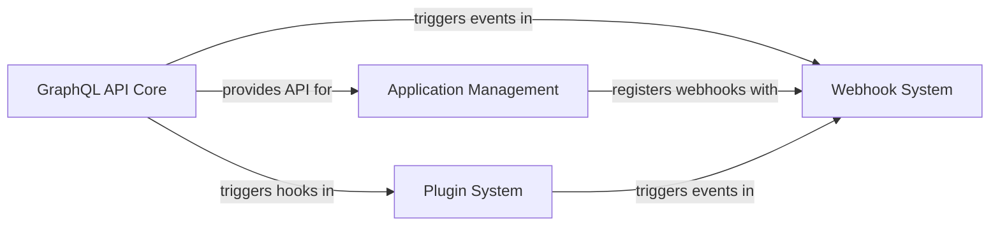

## Component Details

These four components are fundamental to Saleor's "API & Extensibility" because they collectively form the backbone of how Saleor interacts with the outside world and how its core functionality can be extended and customized.

*   **`GraphQL API Core`**: This is the *face* of Saleor. Without a robust and well-defined API, external systems and frontends cannot interact with the platform. It's the primary communication channel for all data operations.
*   **`Plugin System`**: This is the *engine of customization*. It allows Saleor to be adapted to diverse business needs without altering the core codebase, promoting maintainability, upgradeability, and a rich ecosystem of extensions. It's crucial for vertical extensibility.
*   **`Webhook System`**: This is the *event-driven backbone*. It enables real-time or near real-time communication with other services, facilitating integrations, data synchronization, and automated workflows. It's essential for horizontal extensibility and integration with external systems.
*   **`Application Management`**: This is the *governor of external integrations*. It provides a secure and structured way to onboard and manage third-party applications, ensuring that extensions are properly configured, permissioned, and can interact with Saleor in a controlled manner. It's vital for a healthy and secure app ecosystem.

Together, these components ensure that Saleor is not just a standalone e-commerce platform but a highly interconnected and adaptable system capable of evolving with business requirements and integrating seamlessly into a broader digital landscape.

### GraphQL API Core
This component serves as the central entry point for all external interactions with Saleor. It is responsible for receiving and processing GraphQL queries and mutations, validating requests, resolving data, and orchestrating calls to the underlying business logic. It defines the overall structure and capabilities of the Saleor API.

**Related Classes/Methods**:

- <a href="https://github.com/saleor/saleor/blob/master/saleor/graphql/views.py#L1-L1" target="_blank" rel="noopener noreferrer">`saleor.graphql.views` (1:1)</a>
- <a href="https://github.com/saleor/saleor/blob/master/saleor/graphql/api.py#L1-L1" target="_blank" rel="noopener noreferrer">`saleor.graphql.api` (1:1)</a>
- <a href="https://github.com/saleor/saleor/blob/master/saleor/graphql/core/mutations.py#L1-L1" target="_blank" rel="noopener noreferrer">`saleor.graphql.core.mutations` (1:1)</a>
- <a href="https://github.com/saleor/saleor/blob/master/saleor/graphql/core/connection.py#L1-L1" target="_blank" rel="noopener noreferrer">`saleor.graphql.core.connection` (1:1)</a>
- <a href="https://github.com/saleor/saleor/blob/master/saleor/graphql/schema_printer.py#L1-L1" target="_blank" rel="noopener noreferrer">`saleor.graphql.schema_printer` (1:1)</a>
- <a href="https://github.com/saleor/saleor/blob/master/saleor/graphql/context.py#L1-L1" target="_blank" rel="noopener noreferrer">`saleor.graphql.context` (1:1)</a>
- <a href="https://github.com/saleor/saleor/blob/master/saleor/graphql/executor.py#L1-L1" target="_blank" rel="noopener noreferrer">`saleor.graphql.executor` (1:1)</a>

### Plugin System
This component provides a robust and flexible mechanism for extending Saleor's core functionality without modifying its source code. It allows developers to inject custom logic at various points within the application's lifecycle through a manager that dispatches events to registered plugins.

**Related Classes/Methods**:

- <a href="https://github.com/saleor/saleor/blob/master/saleor/plugins/manager.py#L1-L1" target="_blank" rel="noopener noreferrer">`saleor.plugins.manager` (1:1)</a>
- <a href="https://github.com/saleor/saleor/blob/master/saleor/plugins/base_plugin.py#L1-L1" target="_blank" rel="noopener noreferrer">`saleor.plugins.base_plugin` (1:1)</a>
- <a href="https://github.com/saleor/saleor/blob/master/saleor/plugins/models.py#L1-L1" target="_blank" rel="noopener noreferrer">`saleor.plugins.models` (1:1)</a>

### Webhook System
This component facilitates event-driven communication between Saleor and external services. It enables Saleor to notify registered external systems about significant business events (e.g., order creation, product updates) by sending HTTP POST requests with relevant data payloads. It supports both synchronous and asynchronous webhook deliveries.

**Related Classes/Methods**:

- <a href="https://github.com/saleor/saleor/blob/master/saleor/webhook/models.py#L1-L1" target="_blank" rel="noopener noreferrer">`saleor.webhook.models` (1:1)</a>
- <a href="https://github.com/saleor/saleor/blob/master/saleor/webhook/event_types.py#L1-L1" target="_blank" rel="noopener noreferrer">`saleor.webhook.event_types` (1:1)</a>
- <a href="https://github.com/saleor/saleor/blob/master/saleor/webhook/payloads.py#L1-L1" target="_blank" rel="noopener noreferrer">`saleor.webhook.payloads` (1:1)</a>
- <a href="https://github.com/saleor/saleor/blob/master/saleor/webhook/transport/asynchronous/transport.py#L1-L1" target="_blank" rel="noopener noreferrer">`saleor.webhook.transport.asynchronous.transport` (1:1)</a>
- <a href="https://github.com/saleor/saleor/blob/master/saleor/webhook/transport/synchronous/transport.py#L1-L1" target="_blank" rel="noopener noreferrer">`saleor.webhook.transport.synchronous.transport` (1:1)</a>

### Application Management
This component provides the necessary infrastructure for integrating and managing external Saleor applications. It handles the lifecycle of these applications, including their installation, uninstallation, and configuration, allowing them to extend Saleor's capabilities through their own APIs, webhooks, and UI extensions.

**Related Classes/Methods**:

- <a href="https://github.com/saleor/saleor/blob/master/saleor/app/models.py#L1-L1" target="_blank" rel="noopener noreferrer">`saleor.app.models` (1:1)</a>
- <a href="https://github.com/saleor/saleor/blob/master/saleor/app/installation_utils.py#L1-L1" target="_blank" rel="noopener noreferrer">`saleor.app.installation_utils` (1:1)</a>
- <a href="https://github.com/saleor/saleor/blob/master/saleor/app/manifest_validations.py#L1-L1" target="_blank" rel="noopener noreferrer">`saleor.app.manifest_validations` (1:1)</a>
- <a href="https://github.com/saleor/saleor/blob/master/saleor/app/tasks.py#L1-L1" target="_blank" rel="noopener noreferrer">`saleor.app.tasks` (1:1)</a>

### [FAQ](https://github.com/CodeBoarding/GeneratedOnBoardings/tree/main?tab=readme-ov-file#faq)