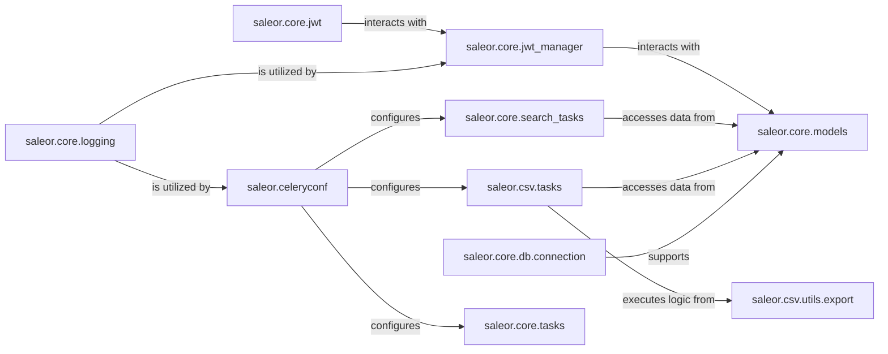

## Component Details

The Core Platform Services component forms the backbone of the Saleor platform, providing essential utilities and infrastructure for stability, security, and efficient background operations.

### saleor.core.models
This module defines the foundational database models for the Saleor platform. These models represent the core data structures, such as `App`, `EventDelivery`, `EventPayload`, and `Webhook`, which are fundamental for managing applications, handling events, and integrating with external services.

**Related Classes/Methods**:

- <a href="https://github.com/saleor/saleor/blob/master/saleor/core/models.py#L1-L1" target="_blank" rel="noopener noreferrer">`saleor.core.models` (1:1)</a>

### saleor.core.jwt
This module provides utilities for handling JSON Web Tokens (JWTs), including functions for creating, decoding, and validating tokens. It's crucial for secure authentication and authorization within the Saleor API.

**Related Classes/Methods**:

- <a href="https://github.com/saleor/saleor/blob/master/saleor/core/jwt.py#L1-L1" target="_blank" rel="noopener noreferrer">`saleor.core.jwt` (1:1)</a>

### saleor.core.jwt_manager
This module manages the lifecycle of JWTs, likely handling token issuance, revocation, and refresh operations. It works in conjunction with `saleor.core.jwt` to provide a robust authentication system.

**Related Classes/Methods**:

- <a href="https://github.com/saleor/saleor/blob/master/saleor/core/jwt_manager.py#L1-L1" target="_blank" rel="noopener noreferrer">`saleor.core.jwt_manager` (1:1)</a>

### saleor.celeryconf
This module configures Celery, the asynchronous task queue system used throughout Saleor. It sets up the Celery application, defines task serialization, and integrates with Django settings, enabling background processing for various operations.

**Related Classes/Methods**:

- <a href="https://github.com/saleor/saleor/blob/master/saleor/celeryconf.py#L1-L1" target="_blank" rel="noopener noreferrer">`saleor.celeryconf` (1:1)</a>

### saleor.core.logging
This module provides centralized logging configurations and utilities for the platform. It ensures that system events, errors, and debugging information are captured and managed effectively.

**Related Classes/Methods**:

- <a href="https://github.com/saleor/saleor/blob/master/saleor/core/logging.py#L1-L1" target="_blank" rel="noopener noreferrer">`saleor.core.logging` (1:1)</a>

### saleor.core.search_tasks
This module contains Celery tasks specifically designed for managing and updating search indexes. These tasks ensure that product data and other searchable content are consistently indexed and available for efficient search queries.

**Related Classes/Methods**:

- <a href="https://github.com/saleor/saleor/blob/master/saleor/core/search_tasks.py#L1-L1" target="_blank" rel="noopener noreferrer">`saleor.core.search_tasks` (1:1)</a>

### saleor.csv.tasks
This module defines Celery tasks responsible for handling asynchronous CSV export operations. These tasks process requests to generate and deliver CSV files, often for large datasets.

**Related Classes/Methods**:

- <a href="https://github.com/saleor/saleor/blob/master/saleor/csv/tasks.py#L1-L1" target="_blank" rel="noopener noreferrer">`saleor.csv.tasks` (1:1)</a>

### saleor.csv.utils.export
This module provides utility functions and logic for generating CSV data. It's used by `saleor.csv.tasks` to construct the actual CSV content based on specified data.

**Related Classes/Methods**:

- <a href="https://github.com/saleor/saleor/blob/master/saleor/csv/utils/export.py#L1-L1" target="_blank" rel="noopener noreferrer">`saleor.csv.utils.export` (1:1)</a>

### saleor.core.db.connection
This module likely manages database connections and provides utilities related to database interactions, such as custom database operations or connection pooling.

**Related Classes/Methods**:

- <a href="https://github.com/saleor/saleor/blob/master/saleor/core/db/connection.py#L1-L1" target="_blank" rel="noopener noreferrer">`saleor.core.db.connection` (1:1)</a>

### saleor.core.tasks
This module contains general-purpose asynchronous tasks that are not specific to search or CSV export. These tasks might include cleanup operations, data synchronization, or other background processes.

**Related Classes/Methods**:

- <a href="https://github.com/saleor/saleor/blob/master/saleor/core/tasks.py#L1-L1" target="_blank" rel="noopener noreferrer">`saleor.core.tasks` (1:1)</a>

### [FAQ](https://github.com/CodeBoarding/GeneratedOnBoardings/tree/main?tab=readme-ov-file#faq)