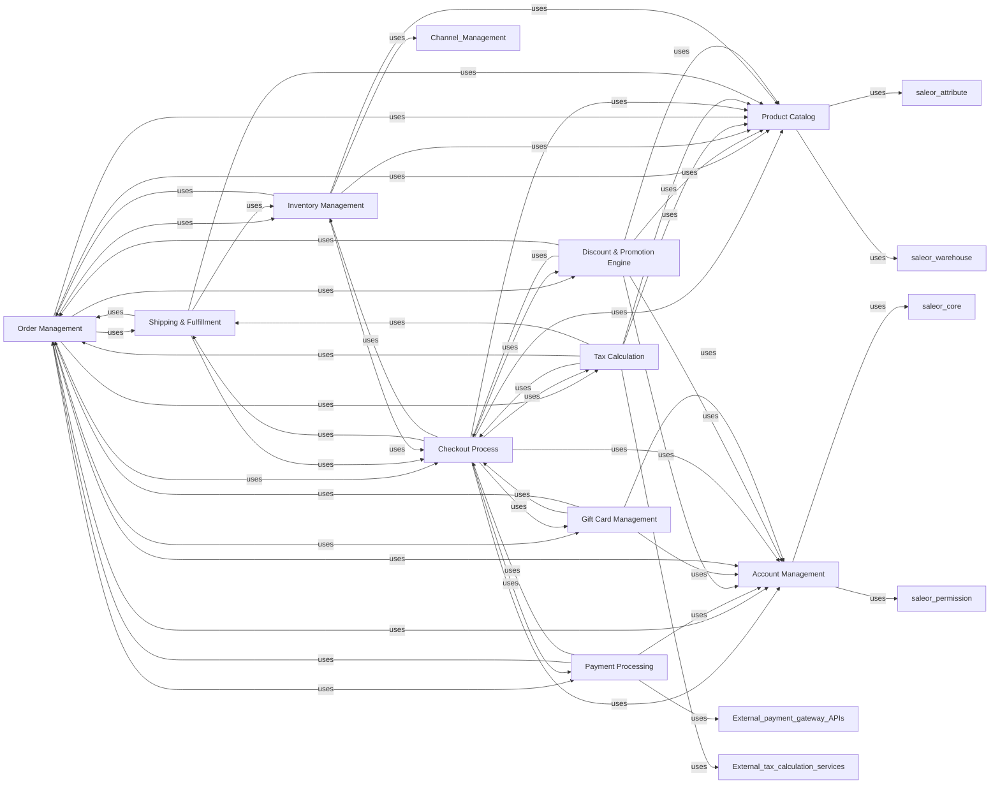

## Component Details

The `E-commerce Business Logic` subsystem is the operational core of the Saleor application, orchestrating all essential e-commerce functionalities. It is composed of ten fundamental components, each with distinct responsibilities, working in concert to manage the entire lifecycle of an online store's operations. These components were chosen because they represent the primary functional domains of any e-commerce platform, directly mapping to the description of the `E-commerce Business Logic` and the provided related files. They are fundamental as they encapsulate the data models, business rules, and operational logic necessary for processing sales, managing products, handling customers, and integrating with external services.

### Account Management
This component is responsible for managing user accounts, staff accounts, customer profiles, addresses, and all authentication-related functionalities. It handles user registration, login, password management, and personal data storage and retrieval.

**Related Classes/Methods**:

- <a href="https://github.com/saleor/saleor/blob/master/saleor/account/models.py#L1-L1" target="_blank" rel="noopener noreferrer">`saleor.account.models` (1:1)</a>
- <a href="https://github.com/saleor/saleor/blob/master/saleor/account/utils.py#L1-L1" target="_blank" rel="noopener noreferrer">`saleor.account.utils` (1:1)</a>
- <a href="https://github.com/saleor/saleor/blob/master/saleor/account/notifications.py#L1-L1" target="_blank" rel="noopener noreferrer">`saleor.account.notifications` (1:1)</a>
- <a href="https://github.com/saleor/saleor/blob/master/saleor/account/search.py#L1-L1" target="_blank" rel="noopener noreferrer">`saleor.account.search` (1:1)</a>

### Product Catalog
This component manages the entire product catalog, including the definition of products, product variants, categories, collections, product media (images, videos), and digital content. It also defines and manages product attributes and their values, and handles product availability and basic pricing information.

**Related Classes/Methods**:

- <a href="https://github.com/saleor/saleor/blob/master/saleor/product/models.py#L1-L1" target="_blank" rel="noopener noreferrer">`saleor.product.models` (1:1)</a>
- <a href="https://github.com/saleor/saleor/blob/master/saleor/product/managers.py#L1-L1" target="_blank" rel="noopener noreferrer">`saleor.product.managers` (1:1)</a>
- <a href="https://github.com/saleor/saleor/blob/master/saleor/product/search.py#L1-L1" target="_blank" rel="noopener noreferrer">`saleor.product.search` (1:1)</a>
- <a href="https://github.com/saleor/saleor/blob/master/saleor/attribute/models/product.py#L1-L1" target="_blank" rel="noopener noreferrer">`saleor.attribute.models.product` (1:1)</a>

### Order Management
This component oversees the entire lifecycle of an order, from its initial draft state to fulfillment and archiving. It handles order status updates, payment capture and refund processes, creation of fulfillments, and logging of all order-related events.

**Related Classes/Methods**:

- <a href="https://github.com/saleor/saleor/blob/master/saleor/order/models.py#L1-L1" target="_blank" rel="noopener noreferrer">`saleor.order.models` (1:1)</a>
- <a href="https://github.com/saleor/saleor/blob/master/saleor/order/actions.py#L1-L1" target="_blank" rel="noopener noreferrer">`saleor.order.actions` (1:1)</a>
- <a href="https://github.com/saleor/saleor/blob/master/saleor/order/calculations.py#L1-L1" target="_blank" rel="noopener noreferrer">`saleor.order.calculations` (1:1)</a>
- <a href="https://github.com/saleor/saleor/blob/master/saleor/order/fetch.py#L1-L1" target="_blank" rel="noopener noreferrer">`saleor.order.fetch` (1:1)</a>

### Checkout Process
This component manages the customer's shopping cart (referred to as a "checkout" in Saleor) and guides them through the purchasing journey. It handles operations such as adding and removing items, applying discounts, selecting shipping methods, and ultimately converting the checkout into a confirmed order.

**Related Classes/Methods**:

- <a href="https://github.com/saleor/saleor/blob/master/saleor/checkout/models.py#L1-L1" target="_blank" rel="noopener noreferrer">`saleor.checkout.models` (1:1)</a>
- <a href="https://github.com/saleor/saleor/blob/master/saleor/checkout/actions.py#L1-L1" target="_blank" rel="noopener noreferrer">`saleor.checkout.actions` (1:1)</a>
- <a href="https://github.com/saleor/saleor/blob/master/saleor/checkout/calculations.py#L1-L1" target="_blank" rel="noopener noreferrer">`saleor.checkout.calculations` (1:1)</a>
- <a href="https://github.com/saleor/saleor/blob/master/saleor/checkout/complete_checkout.py#L1681-L1757" target="_blank" rel="noopener noreferrer">`saleor.checkout.complete_checkout` (1681:1757)</a>

### Payment Processing
This component provides an abstraction layer for integrating with various external payment gateways. It is responsible for handling all payment-related operations, including authorization, capture, refund, and voiding of transactions. It also manages the internal representation of payment transactions.

**Related Classes/Methods**:

- <a href="https://github.com/saleor/saleor/blob/master/saleor/payment/models.py#L1-L1" target="_blank" rel="noopener noreferrer">`saleor.payment.models` (1:1)</a>
- <a href="https://github.com/saleor/saleor/blob/master/saleor/payment/gateway.py#L1-L1" target="_blank" rel="noopener noreferrer">`saleor.payment.gateway` (1:1)</a>
- <a href="https://github.com/saleor/saleor/blob/master/saleor/payment/utils.py#L1-L1" target="_blank" rel="noopener noreferrer">`saleor.payment.utils` (1:1)</a>
- `saleor.payment.gateways` (1:1)

### Tax Calculation
This component is responsible for managing tax configurations, defining tax classes, and accurately calculating taxes for products, shipping, checkouts, and orders. It can apply taxes based on internal rules or integrate with external tax calculation providers.

**Related Classes/Methods**:

- <a href="https://github.com/saleor/saleor/blob/master/saleor/tax/models.py#L1-L1" target="_blank" rel="noopener noreferrer">`saleor.tax.models` (1:1)</a>
- <a href="https://github.com/saleor/saleor/blob/master/saleor/tax/utils.py#L1-L1" target="_blank" rel="noopener noreferrer">`saleor.tax.utils` (1:1)</a>
- <a href="https://github.com/saleor/saleor/blob/master/saleor/tax/calculations/checkout.py#L1-L1" target="_blank" rel="noopener noreferrer">`saleor.tax.calculations.checkout` (1:1)</a>
- <a href="https://github.com/saleor/saleor/blob/master/saleor/tax/calculations/order.py#L1-L1" target="_blank" rel="noopener noreferrer">`saleor.tax.calculations.order` (1:1)</a>

### Shipping & Fulfillment
This component manages all aspects of shipping, including defining shipping zones, shipping methods, and the process of fulfilling orders. It handles the calculation of shipping costs, supports various delivery methods (e.g., standard, express, click & collect), and manages tracking information.

**Related Classes/Methods**:

- <a href="https://github.com/saleor/saleor/blob/master/saleor/shipping/models.py#L1-L1" target="_blank" rel="noopener noreferrer">`saleor.shipping.models` (1:1)</a>
- <a href="https://github.com/saleor/saleor/blob/master/saleor/shipping/postal_codes.py#L1-L1" target="_blank" rel="noopener noreferrer">`saleor.shipping.postal_codes` (1:1)</a>
- <a href="https://github.com/saleor/saleor/blob/master/saleor/shipping/utils.py#L1-L1" target="_blank" rel="noopener noreferrer">`saleor.shipping.utils` (1:1)</a>

### Inventory Management
This component is responsible for tracking the quantity of products available in different warehouses, managing stock allocations (reserving items for orders), and updating inventory levels as products are sold or returned. It ensures accurate stock counts and prevents overselling.

**Related Classes/Methods**:

- <a href="https://github.com/saleor/saleor/blob/master/saleor/warehouse/models.py#L1-L1" target="_blank" rel="noopener noreferrer">`saleor.warehouse.models` (1:1)</a>
- <a href="https://github.com/saleor/saleor/blob/master/saleor/warehouse/management.py#L1-L1" target="_blank" rel="noopener noreferrer">`saleor.warehouse.management` (1:1)</a>
- <a href="https://github.com/saleor/saleor/blob/master/saleor/warehouse/availability.py#L1-L1" target="_blank" rel="noopener noreferrer">`saleor.warehouse.availability` (1:1)</a>

### Discount & Promotion Engine
This component manages the creation and application of various types of discounts, promotions (both catalog-wide and order-based), and vouchers. It defines the rules for applying these price adjustments to products, checkouts, and orders, and tracks their usage.

**Related Classes/Methods**:

- <a href="https://github.com/saleor/saleor/blob/master/saleor/discount/models.py#L1-L1" target="_blank" rel="noopener noreferrer">`saleor.discount.models` (1:1)</a>
- <a href="https://github.com/saleor/saleor/blob/master/saleor/discount/interface.py#L1-L1" target="_blank" rel="noopener noreferrer">`saleor.discount.interface` (1:1)</a>
- `saleor.discount.utils` (1:1)

### Gift Card Management
This component handles the entire lifecycle of gift cards, including their creation, activation, deactivation, and redemption. It tracks the balance of each gift card and allows them to be used as a form of payment or discount during the checkout and order processing.

**Related Classes/Methods**:

- <a href="https://github.com/saleor/saleor/blob/master/saleor/giftcard/models.py#L1-L1" target="_blank" rel="noopener noreferrer">`saleor.giftcard.models` (1:1)</a>
- <a href="https://github.com/saleor/saleor/blob/master/saleor/giftcard/utils.py#L1-L1" target="_blank" rel="noopener noreferrer">`saleor.giftcard.utils` (1:1)</a>
- <a href="https://github.com/saleor/saleor/blob/master/saleor/giftcard/notifications.py#L1-L1" target="_blank" rel="noopener noreferrer">`saleor.giftcard.notifications` (1:1)</a>

### [FAQ](https://github.com/CodeBoarding/GeneratedOnBoardings/tree/main?tab=readme-ov-file#faq)