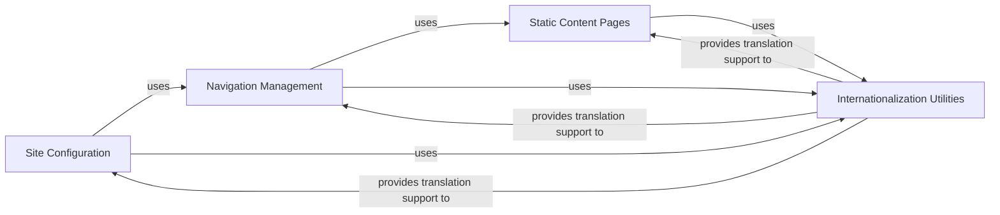

## Component Details

Component Overview: Storefront & Content Management

### Site Configuration
This component is responsible for managing global settings and configurations that apply across the entire storefront. This includes fundamental shop details (e.g., header text, description), contact information, default units (weight), digital product settings, email sender details, stock reservation durations, and gift card expiry rules. It also defines which navigation menus are used as the primary top and bottom menus.

**Related Classes/Methods**:

- <a href="https://github.com/saleor/saleor/blob/master/saleor/site/models.py#L1-L1000" target="_blank" rel="noopener noreferrer">`saleor.site.models` (1:1000)</a>

### Navigation Management
This component handles the creation, organization, and display of navigation menus and their individual items within the storefront. It allows administrators to define hierarchical menu structures and link menu items to various content types, such as product categories, product collections, or static content pages.

**Related Classes/Methods**:

- <a href="https://github.com/saleor/saleor/blob/master/saleor/menu/models.py#L1-L1000" target="_blank" rel="noopener noreferrer">`saleor.menu.models` (1:1000)</a>

### Static Content Pages
This component is dedicated to the creation, management, and display of static informational content pages on the storefront. These pages typically include content like "About Us," "Contact," or "Privacy Policy," which are not directly tied to product listings. It supports rich text content and SEO metadata.

**Related Classes/Methods**:

- <a href="https://github.com/saleor/saleor/blob/master/saleor/page/models.py#L1-L1000" target="_blank" rel="noopener noreferrer">`saleor.page.models` (1:1000)</a>

### Internationalization Utilities
This is a core utility module that provides a generic framework for handling translations across various models within the Saleor application. It enables the storefront to display content in different languages based on user preferences or site settings, ensuring a localized experience.

**Related Classes/Methods**:

- <a href="https://github.com/saleor/saleor/blob/master/saleor/core/utils/translations.py#L1-L1000" target="_blank" rel="noopener noreferrer">`saleor.core.utils.translations` (1:1000)</a>

### [FAQ](https://github.com/CodeBoarding/GeneratedOnBoardings/tree/main?tab=readme-ov-file#faq)