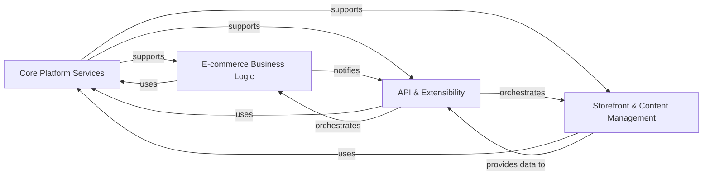

## Component Details

Here's the final architecture analysis for `saleor`, based on the provided Control Flow Graph (CFG) and Source Code Analysis. The architecture is distilled into four fundamental components, chosen for their distinct responsibilities and critical roles in the overall system.

### Core Platform Services
This foundational layer provides essential utilities, including database connection management, JWT authentication, logging, and a robust framework for asynchronous task processing (Celery). It also handles general search indexing and data export functionalities, ensuring the system's stability, security, and efficient background operations.

**Related Classes/Methods**:

- <a href="https://github.com/saleor/saleor/blob/master/saleor/core/models.py#L1-L1" target="_blank" rel="noopener noreferrer">`saleor/core/models.py` (1:1)</a>
- <a href="https://github.com/saleor/saleor/blob/master/saleor/core/jwt.py#L1-L1" target="_blank" rel="noopener noreferrer">`saleor/core/jwt.py` (1:1)</a>
- <a href="https://github.com/saleor/saleor/blob/master/saleor/celeryconf.py#L1-L1" target="_blank" rel="noopener noreferrer">`saleor/celeryconf.py` (1:1)</a>
- <a href="https://github.com/saleor/saleor/blob/master/saleor/csv/utils/export.py#L1-L1" target="_blank" rel="noopener noreferrer">`saleor/csv/utils/export.py` (1:1)</a>
- <a href="https://github.com/saleor/saleor/blob/master/saleor/csv/tasks.py#L1-L1" target="_blank" rel="noopener noreferrer">`saleor/csv/tasks.py` (1:1)</a>
- <a href="https://github.com/saleor/saleor/blob/master/saleor/core/search_tasks.py#L1-L1" target="_blank" rel="noopener noreferrer">`saleor/core/search_tasks.py` (1:1)</a>
- <a href="https://github.com/saleor/saleor/blob/master/saleor/order/tasks.py#L1-L1" target="_blank" rel="noopener noreferrer">`saleor/order/tasks.py` (1:1)</a>
- <a href="https://github.com/saleor/saleor/blob/master/saleor/product/tasks.py#L1-L1" target="_blank" rel="noopener noreferrer">`saleor/product/tasks.py` (1:1)</a>

### E-commerce Business Logic
This is the core of the Saleor application, encapsulating all primary e-commerce operations. It manages user accounts, the product catalog, the entire order and checkout lifecycle (including calculations, fulfillment, and events), payment processing, tax calculations, shipping logistics, inventory management, and the application of discounts and promotions.

**Related Classes/Methods**:

- <a href="https://github.com/saleor/saleor/blob/master/saleor/account/models.py#L1-L1" target="_blank" rel="noopener noreferrer">`saleor/account/models.py` (1:1)</a>
- <a href="https://github.com/saleor/saleor/blob/master/saleor/account/utils.py#L1-L1" target="_blank" rel="noopener noreferrer">`saleor/account/utils.py` (1:1)</a>
- <a href="https://github.com/saleor/saleor/blob/master/saleor/account/notifications.py#L1-L1" target="_blank" rel="noopener noreferrer">`saleor/account/notifications.py` (1:1)</a>
- <a href="https://github.com/saleor/saleor/blob/master/saleor/account/search.py#L1-L1" target="_blank" rel="noopener noreferrer">`saleor/account/search.py` (1:1)</a>
- <a href="https://github.com/saleor/saleor/blob/master/saleor/product/models.py#L1-L1" target="_blank" rel="noopener noreferrer">`saleor/product/models.py` (1:1)</a>
- <a href="https://github.com/saleor/saleor/blob/master/saleor/product/managers.py#L1-L1" target="_blank" rel="noopener noreferrer">`saleor/product/managers.py` (1:1)</a>
- <a href="https://github.com/saleor/saleor/blob/master/saleor/attribute/models/product.py#L1-L1" target="_blank" rel="noopener noreferrer">`saleor/attribute/models/product.py` (1:1)</a>
- <a href="https://github.com/saleor/saleor/blob/master/saleor/order/models.py#L1-L1" target="_blank" rel="noopener noreferrer">`saleor/order/models.py` (1:1)</a>
- <a href="https://github.com/saleor/saleor/blob/master/saleor/order/actions.py#L1-L1" target="_blank" rel="noopener noreferrer">`saleor/order/actions.py` (1:1)</a>
- <a href="https://github.com/saleor/saleor/blob/master/saleor/order/calculations.py#L1-L1" target="_blank" rel="noopener noreferrer">`saleor/order/calculations.py` (1:1)</a>
- <a href="https://github.com/saleor/saleor/blob/master/saleor/checkout/models.py#L1-L1" target="_blank" rel="noopener noreferrer">`saleor/checkout/models.py` (1:1)</a>
- <a href="https://github.com/saleor/saleor/blob/master/saleor/checkout/actions.py#L1-L1" target="_blank" rel="noopener noreferrer">`saleor/checkout/actions.py` (1:1)</a>
- <a href="https://github.com/saleor/saleor/blob/master/saleor/checkout/calculations.py#L1-L1" target="_blank" rel="noopener noreferrer">`saleor/checkout/calculations.py` (1:1)</a>
- <a href="https://github.com/saleor/saleor/blob/master/saleor/payment/models.py#L1-L1" target="_blank" rel="noopener noreferrer">`saleor/payment/models.py` (1:1)</a>
- <a href="https://github.com/saleor/saleor/blob/master/saleor/payment/gateway.py#L1-L1" target="_blank" rel="noopener noreferrer">`saleor/payment/gateway.py` (1:1)</a>
- <a href="https://github.com/saleor/saleor/blob/master/saleor/payment/utils.py#L1-L1" target="_blank" rel="noopener noreferrer">`saleor/payment/utils.py` (1:1)</a>
- <a href="https://github.com/saleor/saleor/blob/master/saleor/tax/utils.py#L1-L1" target="_blank" rel="noopener noreferrer">`saleor/tax/utils.py` (1:1)</a>
- <a href="https://github.com/saleor/saleor/blob/master/saleor/tax/calculations/checkout.py#L1-L1" target="_blank" rel="noopener noreferrer">`saleor/tax/calculations/checkout.py` (1:1)</a>
- <a href="https://github.com/saleor/saleor/blob/master/saleor/tax/calculations/order.py#L1-L1" target="_blank" rel="noopener noreferrer">`saleor/tax/calculations/order.py` (1:1)</a>
- <a href="https://github.com/saleor/saleor/blob/master/saleor/tax/models.py#L1-L1" target="_blank" rel="noopener noreferrer">`saleor/tax/models.py` (1:1)</a>
- <a href="https://github.com/saleor/saleor/blob/master/saleor/shipping/models.py#L1-L1" target="_blank" rel="noopener noreferrer">`saleor/shipping/models.py` (1:1)</a>
- <a href="https://github.com/saleor/saleor/blob/master/saleor/shipping/postal_codes.py#L1-L1" target="_blank" rel="noopener noreferrer">`saleor/shipping/postal_codes.py` (1:1)</a>
- <a href="https://github.com/saleor/saleor/blob/master/saleor/warehouse/models.py#L1-L1" target="_blank" rel="noopener noreferrer">`saleor/warehouse/models.py` (1:1)</a>
- <a href="https://github.com/saleor/saleor/blob/master/saleor/warehouse/management.py#L1-L1" target="_blank" rel="noopener noreferrer">`saleor/warehouse/management.py` (1:1)</a>
- <a href="https://github.com/saleor/saleor/blob/master/saleor/discount/models.py#L1-L1" target="_blank" rel="noopener noreferrer">`saleor/discount/models.py` (1:1)</a>
- <a href="https://github.com/saleor/saleor/blob/master/saleor/giftcard/models.py#L1-L1" target="_blank" rel="noopener noreferrer">`saleor/giftcard/models.py` (1:1)</a>
- <a href="https://github.com/saleor/saleor/blob/master/saleor/giftcard/utils.py#L1-L1" target="_blank" rel="noopener noreferrer">`saleor/giftcard/utils.py` (1:1)</a>

### API & Extensibility
This component serves as the primary interface for all external interactions with Saleor. It provides the GraphQL API, handling incoming queries and mutations, and orchestrating calls to the underlying business logic. Crucially, it also includes the plugin system for extending Saleor's core functionality, the webhook system for event-driven communication with external services, and the management of external Saleor applications, enabling a highly customizable and integrated ecosystem.

**Related Classes/Methods**:

- <a href="https://github.com/saleor/saleor/blob/master/saleor/graphql/views.py#L1-L1" target="_blank" rel="noopener noreferrer">`saleor/graphql/views.py` (1:1)</a>
- <a href="https://github.com/saleor/saleor/blob/master/saleor/graphql/schema_printer.py#L1-L1" target="_blank" rel="noopener noreferrer">`saleor/graphql/schema_printer.py` (1:1)</a>
- <a href="https://github.com/saleor/saleor/blob/master/saleor/graphql/core/mutations.py#L1-L1" target="_blank" rel="noopener noreferrer">`saleor/graphql/core/mutations.py` (1:1)</a>
- <a href="https://github.com/saleor/saleor/blob/master/saleor/graphql/core/connection.py#L1-L1" target="_blank" rel="noopener noreferrer">`saleor/graphql/core/connection.py` (1:1)</a>
- <a href="https://github.com/saleor/saleor/blob/master/saleor/plugins/manager.py#L1-L1" target="_blank" rel="noopener noreferrer">`saleor/plugins/manager.py` (1:1)</a>
- <a href="https://github.com/saleor/saleor/blob/master/saleor/plugins/base_plugin.py#L1-L1" target="_blank" rel="noopener noreferrer">`saleor/plugins/base_plugin.py` (1:1)</a>
- <a href="https://github.com/saleor/saleor/blob/master/saleor/webhook/models.py#L1-L1" target="_blank" rel="noopener noreferrer">`saleor/webhook/models.py` (1:1)</a>
- <a href="https://github.com/saleor/saleor/blob/master/saleor/app/models.py#L1-L1" target="_blank" rel="noopener noreferrer">`saleor/app/models.py` (1:1)</a>
- <a href="https://github.com/saleor/saleor/blob/master/saleor/app/installation_utils.py#L1-L1" target="_blank" rel="noopener noreferrer">`saleor/app/installation_utils.py` (1:1)</a>
- <a href="https://github.com/saleor/saleor/blob/master/saleor/app/manifest_validations.py#L1-L1" target="_blank" rel="noopener noreferrer">`saleor/app/manifest_validations.py` (1:1)</a>

### Storefront & Content Management
This component focuses on managing the presentation layer and static content of the storefront. It includes functionalities for internationalization (translations and country-specific rules), global shop settings, navigation menu management, and the creation/management of static content pages. It defines the overall appearance and user experience of the shop.

**Related Classes/Methods**:

- <a href="https://github.com/saleor/saleor/blob/master/saleor/account/i18n.py#L1-L1" target="_blank" rel="noopener noreferrer">`saleor/account/i18n.py` (1:1)</a>
- <a href="https://github.com/saleor/saleor/blob/master/saleor/core/utils/translations.py#L1-L1" target="_blank" rel="noopener noreferrer">`saleor/core/utils/translations.py` (1:1)</a>
- <a href="https://github.com/saleor/saleor/blob/master/saleor/site/models.py#L1-L1" target="_blank" rel="noopener noreferrer">`saleor/site/models.py` (1:1)</a>
- `saleor/shop/models.py` (1:1)
- <a href="https://github.com/saleor/saleor/blob/master/saleor/menu/models.py#L1-L1" target="_blank" rel="noopener noreferrer">`saleor/menu/models.py` (1:1)</a>
- <a href="https://github.com/saleor/saleor/blob/master/saleor/page/models.py#L1-L1" target="_blank" rel="noopener noreferrer">`saleor/page/models.py` (1:1)</a>

### [FAQ](https://github.com/CodeBoarding/GeneratedOnBoardings/tree/main?tab=readme-ov-file#faq)