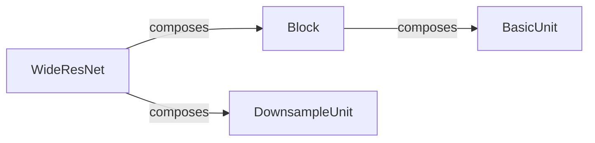

## Details

The `Neural Network Model` subsystem is primarily defined by the `wide_res_net.py` file, which encapsulates the architecture of the `WideResNet` model and its constituent building blocks. This subsystem represents the trainable component within the broader machine learning pipeline, responsible for forward passes and gradient generation.

### WideResNet
The top-level neural network architecture. It defines the overall structure of the model, orchestrating the arrangement of `Block` and `DownsampleUnit` components to form a complete deep learning model. It performs forward passes to generate predictions and, as a PyTorch `nn.Module`, implicitly handles the backward pass for gradient computation.

**Related Classes/Methods**:

- <a href="https://github.com/davda54/sam/blob/main/example/model/wide_res_net.py#L58-L93" target="_blank" rel="noopener noreferrer">`example.model.wide_res_net.WideResNet`:58-93</a>

### Block
A reusable, intermediate-level architectural pattern within the `WideResNet` network. Each `Block` typically encapsulates a sequence of convolutional layers and activation functions, serving as a modular unit for building deeper network stages. It is composed of one or more `BasicUnit`s.

**Related Classes/Methods**:

- <a href="https://github.com/davda54/sam/blob/main/example/model/wide_res_net.py" target="_blank" rel="noopener noreferrer">`example.model.wide_res_net.Block`</a>

### BasicUnit
The fundamental, low-level building block of the `WideResNet` architecture. A `BasicUnit` is a specialized `nn.Module` that typically contains a small set of core operations (e.g., convolutions, batch normalization, activation) that are repeated to form larger `Block` components.

**Related Classes/Methods**:

- <a href="https://github.com/davda54/sam/blob/main/example/model/wide_res_net.py#L8-L22" target="_blank" rel="noopener noreferrer">`example.model.wide_res_net.BasicUnit`:8-22</a>

### DownsampleUnit
A specialized `nn.Module` component within `WideResNet` designed to reduce the spatial dimensions of feature maps. This is crucial for creating hierarchical representations and managing computational complexity across different stages of the network, often implemented via strided convolutions or pooling.

**Related Classes/Methods**:

- <a href="https://github.com/davda54/sam/blob/main/example/model/wide_res_net.py#L25-L43" target="_blank" rel="noopener noreferrer">`example.model.wide_res_net.DownsampleUnit`:25-43</a>

### [FAQ](https://github.com/CodeBoarding/GeneratedOnBoardings/tree/main?tab=readme-ov-file#faq)