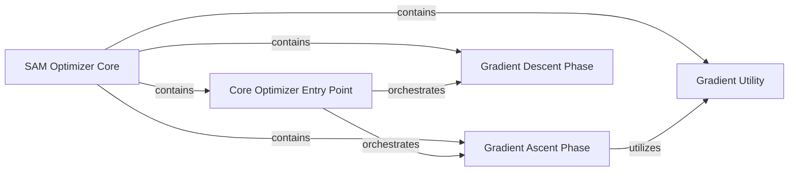

## Details

The `SAM Optimizer Core` subsystem is primarily defined by the `sam.py` file. This file encapsulates the entire implementation of the Sharpness-Aware Minimization (SAM) algorithm, acting as a self-contained module for augmenting PyTorch optimizers.

### SAM Optimizer Core [[Expand]](./SAM_Optimizer_Core.md)
This is the overarching component that implements the Sharpness-Aware Minimization (SAM) algorithm. It acts as a wrapper around a base PyTorch optimizer, augmenting its behavior to find flatter minima through a two-step gradient update process.

**Related Classes/Methods**:

- <a href="https://github.com/davda54/sam/blob/main/sam.py#L4-L63" target="_blank" rel="noopener noreferrer">`sam`:4-63</a>

### Core Optimizer Entry Point
Provides the main public method (`step`) for users to trigger a complete SAM optimization step. It orchestrates the sequential execution of the gradient ascent and gradient descent phases.

**Related Classes/Methods**:

- <a href="https://github.com/davda54/sam/blob/main/sam.py#L40-L47" target="_blank" rel="noopener noreferrer">`sam.step`:40-47</a>

### Gradient Ascent Phase
Responsible for computing the perturbation (epsilon) by performing a gradient ascent step. This involves calculating gradients, normalizing them, and applying the perturbation to the model's parameters to move towards a sharper loss landscape region.

**Related Classes/Methods**:

- <a href="https://github.com/davda54/sam/blob/main/sam.py#L15-L27" target="_blank" rel="noopener noreferrer">`sam.first_step`:15-27</a>

### Gradient Descent Phase
Performs the final gradient descent step using the perturbed weights. It restores the original weights, computes gradients at the perturbed point, and then applies the update using the wrapped base PyTorch optimizer.

**Related Classes/Methods**:

- <a href="https://github.com/davda54/sam/blob/main/sam.py#L29-L38" target="_blank" rel="noopener noreferrer">`sam.second_step`:29-38</a>

### Gradient Utility
Provides a helper function to calculate the L2 norm of the gradients. This utility is crucial for scaling the perturbation accurately during the Gradient Ascent Phase.

**Related Classes/Methods**:

- <a href="https://github.com/davda54/sam/blob/main/sam.py#L49-L59" target="_blank" rel="noopener noreferrer">`sam._grad_norm`:49-59</a>

### [FAQ](https://github.com/CodeBoarding/GeneratedOnBoardings/tree/main?tab=readme-ov-file#faq)