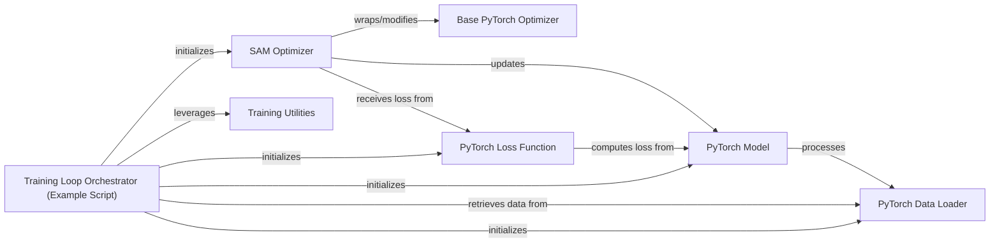

## Details

The `sam` project implements the Sharpness-Aware Minimization (SAM) algorithm, designed to improve the generalization of neural networks. At its core, the `SAM Optimizer` wraps a `Base PyTorch Optimizer` to perform a two-step optimization process: first, it perturbs the model's weights to ascend to a local maximum of the loss landscape, and then it performs a standard gradient descent step from this perturbed point. The `Training Loop Orchestrator` (an example script) demonstrates how to integrate this `SAM Optimizer` with a `PyTorch Model`, `PyTorch Data Loader`, and `PyTorch Loss Function` to conduct a complete training regimen. `Training Utilities` provide auxiliary functions to support this process.

### SAM Optimizer
The core intellectual property of the project, implementing the Sharpness-Aware Minimization (SAM) algorithm. It extends or wraps a standard PyTorch optimizer to enhance training stability and generalization by performing a two-step optimization process.

**Related Classes/Methods**:

- <a href="https://github.com/davda54/sam/blob/main/sam.py#L4-L63" target="_blank" rel="noopener noreferrer">`sam.SAM`:4-63</a>

### Base PyTorch Optimizer
A standard PyTorch optimizer (e.g., `SGD`, `Adam`) that the `SAM Optimizer` utilizes or wraps to perform the underlying gradient updates. It represents the direct integration point with PyTorch's optimization framework.

**Related Classes/Methods**:

### PyTorch Model
The neural network architecture whose parameters are optimized during the training process. It receives input data and produces predictions.

**Related Classes/Methods**:

- <a href="https://github.com/davda54/sam/blob/main/example/model/wide_res_net.py#L58-L93" target="_blank" rel="noopener noreferrer">`model.wide_res_net.WideResNet`:58-93</a>

### PyTorch Data Loader
Responsible for efficiently loading and batching training and validation data, providing it to the model during the training loop.

**Related Classes/Methods**:

- <a href="https://github.com/davda54/sam/blob/main/example/data/cifar.py#L9-L38" target="_blank" rel="noopener noreferrer">`data.cifar.Cifar`:9-38</a>

### PyTorch Loss Function
Computes the discrepancy between the model's predictions and the true labels, providing a scalar value that the optimizer aims to minimize.

**Related Classes/Methods**:

- <a href="https://github.com/davda54/sam/blob/main/example/model/smooth_cross_entropy.py#L6-L13" target="_blank" rel="noopener noreferrer">`model.smooth_cross_entropy.smooth_crossentropy`:6-13</a>

### Training Loop Orchestrator (Example Script)
This component, embodied by the `train.py` script, serves as an *example* demonstration of how to integrate and use the `SAM Optimizer` within a typical PyTorch training loop. It sets up the model, data loaders, loss function, and coordinates the training process across epochs and batches. It is not a core, reusable component of the `sam` library itself but a practical guide for users.

**Related Classes/Methods**:

- <a href="https://github.com/davda54/sam/blob/main/example/train.py" target="_blank" rel="noopener noreferrer">`example.train`</a>

### Training Utilities
A collection of helper functions or classes that support the training process, potentially including utilities for managing batch normalization, distributed training, logging, or checkpointing. These components facilitate the correct and efficient usage of the `SAM Optimizer` within complex training setups.

**Related Classes/Methods**:

### [FAQ](https://github.com/CodeBoarding/GeneratedOnBoardings/tree/main?tab=readme-ov-file#faq)