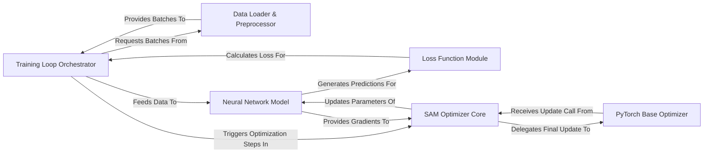

## Details

The project implements a Sharpness-Aware Minimization (SAM) training pipeline. The `Training Loop Orchestrator` acts as the central coordinator, managing the flow of data from the `Data Loader & Preprocessor` to the `Neural Network Model`. It leverages the `Loss Function Module` to quantify prediction errors. The core optimization is handled by the `SAM Optimizer Core`, which interacts with the `Neural Network Model` to obtain gradients and delegates the final parameter updates to a `PyTorch Base Optimizer`. This modular design ensures clear separation of concerns, facilitating both understanding and potential modifications.

### Training Loop Orchestrator [[Expand]](./Training_Loop_Orchestrator.md)
The central control unit managing the entire training process, iterating over epochs and batches, and coordinating interactions between all other components. This component is primarily embodied by the `train.py` script.

**Related Classes/Methods**:

- <a href="https://github.com/davda54/sam/blob/main/example/train.py" target="_blank" rel="noopener noreferrer">`train.py`</a>

### Data Loader & Preprocessor
Responsible for loading, transforming, and batching datasets for training and evaluation.

**Related Classes/Methods**:

- <a href="https://github.com/davda54/sam/blob/main/example/data/cifar.py" target="_blank" rel="noopener noreferrer">`cifar.py`</a>

### Neural Network Model [[Expand]](./Neural_Network_Model.md)
Defines the neural network architecture whose parameters are optimized; performs forward passes and generates gradients during backward passes.

**Related Classes/Methods**:

- <a href="https://github.com/davda54/sam/blob/main/example/model/wide_res_net.py" target="_blank" rel="noopener noreferrer">`wide_res_net.py`</a>

### Loss Function Module
Provides the differentiable loss function used to quantify the error between model predictions and true labels.

**Related Classes/Methods**:

- <a href="https://github.com/davda54/sam/blob/main/example/model/smooth_cross_entropy.py" target="_blank" rel="noopener noreferrer">`smooth_cross_entropy.py`</a>

### SAM Optimizer Core [[Expand]](./SAM_Optimizer_Core.md)
Implements the Sharpness-Aware Minimization (SAM) algorithm, orchestrating a two-step gradient update process to find flatter minima.

**Related Classes/Methods**:

- <a href="https://github.com/davda54/sam/blob/main/sam.py" target="_blank" rel="noopener noreferrer">`sam.py`</a>

### PyTorch Base Optimizer
Represents the underlying standard PyTorch optimizer (e.g., SGD, Adam) that the SAM optimizer wraps and delegates the final parameter update to. This is a conceptual component representing the `torch.optim.Optimizer` class and its subclasses, which are external to this project.

**Related Classes/Methods**:

### [FAQ](https://github.com/CodeBoarding/GeneratedOnBoardings/tree/main?tab=readme-ov-file#faq)