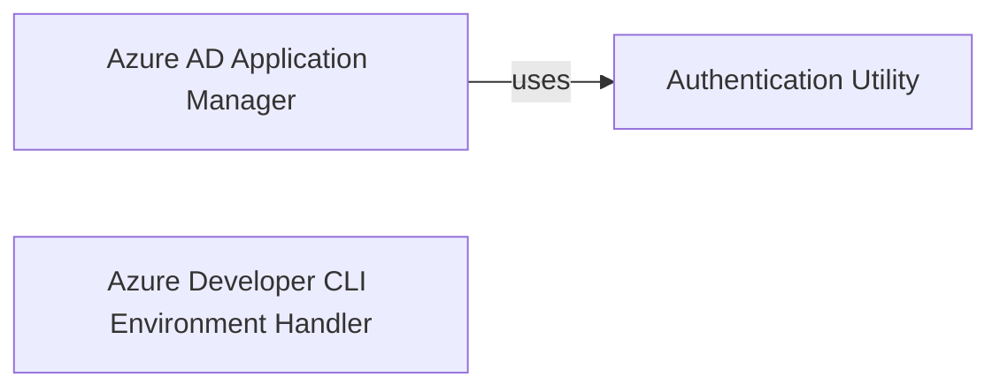

## Component Details

This system manages Azure AD application registrations, including their creation, secret management, and integration with Azure Developer CLI environment variables. It ensures secure application setup and interaction with the Microsoft Graph API by handling authentication and environment configuration.

### Authentication Utility
This component provides a utility function to obtain authentication headers required for interacting with Microsoft Graph API, typically by acquiring a token from a credential.

**Related Classes/Methods**:

- <a href="https://github.com/microsoft/sample-app-aoai-chatGPT/blob/master/scripts/auth_init.py#L8-L12" target="_blank" rel="noopener noreferrer">`sample-app-aoai-chatGPT.scripts.auth_init:get_auth_headers` (8:12)</a>

### Azure AD Application Manager
This component is responsible for managing Azure Active Directory application registrations. It includes functionalities to check for the existence of an application, create new application registrations, and add client secrets to existing applications, all interacting with the Microsoft Graph API.

**Related Classes/Methods**:

- <a href="https://github.com/microsoft/sample-app-aoai-chatGPT/blob/master/scripts/auth_init.py#L15-L24" target="_blank" rel="noopener noreferrer">`sample-app-aoai-chatGPT.scripts.auth_init:check_for_application` (15:24)</a>
- <a href="https://github.com/microsoft/sample-app-aoai-chatGPT/blob/master/scripts/auth_init.py#L27-L46" target="_blank" rel="noopener noreferrer">`sample-app-aoai-chatGPT.scripts.auth_init:create_application` (27:46)</a>
- <a href="https://github.com/microsoft/sample-app-aoai-chatGPT/blob/master/scripts/auth_init.py#L49-L58" target="_blank" rel="noopener noreferrer">`sample-app-aoai-chatGPT.scripts.auth_init:add_client_secret` (49:58)</a>

### Azure Developer CLI Environment Handler
This component provides functionality to interact with the Azure Developer CLI (azd) to set and update environment variables, which is crucial for configuring the application's runtime environment.

**Related Classes/Methods**:

- <a href="https://github.com/microsoft/sample-app-aoai-chatGPT/blob/master/scripts/auth_init.py#L61-L62" target="_blank" rel="noopener noreferrer">`sample-app-aoai-chatGPT.scripts.auth_init:update_azd_env` (61:62)</a>

### [FAQ](https://github.com/CodeBoarding/GeneratedOnBoardings/tree/main?tab=readme-ov-file#faq)