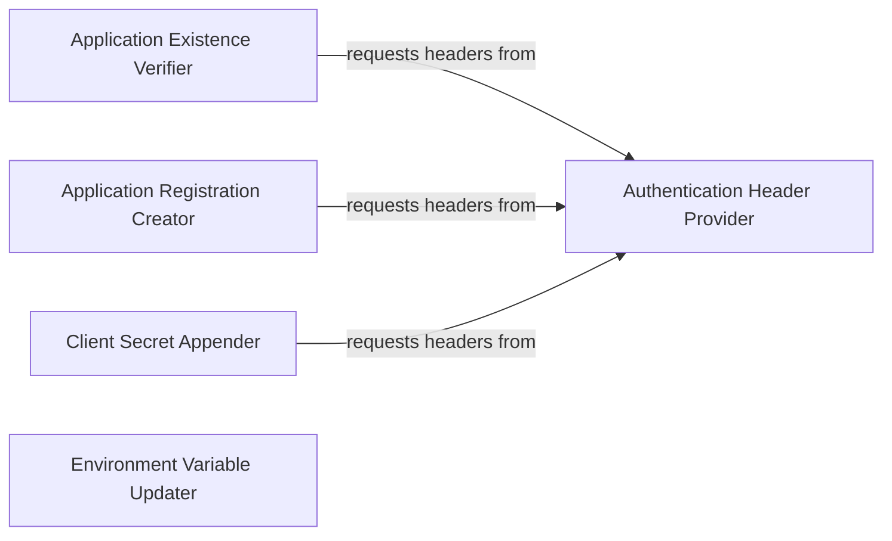

## Component Details

This system is responsible for managing Azure Active Directory application registrations, which are crucial for secure communication with Microsoft Graph API and other authenticated services. It encompasses functionalities for generating authentication headers, verifying the existence of applications, creating new application registrations, adding client secrets to existing applications, and updating local environment variables with the necessary application IDs and secrets. The overall purpose is to streamline the setup and management of application authentication within an Azure Developer CLI context.

### Authentication Header Provider
Responsible for generating and providing authentication headers necessary for secure communication with Microsoft Graph API and other authenticated services, leveraging Azure Developer CLI credentials.

**Related Classes/Methods**:

- <a href="https://github.com/microsoft/sample-app-aoai-chatGPT/blob/master/scripts/auth_init.py#L8-L12" target="_blank" rel="noopener noreferrer">`sample-app-aoai-chatGPT.scripts.auth_init.get_auth_headers` (8:12)</a>

### Application Existence Verifier
This component checks for the existence of a specific application registration within Azure Active Directory by making a GET request to the Microsoft Graph API, utilizing authentication headers.

**Related Classes/Methods**:

- <a href="https://github.com/microsoft/sample-app-aoai-chatGPT/blob/master/scripts/auth_init.py#L15-L24" target="_blank" rel="noopener noreferrer">`sample-app-aoai-chatGPT.scripts.auth_init.check_for_application` (15:24)</a>

### Application Registration Creator
This component handles the creation of new application registrations in Azure Active Directory, defining properties such as display name, sign-in audience, and redirect URIs, and requires authentication headers for the POST request.

**Related Classes/Methods**:

- <a href="https://github.com/microsoft/sample-app-aoai-chatGPT/blob/master/scripts/auth_init.py#L27-L46" target="_blank" rel="noopener noreferrer">`sample-app-aoai-chatGPT.scripts.auth_init.create_application` (27:46)</a>

### Client Secret Appender
This component adds a new client secret to an existing Azure Active Directory application registration, which is used for secure authentication, and necessitates authentication headers for the operation.

**Related Classes/Methods**:

- <a href="https://github.com/microsoft/sample-app-aoai-chatGPT/blob/master/scripts/auth_init.py#L49-L58" target="_blank" rel="noopener noreferrer">`sample-app-aoai-chatGPT.scripts.auth_init.add_client_secret` (49:58)</a>

### Environment Variable Updater
This component updates the local environment variables, specifically those managed by the Azure Developer CLI, with the IDs and secrets of the created or verified application registration.

**Related Classes/Methods**:

- <a href="https://github.com/microsoft/sample-app-aoai-chatGPT/blob/master/scripts/auth_init.py#L61-L62" target="_blank" rel="noopener noreferrer">`sample-app-aoai-chatGPT.scripts.auth_init.update_azd_env` (61:62)</a>

### [FAQ](https://github.com/CodeBoarding/GeneratedOnBoardings/tree/main?tab=readme-ov-file#faq)