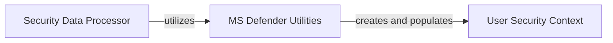

## Component Details

This graph illustrates the components involved in processing user security data. The `Security Data Processor` orchestrates the extraction of security information, primarily leveraging `MS Defender Utilities` to gather details from various sources. The extracted data is then structured and stored within the `User Security Context` component, providing a standardized representation of the user's security posture.

### Security Data Processor
Handles the extraction and processing of user security-related information from various sources, such as Microsoft Defender, to populate a structured user security context.

**Related Classes/Methods**:

- <a href="https://github.com/microsoft/sample-app-aoai-chatGPT/blob/master/backend/security/ms_defender_utils.py#L16-L20" target="_blank" rel="noopener noreferrer">`sample-app-aoai-chatGPT.backend.security.ms_defender_utils:get_msdefender_user_json` (16:20)</a>

### MS Defender Utilities
This component provides utility functions for interacting with Microsoft Defender-related security aspects. Its primary function, `get_msdefender_user_json`, is responsible for extracting relevant user security details from authentication information and request headers to construct a User Security Context.

**Related Classes/Methods**:

- <a href="https://github.com/microsoft/sample-app-aoai-chatGPT/blob/master/backend/security/ms_defender_utils.py#L16-L20" target="_blank" rel="noopener noreferrer">`sample-app-aoai-chatGPT.backend.security.ms_defender_utils:get_msdefender_user_json` (16:20)</a>

### User Security Context
This component encapsulates the security context of a user, including attributes such as application name, end-user ID, end-user tenant ID, and source IP. It provides a structured way to store and retrieve user-specific security information.

**Related Classes/Methods**:

- <a href="https://github.com/microsoft/sample-app-aoai-chatGPT/blob/master/backend/security/ms_defender_utils.py#L7-L13" target="_blank" rel="noopener noreferrer">`sample-app-aoai-chatGPT.backend.security.ms_defender_utils.UserSecurityContext` (7:13)</a>

### [FAQ](https://github.com/CodeBoarding/GeneratedOnBoardings/tree/main?tab=readme-ov-file#faq)