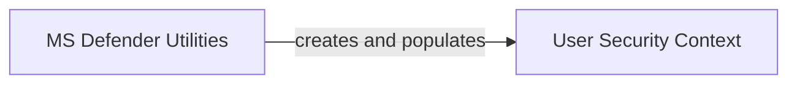

## Component Details

This graph illustrates the interaction between the User Security Context, which defines the data model for user security attributes, and the MS Defender Utilities component. The MS Defender Utilities component is responsible for extracting security-relevant user details from authentication information and request headers, and then populating an instance of the User Security Context with this data. This flow ensures that user security attributes are properly encapsulated and made available for further security processing.

### User Security Context
Defines the data model for encapsulating a user's security attributes, including application name, user ID, tenant ID, and source IP, serving as a structured representation of security-relevant data.

**Related Classes/Methods**:

- <a href="https://github.com/microsoft/sample-app-aoai-chatGPT/blob/master/backend/security/ms_defender_utils.py#L7-L13" target="_blank" rel="noopener noreferrer">`sample-app-aoai-chatGPT.backend.security.ms_defender_utils.UserSecurityContext` (7:13)</a>

### MS Defender Utilities
This component provides utility functions for interacting with Microsoft Defender-related security aspects. Its primary function, `get_msdefender_user_json`, is responsible for extracting relevant user security details from authentication information and request headers to construct a User Security Context.

**Related Classes/Methods**:

- <a href="https://github.com/microsoft/sample-app-aoai-chatGPT/blob/master/backend/security/ms_defender_utils.py#L16-L20" target="_blank" rel="noopener noreferrer">`sample-app-aoai-chatGPT.backend.security.ms_defender_utils:get_msdefender_user_json` (16:20)</a>

### [FAQ](https://github.com/CodeBoarding/GeneratedOnBoardings/tree/main?tab=readme-ov-file#faq)