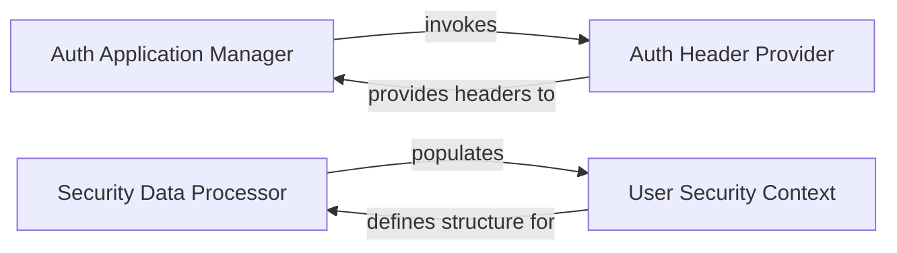

## Component Details

This architecture outlines the core components responsible for managing Azure Active Directory application authentication and processing user security data. The main flow involves setting up the application's authentication credentials, obtaining necessary authorization headers, and then utilizing these to fetch and structure user-specific security information from services like Microsoft Defender.

### Auth Application Manager
Manages the lifecycle of Azure AD application registrations, including creation, secret management, and updating Azure Developer CLI environment variables for secure application setup and interaction with Microsoft Graph API.

**Related Classes/Methods**:

- <a href="https://github.com/microsoft/sample-app-aoai-chatGPT/blob/master/scripts/auth_init.py#L15-L24" target="_blank" rel="noopener noreferrer">`sample-app-aoai-chatGPT.scripts.auth_init:check_for_application` (15:24)</a>
- <a href="https://github.com/microsoft/sample-app-aoai-chatGPT/blob/master/scripts/auth_init.py#L27-L46" target="_blank" rel="noopener noreferrer">`sample-app-aoai-chatGPT.scripts.auth_init:create_application` (27:46)</a>
- <a href="https://github.com/microsoft/sample-app-aoai-chatGPT/blob/master/scripts/auth_init.py#L49-L58" target="_blank" rel="noopener noreferrer">`sample-app-aoai-chatGPT.scripts.auth_init:add_client_secret` (49:58)</a>
- <a href="https://github.com/microsoft/sample-app-aoai-chatGPT/blob/master/scripts/auth_init.py#L61-L62" target="_blank" rel="noopener noreferrer">`sample-app-aoai-chatGPT.scripts.auth_init:update_azd_env` (61:62)</a>

### Auth Header Provider
Responsible for generating and providing authentication headers necessary for secure communication with Microsoft Graph API and other authenticated services, leveraging Azure Developer CLI credentials.

**Related Classes/Methods**:

- <a href="https://github.com/microsoft/sample-app-aoai-chatGPT/blob/master/scripts/auth_init.py#L8-L12" target="_blank" rel="noopener noreferrer">`sample-app-aoai-chatGPT.scripts.auth_init:get_auth_headers` (8:12)</a>

### Security Data Processor
Handles the extraction and processing of user security-related information from various sources, such as Microsoft Defender, to populate a structured user security context.

**Related Classes/Methods**:

- <a href="https://github.com/microsoft/sample-app-aoai-chatGPT/blob/master/backend/security/ms_defender_utils.py#L16-L20" target="_blank" rel="noopener noreferrer">`sample-app-aoai-chatGPT.backend.security.ms_defender_utils:get_msdefender_user_json` (16:20)</a>

### User Security Context
Defines the data model for encapsulating a user's security attributes, including application name, user ID, tenant ID, and source IP, serving as a structured representation of security-relevant data.

**Related Classes/Methods**:

- <a href="https://github.com/microsoft/sample-app-aoai-chatGPT/blob/master/backend/security/ms_defender_utils.py#L7-L13" target="_blank" rel="noopener noreferrer">`sample-app-aoai-chatGPT.backend.security.ms_defender_utils.UserSecurityContext` (7:13)</a>

### [FAQ](https://github.com/CodeBoarding/GeneratedOnBoardings/tree/main?tab=readme-ov-file#faq)