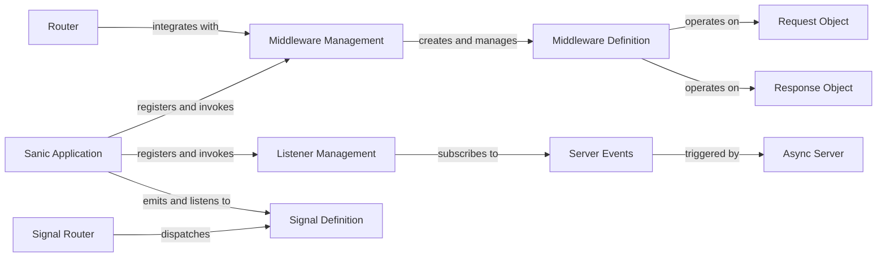

## Component Details

The `Extensibility & Event Management` component in Sanic provides a flexible and powerful way to inject custom logic into the request/response pipeline and enable decoupled communication through a publish-subscribe model. This is achieved through a well-defined set of core components that manage middleware, listeners, and signals.

### Middleware Definition
This component defines the structure for individual middleware functions. It encapsulates the callable, its intended `location` (request or response processing), and its `priority` for execution order.

**Related Classes/Methods**:

- <a href="https://github.com/sanic-org/sanic/blob/master/sanic/middleware.py#L1-L1" target="_blank" rel="noopener noreferrer">`sanic.middleware` (1:1)</a>

### Middleware Management
This mixin provides the public API for registering middleware functions. It includes decorators like `@app.middleware`, `@app.on_request`, and `@app.on_response`, allowing developers to easily hook into the request and response processing phases. It also handles the internal storage and application of middleware.

**Related Classes/Methods**:

- <a href="https://github.com/sanic-org/sanic/blob/master/sanic/mixins/middleware.py#L1-L1" target="_blank" rel="noopener noreferrer">`sanic.mixins.middleware` (1:1)</a>

### Listener Management
This mixin offers the API for registering event listeners for various application lifecycle events (e.g., server start/stop, process start/stop). It provides the `@app.listener` decorator and convenience methods like `@app.before_server_start`.

**Related Classes/Methods**:

- <a href="https://github.com/sanic-org/sanic/blob/master/sanic/mixins/listeners.py#L1-L1" target="_blank" rel="noopener noreferrer">`sanic.mixins.listeners` (1:1)</a>

### Signal Definition
Represents a dispatchable event within the Sanic application. It acts as a specialized "route" for event handling, allowing for a publish-subscribe pattern where components can emit signals and others can subscribe to them.

**Related Classes/Methods**:

- <a href="https://github.com/sanic-org/sanic/blob/master/sanic/signals.py#L1-L1" target="_blank" rel="noopener noreferrer">`sanic.signals` (1:1)</a>

### Signal Router
This component is responsible for managing and dispatching signals to their registered handlers. It likely maintains a mapping of signal names to their corresponding listeners and orchestrates the execution of these listeners when a signal is emitted.

**Related Classes/Methods**:

- <a href="https://github.com/sanic-org/sanic/blob/master/sanic/signals.py#L126-L419" target="_blank" rel="noopener noreferrer">`sanic.signals.SignalRouter` (126:419)</a>

### Sanic Application
The central application instance (`Sanic` class) that integrates and orchestrates all the extensibility mechanisms. It inherits from the `MiddlewareManagement` and `ListenerManagement` mixins, making these features available to the application developer.

**Related Classes/Methods**:

- <a href="https://github.com/sanic-org/sanic/blob/master/sanic/app.py#L1-L1" target="_blank" rel="noopener noreferrer">`sanic.app` (1:1)</a>

### Request Object
Represents the incoming HTTP request. Middleware functions often interact with and modify this object (e.g., adding context, parsing data) before it reaches the route handler.

**Related Classes/Methods**:

- `sanic.request` (1:1)

### Response Object
Represents the outgoing HTTP response. Middleware functions can inspect or modify this object (e.g., adding headers, compressing content) before it is sent back to the client.

**Related Classes/Methods**:

- `sanic.response` (1:1)

### Router
While primarily responsible for mapping URLs to handlers, the Router interacts with middleware by providing route-specific middleware capabilities. It ensures that global and route-specific middleware are correctly applied based on the matched route.

**Related Classes/Methods**:

- <a href="https://github.com/sanic-org/sanic/blob/master/sanic/router.py#L1-L1" target="_blank" rel="noopener noreferrer">`sanic.router` (1:1)</a>

### Server Events
This component defines and manages the various events that occur during the server's lifecycle, such as `before_server_start`, `after_server_stop`, etc. These events are the triggers for the listeners registered via the `ListenerManagement` mixin.

**Related Classes/Methods**:

- <a href="https://github.com/sanic-org/sanic/blob/master/sanic/server/events.py#L1-L1" target="_blank" rel="noopener noreferrer">`sanic.server.events` (1:1)</a>

### Async Server
Represents the underlying asynchronous server that triggers server lifecycle events.

**Related Classes/Methods**: _None_

### [FAQ](https://github.com/CodeBoarding/GeneratedOnBoardings/tree/main?tab=readme-ov-file#faq)