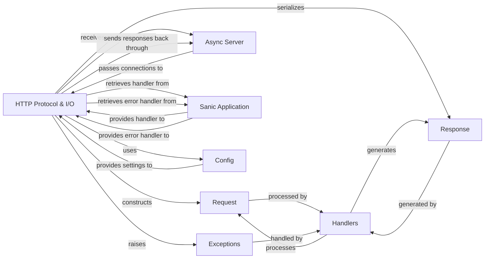

## Component Details

This is the final component overview for `HTTP Protocol & I/O`, including its structure, flow, purpose, and relationships with other fundamental components of the Sanic framework.

### HTTP Protocol & I/O
This component is the backbone of network communication, handling the low-level details of HTTP protocol implementation. It's responsible for parsing raw incoming bytes into structured `Request` objects and serializing `HTTPResponse` objects back into raw bytes for network transmission. It manages HTTP headers, cookies, and the underlying network communication, including specifics for HTTP/1.1 and HTTP/3.

**Related Classes/Methods**:

- <a href="https://github.com/sanic-org/sanic/blob/master/sanic/server/protocols/http_protocol.py#L83-L320" target="_blank" rel="noopener noreferrer">`sanic.server.protocols.http_protocol.HttpProtocol` (83:320)</a>
- <a href="https://github.com/sanic-org/sanic/blob/master/sanic/server/protocols/http_protocol.py#L49-L80" target="_blank" rel="noopener noreferrer">`sanic.server.protocols.http_protocol.HttpProtocolMixin` (49:80)</a>
- <a href="https://github.com/sanic-org/sanic/blob/master/sanic/http/http1.py#L32-L615" target="_blank" rel="noopener noreferrer">`sanic.http.http1.Http` (32:615)</a>
- <a href="https://github.com/sanic-org/sanic/blob/master/sanic/http/http3.py#L283-L384" target="_blank" rel="noopener noreferrer">`sanic.http.http3.Http3` (283:384)</a>
- `sanic.request.Request` (0:0)
- `sanic.response.HTTPResponse` (0:0)
- <a href="https://github.com/sanic-org/sanic/blob/master/sanic/cookies/request.py#L0-L0" target="_blank" rel="noopener noreferrer">`sanic.cookies.request` (0:0)</a>
- <a href="https://github.com/sanic-org/sanic/blob/master/sanic/cookies/response.py#L0-L0" target="_blank" rel="noopener noreferrer">`sanic.cookies.response` (0:0)</a>
- <a href="https://github.com/sanic-org/sanic/blob/master/sanic/headers.py#L0-L0" target="_blank" rel="noopener noreferrer">`sanic.headers` (0:0)</a>
- <a href="https://github.com/sanic-org/sanic/blob/master/sanic/http/constants.py#L0-L0" target="_blank" rel="noopener noreferrer">`sanic.http.constants` (0:0)</a>
- <a href="https://github.com/sanic-org/sanic/blob/master/sanic/http/stream.py#L0-L0" target="_blank" rel="noopener noreferrer">`sanic.http.stream` (0:0)</a>
- <a href="https://github.com/sanic-org/sanic/blob/master/sanic/models/http_types.py#L0-L0" target="_blank" rel="noopener noreferrer">`sanic.models.http_types` (0:0)</a>
- <a href="https://github.com/sanic-org/sanic/blob/master/sanic/models/protocol_types.py#L0-L0" target="_blank" rel="noopener noreferrer">`sanic.models.protocol_types` (0:0)</a>

### Request
Represents an incoming HTTP request, encapsulating all information about the client's request, including headers, body, query parameters, and cookies. It is constructed by the `HTTP Protocol & I/O` component.

**Related Classes/Methods**:

- `sanic.request.Request` (0:0)
- <a href="https://github.com/sanic-org/sanic/blob/master/sanic/request/types.py#L88-L1147" target="_blank" rel="noopener noreferrer">`sanic.request.types.Request` (88:1147)</a>

### Response
Represents the HTTP response sent back to the client. It allows setting status codes, headers, and the response body. It is generated by `Handlers` and then serialized by the `HTTP Protocol & I/O` component.

**Related Classes/Methods**:

- `sanic.response.Response` (0:0)
- <a href="https://github.com/sanic-org/sanic/blob/master/sanic/response/types.py#L213-L248" target="_blank" rel="noopener noreferrer">`sanic.response.types.HTTPResponse` (213:248)</a>

### Async Server
The core server component that listens for incoming network connections, manages the event loop, and dispatches these connections to appropriate protocol handlers, such as `HTTP Protocol & I/O`.

**Related Classes/Methods**:

- <a href="https://github.com/sanic-org/sanic/blob/master/sanic/server/async_server.py#L13-L113" target="_blank" rel="noopener noreferrer">`sanic.server.async_server.AsyncioServer` (13:113)</a>
- <a href="https://github.com/sanic-org/sanic/blob/master/sanic/server/protocols/base_protocol.py#L19-L192" target="_blank" rel="noopener noreferrer">`sanic.server.protocols.base_protocol.SanicProtocol` (19:192)</a>

### Sanic Application
The central application object that orchestrates the entire web application. It manages routes, middleware, listeners, and the server lifecycle. `HTTP Protocol & I/O` interacts with it to retrieve the main request handler and error handler.

**Related Classes/Methods**:

- <a href="https://github.com/sanic-org/sanic/blob/master/sanic/app.py#L110-L2548" target="_blank" rel="noopener noreferrer">`sanic.app.Sanic` (110:2548)</a>

### Handlers
Manages how different types of requests are processed, including the primary request handling logic and error handling. This component takes a `Request` object and produces a `Response` object.

**Related Classes/Methods**:

- <a href="https://github.com/sanic-org/sanic/blob/master/sanic/handlers/error.py#L13-L204" target="_blank" rel="noopener noreferrer">`sanic.handlers.error.ErrorHandler` (13:204)</a>
- <a href="https://github.com/sanic-org/sanic/blob/master/sanic/app.py#L1281-L1438" target="_blank" rel="noopener noreferrer">`sanic.app.Sanic.handle_request` (1281:1438)</a>

### Config
Manages the application's configuration settings, providing essential parameters like timeouts, maximum request sizes, and logging preferences, which are utilized by the `HTTP Protocol & I/O` component.

**Related Classes/Methods**:

- <a href="https://github.com/sanic-org/sanic/blob/master/sanic/config.py#L86-L432" target="_blank" rel="noopener noreferrer">`sanic.config.Config` (86:432)</a>

### Exceptions
Defines custom exception classes used throughout the framework to signal various error conditions (e.g., `RequestTimeout`, `RequestCancelled`). These exceptions can be raised during protocol handling and are typically managed by the `ErrorHandler`.

**Related Classes/Methods**:

- <a href="https://github.com/sanic-org/sanic/blob/master/sanic/exceptions.py#L0-L0" target="_blank" rel="noopener noreferrer">`sanic.exceptions` (0:0)</a>

### [FAQ](https://github.com/CodeBoarding/GeneratedOnBoardings/tree/main?tab=readme-ov-file#faq)