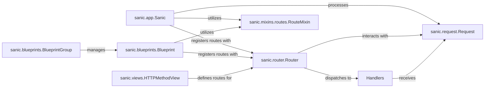

## Component Details

The Request Routing & Dispatch subsystem in Sanic is responsible for efficiently mapping incoming HTTP requests to the appropriate handler functions. It provides a flexible and modular way to define and manage application endpoints.

### sanic.app.Sanic
The central application instance. It acts as the orchestrator, managing the application lifecycle, registering blueprints, middleware, and ultimately initiating the request handling process by interacting with the Router.

**Related Classes/Methods**:

- <a href="https://github.com/sanic-org/sanic/blob/master/sanic/app.py#L110-L2548" target="_blank" rel="noopener noreferrer">`sanic.app.Sanic` (110:2548)</a>

### sanic.router.Router
The core of the routing mechanism. It stores all registered routes and, given an incoming request's URL, HTTP method, and host, it efficiently resolves and dispatches the request to the correct handler function. It manages different types of routes (static, dynamic, regex).

**Related Classes/Methods**:

- <a href="https://github.com/sanic-org/sanic/blob/master/sanic/router.py#L24-L272" target="_blank" rel="noopener noreferrer">`sanic.router.Router` (24:272)</a>

### sanic.blueprints.Blueprint
Provides a modular way to organize routes, middleware, listeners, and exception handlers into reusable units. Blueprints allow for better code organization and can be registered with the main `Sanic` application, often with a URL prefix or version.

**Related Classes/Methods**:

- <a href="https://github.com/sanic-org/sanic/blob/master/sanic/blueprints.py#L72-L606" target="_blank" rel="noopener noreferrer">`sanic.blueprints.Blueprint` (72:606)</a>

### sanic.blueprints.BlueprintGroup
A utility class that allows for grouping multiple `Blueprints` together. This enables applying common configurations, such as a shared URL prefix or API version, to a collection of blueprints, further enhancing modularity and organization.

**Related Classes/Methods**:

- <a href="https://github.com/sanic-org/sanic/blob/master/sanic/blueprints.py#L612-L984" target="_blank" rel="noopener noreferrer">`sanic.blueprints.BlueprintGroup` (612:984)</a>

### sanic.mixins.routes.RouteMixin
This mixin provides the high-level API for defining routes using decorators (e.g., `@app.route`, `@bp.get`, `@bp.post`). It abstracts the direct interaction with the `Router`, offering a convenient and expressive way for developers to declare endpoints.

**Related Classes/Methods**:

- <a href="https://github.com/sanic-org/sanic/blob/master/sanic/mixins/routes.py#L29-L816" target="_blank" rel="noopener noreferrer">`sanic.mixins.routes.RouteMixin` (29:816)</a>

### sanic.views.HTTPMethodView
Offers a class-based approach to defining route handlers. Instead of separate functions for each HTTP method, different methods (e.g., `get`, `post`, `put`) within a single class handle the corresponding HTTP verbs for a given URI.

**Related Classes/Methods**:

- <a href="https://github.com/sanic-org/sanic/blob/master/sanic/views.py#L20-L240" target="_blank" rel="noopener noreferrer">`sanic.views.HTTPMethodView` (20:240)</a>

### sanic.request.Request
Represents an incoming HTTP request. It encapsulates all relevant information, including the URL path, HTTP method, headers, query parameters, and request body. This object is passed to route handlers for processing.

**Related Classes/Methods**:

- `sanic.request.Request` (0:0)

### Handlers
These are the user-defined asynchronous or synchronous Python functions (or methods within `HTTPMethodView` classes) that contain the actual business logic to process an incoming request and generate an HTTP response. They are the ultimate destination of the routing and dispatch process.

**Related Classes/Methods**:

- `Handlers` (0:0)

### [FAQ](https://github.com/CodeBoarding/GeneratedOnBoardings/tree/main?tab=readme-ov-file#faq)