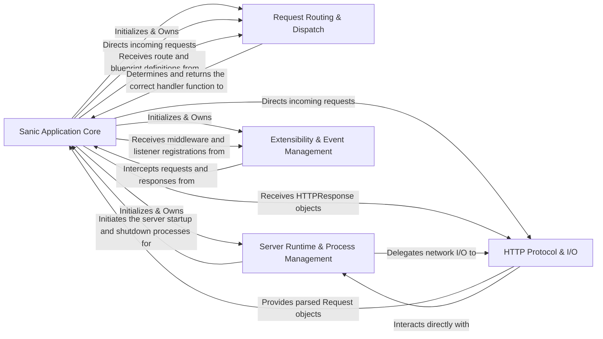

## Component Details

Sanic's architecture is designed for high performance and extensibility, built around an asynchronous core. The framework can be broken down into five fundamental components that orchestrate the entire request-response lifecycle and application management.

### Sanic Application Core
The central orchestrator of the Sanic application. It initializes, configures, and manages the entire application lifecycle, acting as the primary interface for developers to define routes, middleware, listeners, and manage application-wide settings. It holds the core state and configuration.

**Related Classes/Methods**:

- <a href="https://github.com/sanic-org/sanic/blob/master/sanic/app.py#L1-L1" target="_blank" rel="noopener noreferrer">`sanic/app.py` (1:1)</a>
- <a href="https://github.com/sanic-org/sanic/blob/master/sanic/config.py#L1-L1" target="_blank" rel="noopener noreferrer">`sanic/config.py` (1:1)</a>
- <a href="https://github.com/sanic-org/sanic/blob/master/sanic/application/state.py#L1-L1" target="_blank" rel="noopener noreferrer">`sanic/application/state.py` (1:1)</a>
- <a href="https://github.com/sanic-org/sanic/blob/master/sanic/base/root.py#L1-L1" target="_blank" rel="noopener noreferrer">`sanic/base/root.py` (1:1)</a>

### HTTP Protocol & I/O
Handles the low-level details of HTTP protocol implementation. It parses incoming raw bytes into structured `Request` objects and serializes `HTTPResponse` objects back into raw bytes for network transmission. This component manages HTTP headers, cookies, and the underlying network communication.

**Related Classes/Methods**:

- <a href="https://github.com/sanic-org/sanic/blob/master/sanic/request/types.py#L1-L1" target="_blank" rel="noopener noreferrer">`sanic/request/types.py` (1:1)</a>
- <a href="https://github.com/sanic-org/sanic/blob/master/sanic/response/types.py#L1-L1" target="_blank" rel="noopener noreferrer">`sanic/response/types.py` (1:1)</a>
- <a href="https://github.com/sanic-org/sanic/blob/master/sanic/http/http1.py#L1-L1" target="_blank" rel="noopener noreferrer">`sanic/http/http1.py` (1:1)</a>
- <a href="https://github.com/sanic-org/sanic/blob/master/sanic/http/http3.py#L1-L1" target="_blank" rel="noopener noreferrer">`sanic/http/http3.py` (1:1)</a>
- <a href="https://github.com/sanic-org/sanic/blob/master/sanic/cookies/request.py#L1-L1" target="_blank" rel="noopener noreferrer">`sanic/cookies/request.py` (1:1)</a>
- <a href="https://github.com/sanic-org/sanic/blob/master/sanic/cookies/response.py#L1-L1" target="_blank" rel="noopener noreferrer">`sanic/cookies/response.py` (1:1)</a>
- <a href="https://github.com/sanic-org/sanic/blob/master/sanic/headers.py#L1-L1" target="_blank" rel="noopener noreferrer">`sanic/headers.py` (1:1)</a>
- <a href="https://github.com/sanic-org/sanic/blob/master/sanic/server/protocols/http_protocol.py#L1-L1" target="_blank" rel="noopener noreferrer">`sanic/server/protocols/http_protocol.py` (1:1)</a>

### Request Routing & Dispatch
Maps incoming HTTP requests (based on URL path, HTTP method, and potentially host) to the appropriate handler functions (endpoints). It provides mechanisms for organizing routes into modular `Blueprints` and for generating URLs from view names.

**Related Classes/Methods**:

- <a href="https://github.com/sanic-org/sanic/blob/master/sanic/router.py#L1-L1" target="_blank" rel="noopener noreferrer">`sanic/router.py` (1:1)</a>
- <a href="https://github.com/sanic-org/sanic/blob/master/sanic/blueprints.py#L1-L1" target="_blank" rel="noopener noreferrer">`sanic/blueprints.py` (1:1)</a>
- <a href="https://github.com/sanic-org/sanic/blob/master/sanic/mixins/routes.py#L1-L1" target="_blank" rel="noopener noreferrer">`sanic/mixins/routes.py` (1:1)</a>
- <a href="https://github.com/sanic-org/sanic/blob/master/sanic/views.py#L1-L1" target="_blank" rel="noopener noreferrer">`sanic/views.py` (1:1)</a>
- <a href="https://github.com/sanic-org/sanic/blob/master/sanic/blueprint_group.py#L1-L1" target="_blank" rel="noopener noreferrer">`sanic/blueprint_group.py` (1:1)</a>

### Server Runtime & Process Management
Handles the actual execution and scaling of the Sanic application. This includes starting and stopping the HTTP server, managing multiple worker processes for concurrency, and providing auto-reloading capabilities during development to enhance developer experience.

**Related Classes/Methods**:

- <a href="https://github.com/sanic-org/sanic/blob/master/sanic/server/runners.py#L1-L1" target="_blank" rel="noopener noreferrer">`sanic/server/runners.py` (1:1)</a>
- <a href="https://github.com/sanic-org/sanic/blob/master/sanic/server/async_server.py#L1-L1" target="_blank" rel="noopener noreferrer">`sanic/server/async_server.py` (1:1)</a>
- <a href="https://github.com/sanic-org/sanic/blob/master/sanic/worker/manager.py#L1-L1" target="_blank" rel="noopener noreferrer">`sanic/worker/manager.py` (1:1)</a>
- <a href="https://github.com/sanic-org/sanic/blob/master/sanic/worker/reloader.py#L1-L1" target="_blank" rel="noopener noreferrer">`sanic/worker/reloader.py` (1:1)</a>
- <a href="https://github.com/sanic-org/sanic/blob/master/sanic/worker/process.py#L1-L1" target="_blank" rel="noopener noreferrer">`sanic/worker/process.py` (1:1)</a>
- <a href="https://github.com/sanic-org/sanic/blob/master/sanic/worker/serve.py#L1-L1" target="_blank" rel="noopener noreferrer">`sanic/worker/serve.py` (1:1)</a>

### Extensibility & Event Management
Provides a flexible and extensible mechanism for injecting custom logic into the request/response processing pipeline (middleware) and for enabling decoupled communication between different parts of the application through a publish-subscribe model (signals and listeners).

**Related Classes/Methods**:

- <a href="https://github.com/sanic-org/sanic/blob/master/sanic/middleware.py#L1-L1" target="_blank" rel="noopener noreferrer">`sanic/middleware.py` (1:1)</a>
- <a href="https://github.com/sanic-org/sanic/blob/master/sanic/mixins/middleware.py#L1-L1" target="_blank" rel="noopener noreferrer">`sanic/mixins/middleware.py` (1:1)</a>
- <a href="https://github.com/sanic-org/sanic/blob/master/sanic/mixins/listeners.py#L1-L1" target="_blank" rel="noopener noreferrer">`sanic/mixins/listeners.py` (1:1)</a>
- <a href="https://github.com/sanic-org/sanic/blob/master/sanic/signals.py#L1-L1" target="_blank" rel="noopener noreferrer">`sanic/signals.py` (1:1)</a>
- `sanic/signals/SignalRouter.py` (1:1)
- <a href="https://github.com/sanic-org/sanic/blob/master/sanic/server/events.py#L1-L1" target="_blank" rel="noopener noreferrer">`sanic/server/events.py` (1:1)</a>
- <a href="https://github.com/sanic-org/sanic/blob/master/sanic/mixins/signals.py#L1-L1" target="_blank" rel="noopener noreferrer">`sanic/mixins/signals.py` (1:1)</a>

### [FAQ](https://github.com/CodeBoarding/GeneratedOnBoardings/tree/main?tab=readme-ov-file#faq)