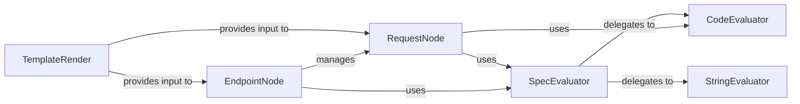

## Details

The API Specification Processor subsystem is responsible for parsing the raw API specification into an executable tree structure, handling templating, and dynamic expression evaluation.

### EndpointNode
Represents a node in the API specification tree, structuring nested endpoints and orchestrating the execution of associated requests. It forms the backbone of the "executable tree structure."

**Related Classes/Methods**:

- <a href="https://github.com/scanapi/scanapi/blob/main/scanapi/tree/endpoint_node.py" target="_blank" rel="noopener noreferrer">`scanapi.tree.endpoint_node`</a>
- <a href="https://github.com/scanapi/scanapi/blob/main/scanapi/tree/request_node.py" target="_blank" rel="noopener noreferrer">`scanapi.tree.request_node`</a>
- <a href="https://github.com/scanapi/scanapi/blob/main/scanapi/evaluators/spec_evaluator.py" target="_blank" rel="noopener noreferrer">`scanapi.evaluators.spec_evaluator`</a>

### RequestNode
Encapsulates a single HTTP request, managing its details (URL, method, headers, body) and execution flow, including pre-request delays, retries, and post-request test execution. It is a leaf node in the executable tree.

**Related Classes/Methods**:

- <a href="https://github.com/scanapi/scanapi/blob/main/scanapi/tree/request_node.py" target="_blank" rel="noopener noreferrer">`scanapi.tree.request_node`</a>
- <a href="https://github.com/scanapi/scanapi/blob/main/scanapi/evaluators/spec_evaluator.py" target="_blank" rel="noopener noreferrer">`scanapi.evaluators.spec_evaluator`</a>
- <a href="https://github.com/scanapi/scanapi/blob/main/scanapi/evaluators/code_evaluator.py" target="_blank" rel="noopener noreferrer">`scanapi.evaluators.code_evaluator`</a>

### TemplateRender
Handles the "templating" aspect, dynamically generating parts of the API specification by resolving variables and expressions *before* the evaluation phase.

**Related Classes/Methods**:

- <a href="https://github.com/scanapi/scanapi/blob/main/scanapi/template_render.py" target="_blank" rel="noopener noreferrer">`scanapi.template_render`</a>

### SpecEvaluator
The primary orchestrator for "dynamic expression evaluation." It recursively traverses the specification, delegating specific evaluation tasks (code, string variables) to specialized evaluators.

**Related Classes/Methods**:

- <a href="https://github.com/scanapi/scanapi/blob/main/scanapi/evaluators/spec_evaluator.py" target="_blank" rel="noopener noreferrer">`scanapi.evaluators.spec_evaluator`</a>
- <a href="https://github.com/scanapi/scanapi/blob/main/scanapi/evaluators/code_evaluator.py" target="_blank" rel="noopener noreferrer">`scanapi.evaluators.code_evaluator`</a>
- <a href="https://github.com/scanapi/scanapi/blob/main/scanapi/evaluators/string_evaluator.py" target="_blank" rel="noopener noreferrer">`scanapi.evaluators.string_evaluator`</a>

### CodeEvaluator
Executes Python code snippets embedded within the specification, enabling dynamic value generation and complex assertion logic.

**Related Classes/Methods**:

- <a href="https://github.com/scanapi/scanapi/blob/main/scanapi/evaluators/code_evaluator.py" target="_blank" rel="noopener noreferrer">`scanapi.evaluators.code_evaluator`</a>

### StringEvaluator
Resolves string-based dynamic values, primarily by replacing placeholders with values from environment or custom variables.

**Related Classes/Methods**:

- <a href="https://github.com/scanapi/scanapi/blob/main/scanapi/evaluators/string_evaluator.py" target="_blank" rel="noopener noreferrer">`scanapi.evaluators.string_evaluator`</a>

### [FAQ](https://github.com/CodeBoarding/GeneratedOnBoardings/tree/main?tab=readme-ov-file#faq)