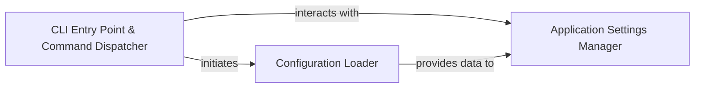

## Details

The `CLI & Configuration Manager` subsystem is crucial for `scanapi`'s operation, handling all aspects of user interaction via the command line and managing the application's runtime configuration. It aligns with the project's CLI Tool nature, providing the entry point and ensuring data-driven testing through robust configuration management.

### CLI Entry Point & Command Dispatcher
This component serves as the application's initial point of contact for users. It initializes the command-line interface, defines available commands (e.g., `run`, `init`), parses user-provided arguments, and dispatches control to the appropriate internal functions or modules based on the executed command. It orchestrates the initial setup and flow of the application.

**Related Classes/Methods**:

- <a href="https://github.com/scanapi/scanapi/blob/main/scanapi/__main__.py" target="_blank" rel="noopener noreferrer">`scanapi.__main__`</a>
- <a href="https://github.com/scanapi/scanapi/blob/main/scanapi/cli.py" target="_blank" rel="noopener noreferrer">`scanapi.cli`</a>

### Configuration Loader
This component is dedicated to reading, parsing, and validating external configuration files (e.g., `scanapi.yaml`). Its primary role is to ensure that all operational parameters and test specifications required by the application are correctly loaded and made available from these external sources.

**Related Classes/Methods**:

- <a href="https://github.com/scanapi/scanapi/blob/main/scanapi/config_loader.py" target="_blank" rel="noopener noreferrer">`scanapi.config_loader`</a>

### Application Settings Manager
This component acts as the central repository and orchestrator for all application preferences and settings. It consolidates settings from multiple sources, including default values, environment variables, configuration files, and command-line arguments, ensuring a consistent and prioritized application of these settings across the entire system. Internally, it manages preferences from configuration files (`ConfigFileHandler`) and command-line arguments (`ClickPreferencesHandler`), orchestrated by a `SettingsManager`.

**Related Classes/Methods**:

- <a href="https://github.com/scanapi/scanapi/blob/main/scanapi/settings.py" target="_blank" rel="noopener noreferrer">`scanapi.settings`</a>

### [FAQ](https://github.com/CodeBoarding/GeneratedOnBoardings/tree/main?tab=readme-ov-file#faq)