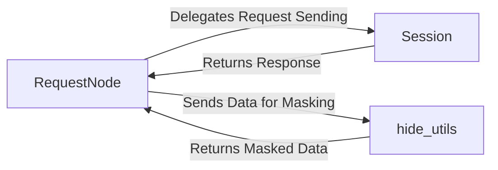

## Details

The HTTP Request & Response Handler subsystem manages the lifecycle of an HTTP request, from its initiation and execution to the processing and masking of its response.

### RequestNode
Acts as the primary orchestrator for individual API requests. It encapsulates all request-specific details (URL, method, headers, body, query parameters, options) and drives the execution flow. After a request is sent, it also handles post-response processing, including test execution and data masking.

**Related Classes/Methods**:

- <a href="https://github.com/scanapi/scanapi/blob/main/scanapi/tree/request_node.py#L25-L236" target="_blank" rel="noopener noreferrer">`scanapi.tree.request_node.RequestNode`:25-236</a>

### Session
Manages the underlying HTTP client session, providing the actual mechanism for sending HTTP requests efficiently. It handles persistent connections, which is crucial for performance in API testing, and can manage aspects like cookies or authentication across multiple requests.

**Related Classes/Methods**:

- <a href="https://github.com/scanapi/scanapi/blob/main/scanapi/session.py" target="_blank" rel="noopener noreferrer">`scanapi.session.Session`</a>

### hide_utils
A utility module dedicated to masking sensitive information within both request and response data. This is a critical security and privacy feature, preventing the exposure of confidential data (e.g., API keys, personal identifiers) in logs or reports.

**Related Classes/Methods**:

- <a href="https://github.com/scanapi/scanapi/blob/main/scanapi/hide_utils.py" target="_blank" rel="noopener noreferrer">`scanapi.hide_utils`</a>

### [FAQ](https://github.com/CodeBoarding/GeneratedOnBoardings/tree/main?tab=readme-ov-file#faq)