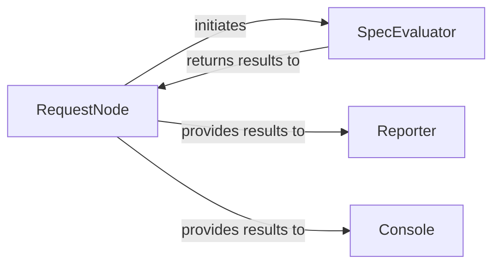

## Details

The `Test & Reporting Engine` subsystem is responsible for evaluating test assertions against API responses and generating comprehensive reports and console output.

### RequestNode
Acts as the orchestrator for a single API request's test execution. It initiates the assertion process by interacting with the `SpecEvaluator` and then dispatches the results to the `Reporter` and `Console` components for output. This aligns with the "Test Runner" aspect of the "Test Runner/Assertion Engine" pattern.

**Related Classes/Methods**:

- <a href="https://github.com/scanapi/scanapi/blob/main/scanapi/tree/request_node.py" target="_blank" rel="noopener noreferrer">`scanapi/tree/request_node.py`</a>

### SpecEvaluator
The core engine responsible for evaluating various types of assertions (e.g., status code, headers, body content) against the API response data. It determines the pass/fail status of each individual test assertion. This directly embodies the "Assertion Engine" part of the "Test Runner/Assertion Engine" pattern.

**Related Classes/Methods**:

- <a href="https://github.com/scanapi/scanapi/blob/main/scanapi/evaluators/spec_evaluator.py" target="_blank" rel="noopener noreferrer">`scanapi/evaluators/spec_evaluator.py`</a>

### Reporter
Generates comprehensive, often human-readable, test reports (e.g., HTML, JSON). It aggregates the overall test results received from the `RequestNode` and formats them for detailed review and archival. This aligns with the "Report Generator" pattern.

**Related Classes/Methods**:

- <a href="https://github.com/scanapi/scanapi/blob/main/scanapi/reporter.py" target="_blank" rel="noopener noreferrer">`scanapi/reporter.py`</a>

### Console
Manages the immediate display of test results and summaries directly to the command-line interface, providing quick feedback to the user during test execution. This serves as a specialized output mechanism, complementing the `Reporter`.

**Related Classes/Methods**:

- <a href="https://github.com/scanapi/scanapi/blob/main/scanapi/console.py" target="_blank" rel="noopener noreferrer">`scanapi/console.py`</a>

### [FAQ](https://github.com/CodeBoarding/GeneratedOnBoardings/tree/main?tab=readme-ov-file#faq)