```mermaid
graph LR
    CLI_Configuration_Manager["CLI & Configuration Manager"]
    API_Specification_Processor["API Specification Processor"]
    HTTP_Request_Response_Handler["HTTP Request & Response Handler"]
    Test_Reporting_Engine["Test & Reporting Engine"]
    CLI_Configuration_Manager -- "Initializes & Directs" --> API_Specification_Processor
    CLI_Configuration_Manager -- "Provides Configuration" --> API_Specification_Processor
    API_Specification_Processor -- "Provides Request Details" --> HTTP_Request_Response_Handler
    API_Specification_Processor -- "Supplies Evaluated Data" --> HTTP_Request_Response_Handler
    HTTP_Request_Response_Handler -- "Forwards Responses" --> Test_Reporting_Engine
    HTTP_Request_Response_Handler -- "Provides Masked Data" --> Test_Reporting_Engine
    Test_Reporting_Engine -- "Outputs Results" --> CLI_Configuration_Manager
    click CLI_Configuration_Manager href "https://github.com/CodeBoarding/GeneratedOnBoardings/blob/main/scanapi/CLI_Configuration_Manager.md" "Details"
    click API_Specification_Processor href "https://github.com/CodeBoarding/GeneratedOnBoardings/blob/main/scanapi/API_Specification_Processor.md" "Details"
    click HTTP_Request_Response_Handler href "https://github.com/CodeBoarding/GeneratedOnBoardings/blob/main/scanapi/HTTP_Request_Response_Handler.md" "Details"
    click Test_Reporting_Engine href "https://github.com/CodeBoarding/GeneratedOnBoardings/blob/main/scanapi/Test_Reporting_Engine.md" "Details"
```

## Details

The `scanapi` architecture is designed as a sequential, data-driven pipeline, ideal for automated API testing. It starts with the CLI & Configuration Manager handling user input and system settings. This information then flows to the API Specification Processor, which transforms the human-readable API test definitions into an executable format, incorporating dynamic values through templating and expression evaluation. The processed specification guides the HTTP Request & Response Handler in executing API calls and managing the raw network interactions, including the crucial step of masking sensitive data. Finally, the Test & Reporting Engine consumes the responses, performs assertions to determine test outcomes, and consolidates all results into user-friendly reports and console outputs. This clear, unidirectional flow ensures a predictable and efficient API testing process, making it highly suitable for visual representation as a data flow diagram.

### CLI & Configuration Manager [[Expand]](./CLI_Configuration_Manager.md)
Manages user interaction, command-line argument parsing, and loads/manages application-wide settings and configurations.

**Related Classes/Methods**:

- <a href="https://github.com/scanapi/scanapi/blob/main/scanapi/cli.py" target="_blank" rel="noopener noreferrer">`scanapi/cli.py`</a>
- <a href="https://github.com/scanapi/scanapi/blob/main/scanapi/__main__.py" target="_blank" rel="noopener noreferrer">`scanapi/__main__.py`</a>
- <a href="https://github.com/scanapi/scanapi/blob/main/scanapi/config_loader.py" target="_blank" rel="noopener noreferrer">`scanapi/config_loader.py`</a>
- <a href="https://github.com/scanapi/scanapi/blob/main/scanapi/settings.py" target="_blank" rel="noopener noreferrer">`scanapi/settings.py`</a>

### API Specification Processor [[Expand]](./API_Specification_Processor.md)
Parses the raw API specification into an executable tree structure, handling templating and dynamic expression evaluation.

**Related Classes/Methods**:

- <a href="https://github.com/scanapi/scanapi/blob/main/scanapi/tree/endpoint_node.py" target="_blank" rel="noopener noreferrer">`scanapi/tree/endpoint_node.py`</a>
- <a href="https://github.com/scanapi/scanapi/blob/main/scanapi/tree/request_node.py" target="_blank" rel="noopener noreferrer">`scanapi/tree/request_node.py`</a>
- <a href="https://github.com/scanapi/scanapi/blob/main/scanapi/template_render.py" target="_blank" rel="noopener noreferrer">`scanapi/template_render.py`</a>
- <a href="https://github.com/scanapi/scanapi/blob/main/scanapi/evaluators/code_evaluator.py" target="_blank" rel="noopener noreferrer">`scanapi.evaluators.code_evaluator.py`</a>
- <a href="https://github.com/scanapi/scanapi/blob/main/scanapi/evaluators/string_evaluator.py" target="_blank" rel="noopener noreferrer">`scanapi/evaluators/string_evaluator.py`</a>
- <a href="https://github.com/scanapi/scanapi/blob/main/scanapi/evaluators/spec_evaluator.py" target="_blank" rel="noopener noreferrer">`scanapi/evaluators/spec_evaluator.py`</a>

### HTTP Request & Response Handler [[Expand]](./HTTP_Request_Response_Handler.md)
Executes HTTP requests, manages sessions, and processes raw responses, including sensitive data masking.

**Related Classes/Methods**:

- <a href="https://github.com/scanapi/scanapi/blob/main/scanapi/tree/request_node.py" target="_blank" rel="noopener noreferrer">`scanapi/tree/request_node.py`</a>
- <a href="https://github.com/scanapi/scanapi/blob/main/scanapi/session.py" target="_blank" rel="noopener noreferrer">`scanapi/session.py`</a>
- <a href="https://github.com/scanapi/scanapi/blob/main/scanapi/hide_utils.py" target="_blank" rel="noopener noreferrer">`scanapi/hide_utils.py`</a>

### Test & Reporting Engine [[Expand]](./Test_Reporting_Engine.md)
Evaluates test assertions against responses and generates comprehensive reports and console output.

**Related Classes/Methods**:

- <a href="https://github.com/scanapi/scanapi/blob/main/scanapi/evaluators/spec_evaluator.py" target="_blank" rel="noopener noreferrer">`scanapi/evaluators/spec_evaluator.py`</a>
- <a href="https://github.com/scanapi/scanapi/blob/main/scanapi/reporter.py" target="_blank" rel="noopener noreferrer">`scanapi/reporter.py`</a>
- <a href="https://github.com/scanapi/scanapi/blob/main/scanapi/console.py" target="_blank" rel="noopener noreferrer">`scanapi/console.py`</a>

### [FAQ](https://github.com/CodeBoarding/GeneratedOnBoardings/tree/main?tab=readme-ov-file#faq)